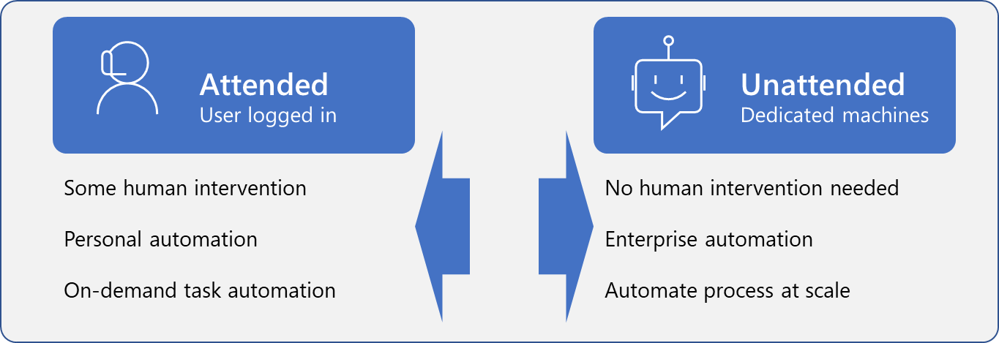

Some business processes require supervision or input that's impossible or risky to automate. For example, approval to implement a financial transaction of significant value. However, you can fully automate other processes that don't require human oversight or are inconvenient or impractical to constantly monitor. 

This module demonstrates the solution for these scenarios by explaining how to run your UI and API flows in **unattended** mode.

> 
**Unattended mode offers the benefit of using robotic process automation (RPA) at scale.**

In this module, you'll:

- Run a basic desktop flow in unattended mode.

- Run a desktop flow and cloud flow scenario in unattended mode.

- Learn about best practices and setup for unattended desktop flows.
