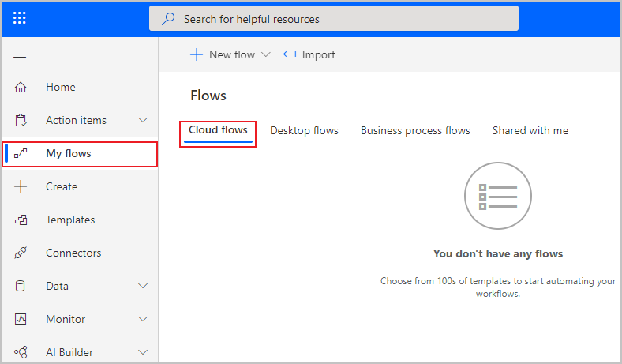
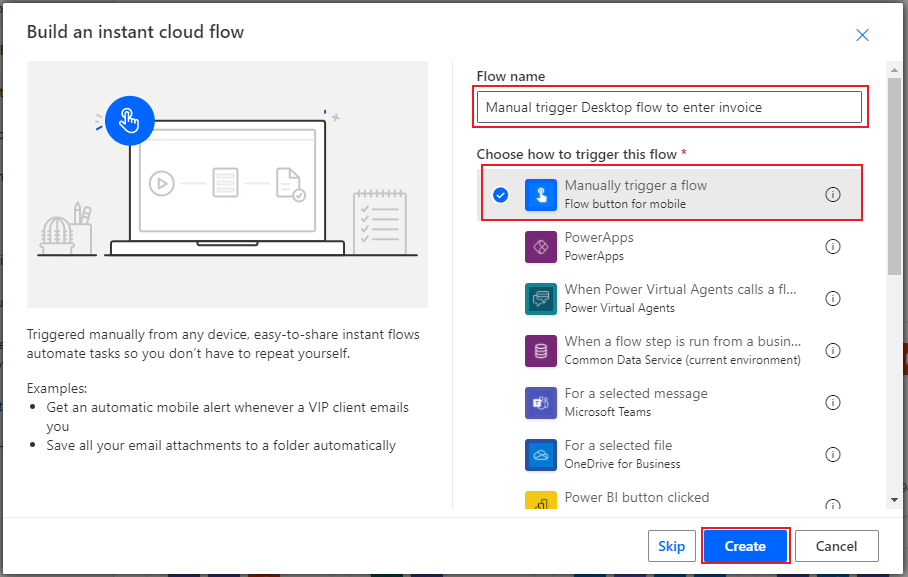
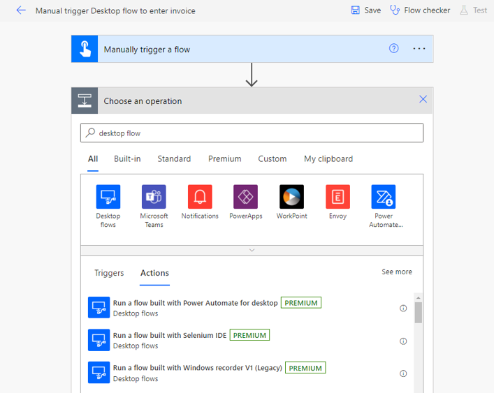

A cloud flow runs in the cloud and accesses services through APIs. Cloud flows are required to trigger the unattended desktop flow. To begin creating your cloud flow, open [Power Automate](https://us.flow.microsoft.com/?azure-portal=true) and select **My flows** and then **Cloud flows**.

> [!div class="mx-imgBorder"]
> 

Next, select **New flow > Instant cloud flow**.

> [!div class="mx-imgBorder"]
> 

Name your flow. The following screenshot shows the example name as **Manual trigger Desktop flow to enter invoice**. Select the **Manually trigger a flow** option and then select **Create**.

> [!div class="mx-imgBorder"]
> 

When the screen changes to the flow builder, select **New step** and then search for and select **Run a flow built with Power Automate for desktop flow**.

> [!div class="mx-imgBorder"]
> 

If you haven't already set up your gateway connection, use the **Gateway name** dropdown menu to select the appropriate gateway.

If you can't find your gateway, you might need to delete this step and re-create it to refresh the list. If your gateway still doesn't appear, you might need to restart the gateway on your PC and then retry the process.

The next two fields will request your credentials to sign in to your computer. If you're unsure of what to put in the **Domain and username** field, you can open a command prompt window by opening the **Start** menu, entering **CMD** in the search box, and then pressing the **Enter** key. When the command prompt opens, enter **Set user** and then press the **Enter** key.

Several lines of code will appear. Separate the **user domain** and the **username** with a backslash (\\), as shown in the following screenshot. Select **Create**.

> [!div class="mx-imgBorder"]
> 

When you've connected to your desktop, Power Automate will prompt you for information that's specific to your desktop flow. In the **Desktop flow** dropdown menu, select the name of your flow, in this case **Invoicing**, and then select the **Unattended - Runs in the background without signing in** option in the **Run Mode** dropdown menu.

After you've selected your desktop flow, the requested input variables will be added for you to fill in. You can use dynamic content from the trigger or other steps in your cloud flow to populate these variables. For the purposes of this module, you can enter placeholders because you're only testing the unattended flow. Select **Save**.

> [!div class="mx-imgBorder"]
> 

Now that you've created the unattended desktop flow, you can test it.
