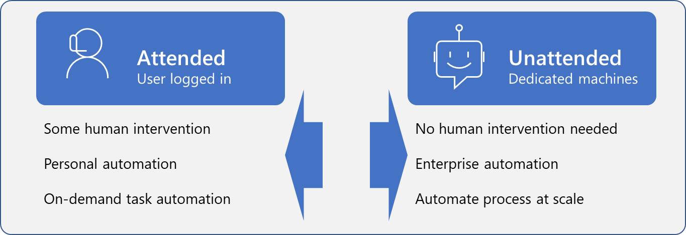

Unattended desktop flows allow you to use the full power of desktop apps with minimal human oversight, creating a robust and complete robotic process automation (RPA). Now, you've learned how to build and run unattended desktop flows to complete your RPA. You can use the concepts that you've learned and build on them to automate your tasks so that you can focus more on your creative and strategic pursuits.

> 
**Unattended mode offers the benefit of using RPA at scale.**

In this module, you learned how to:

- Run a basic desktop flow in unattended mode.

- Run a desktop flow and cloud flow scenario in unattended mode.

- Strategize by using best practices and set up for unattended desktop flows.

## Key takeaways

Three key takeaways for this module are:

- Unattended desktop flows allow you to automate processes that can run without human oversight. 

- Follow best practices to avoid overloading your machine or having your flows time out.

- Ensure that the device that's running your unattended flow doesn't have signed-in users.

For more information, see [manage machine groups](/power-automate/desktop-flows/manage-machine-groups).
