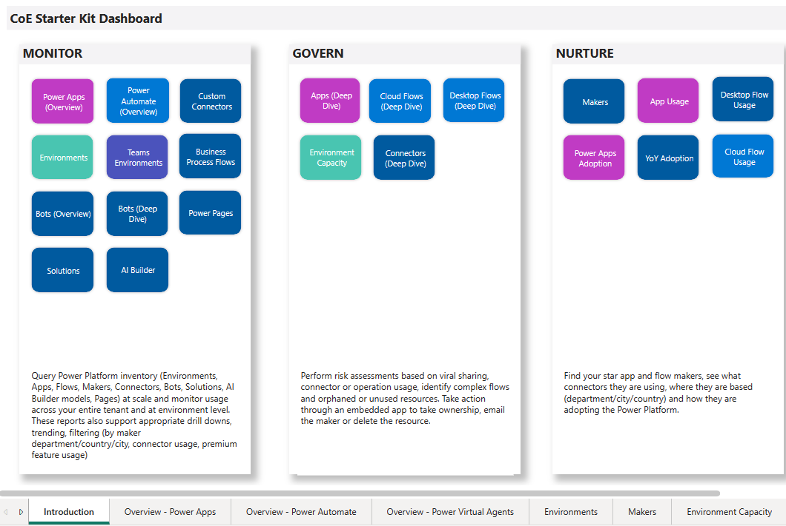
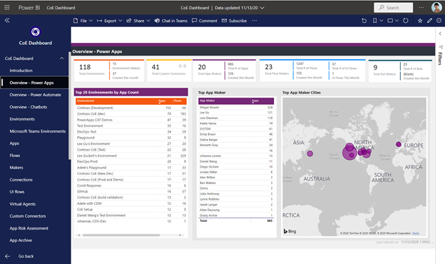

In an organization, a Center of Excellence (CoE) is like a hub for innovation and improvement. It brings together people who share similar business goals to exchange knowledge and success stories. It also helps maintain consistency and order within the organization. When set up properly, a CoE can support the growth of citizen developers while keeping things organized. It fosters innovation, breaks down barriers between teams, and helps everyone work toward the same business goals instead of just focusing on individual targets.

Now, let's talk about the Microsoft Power Platform CoE Starter Kit. Think of it as a toolbox filled with templates and tools that are designed to make your journey into the Microsoft Power Platform (especially Power Apps and Power Automate) smoother. It's the result of input from various organizations on how to kickstart your journey, and it keeps getting better with updates.

It's important to note that the CoE Starter Kit isn't the entire CoE package. Building a CoE requires people, communication, and well-defined processes. The tools in the kit are like stepping stones to help you reach your goal, but you need to put some thought into designing a CoE that works best for your organization's unique needs and preferences.

This kit offers some nifty automation and tools to help your organization create the monitoring and automation needed to support a CoE. It's based on a Microsoft Dataverse data model and comes with workflows to gather information from all your tenant environments. You can find multiple apps and Power BI analytics to visualize and work with the data you collect. Plus, it offers templates and recommended ways of doing things to help you set up your CoE effectively.
This learning document focuses on getting started with the initial configuring of the CoE kit in your tenant. It focuses on the core setup components, governance components, audit log data, and the Microsoft Power BI report.

> [!div class="mx-imgBorder"]
> 

## Confirm licensing requirements for CoE Kit use

Make sure that you meet the following licensing requirements met before you begin this module:

- Microsoft Power Platform service admin, global tenant admin, or Microsoft Dynamics 365 service admin.

- Power Apps Per User license (non-trial) and Microsoft 365 license.

- Power Automate Per User license, or Per Flow licenses (non-trial).

- Power BI Premium per user or per capacity (if using Data Export for inventory)

- Have access to an Office 365 mailbox that has the REST API enabled. It must also meet all requirements to use the Office 365 Outlook connector.

- If you want to collect information such as app launches and unique users per app, you must be granted access to the Audit Log and work with a Global Admin who has access to Microsoft 365 audit log to complete the setup.

- If you want to share the Power BI report that's part of the CoE Starter Kit, this identity needs to have the Power BI Pro license.

## Set up environments

Microsoft recommends creating two environments to install the CoE Starter Kit solutions - one for testing, and one for production use.

- Create an environment with a database

- Choose English as the default language

- Don't add sample apps and datasets

- Set the security group to None to allow open access. Some parts of the CoE Starter Kit use approval actions and require makers to be able to interact with the environment.

- After importing the solution and completing the setup steps, set the *ProductionEnvironment* variable to no in your test environment. This means you can test the CoE Starter Kit processes without impacting makers and end users.

## Validate data loss prevention (DLP) policies

The environment must have a data loss prevention (DLP) policy that allows the following connectors to be used together in the business group:

- Approvals

- Azure Resource Manager

- HTTP

- HTTP with Microsoft Entra ID

- Microsoft Dataverse

- Microsoft Dataverse (legacy)

- Microsoft Teams

- Office 365 Groups

- Office 365 Outlook

- Office 365 Users

- Power Apps for Admins

- Power Apps for Makers

- Power Automate for Admins

- Power Automate Management

- Power Platform for Admins

- Power Query Dataflows

- RSS

- SharePoint

## Download the solution

After you have your environments set up, you need to download the CoE Starter Kit. The entire content package can be downloaded directly at [aka.ms/CoEStarterKitDownload](https://aka.ms/CoeStarterKitDownload).
