Core components are set up to sync all your resources from Microsoft Power Platform into tables to get more visibility into the apps, flows, and makers that exist in your environment. The core components contain assets that are relevant to citizen developers, makers, administrators, and security.

The following information is available for each app:

- Display name
- App ID
- Environment
- Owner
- Created on
- Modified on
- Published on
- Last launched on (if collecting audit log information is configured)
- App plan classification (standard, premium, extended)
- Shared users
- Shared groups
- Shared with tenant (yes/no)
- App type (canvas, model-driven, SharePoint form app)
- App orphaned

PowerApps Connector represents a standard or custom connector. The following information is available for each connector:

- Connector ID
- Display name
- Icon background color and URI
- Is custom connector (yes/no)
- Maker (for custom connectors)
- Publisher
- Tier (standard/premium)

Maker represents a user who creates an app, flow, custom connector, or environment. The following information is available for each maker (retrieved from Microsoft 365 user profiles):

- Display name
- ID
- Email (user principal name)
- City
- Country/region
- Department
- Job title
- Office
- Number of apps (rollup)
- Number of flows (rollup)

Audit Log represents session details for Power Apps. The following information is available for each audit log entry:

- Operation (launched app, deleted app, deleted flow)
- App/cloud flow ID
- User city, country/region, department, job title (from Microsoft 365)
- Audit log event time

With Power BI reports, you can get a holistic view of Dataverse data with visualizations and insights for Environments, Apps, Flows, Connector, Connection Reference, Maker, and Audit Log tables.

> [!div class="mx-imgBorder"]
> [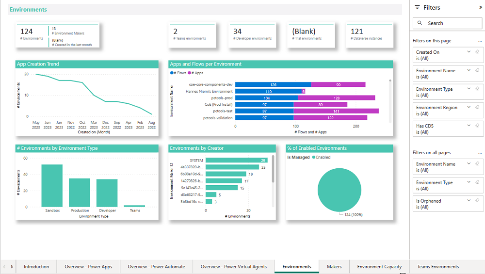](../media/power-bi-dashboard-enviroments.png#lightbox)

## Create an environment for the CoE Kit

An environment with Dataverse is required to set up the CoE.

1. Go to [Microsoft Power Platform admin center](https://admin.powerplatform.microsoft.com/?azure-portal=true).

1. Select **Environments** > **New**, and then enter a name, type, and purpose.

1. Select **Yes** for creating the database and then select **Next**.

1. Leave Sample apps and data set to **No**.

1. Select **Save**.

For the rest of the exercises, you need to be in this new environment. To switch environments, select the environment name in the upper left corner of the screen and then select the environment you created.

## Import the Creator Kit

The CoE Starter Kit includes features that require the installation of the [Creator Kit](/power-platform/guidance/creator-kit/overview/?azure-portal=true) in the environment where you install the CoE Starter Kit.

### Instructions for installing the Creator Kit

There are two ways to import the Creator Kit solution:

- [Manually install the solution.](/power-platform/guidance/creator-kit/setup#option-1-manually-install-the-solutions/?azure-portal=true)

- [Install from AppSource.](/power-platform/guidance/creator-kit/setup?azure-portal=true#option-2-install-from-appsource)

Here are the steps to manually install the solution from AppSource. For more on how to install from AppSource, see [Install the Creator Kit](/power-platform/guidance/creator-kit/setup#option-2-install-from-appsource/?azure-portal=true).

1. [Download](https://aka.ms/creatorkitdownload) the Creator Kit.

1. In the top right hand corner of [PowerApps](https://make.powerapps.com/?azure-portal=true), select the environment you created in the previous section.

1. On the left navigation pane, select **Solutions**.

1. Select **Import Solution** > **Browse** and then choose the file you downloaded in Step 1.

1. When the solution is imported, it displays a success message.

   > [!div class="mx-imgBorder"]
   > [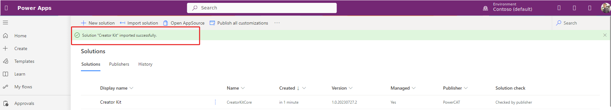](../media/creator-kit-install.svg#lightbox)

For more information about importing solutions, see [Import solutions](/power-apps/maker/data-platform/import-update-export-solutions).

## Create connections

Microsoft recommends creating all connections prior to importing the CoE Starter Kit to make the setup go faster.

1. Go to [Power Automate](https://make.powerautomate.com/?azure-portal=true)

1. Select your CoE environment, and go to **More > Connections > New Connection**

   > [!div class="mx-imgBorder"]
   > [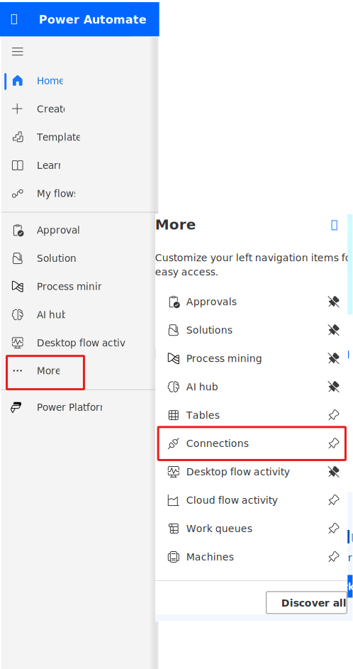](../media/new-connection.svg#lightbox)

1. In the top right hand corner, search for **Dataverse** and then select the **+** icon to add the connection.

   > [!div class="mx-imgBorder"]
   > [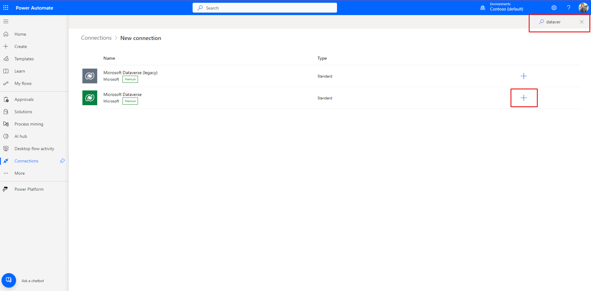](../media/create-connection.svg#lightbox)

1. Create connections for the following connectors:
   - [Approvals](/connectors/approvals/?azure-portal=true)
   - [Microsoft Dataverse](/connectors/commondataserviceforapps/?azure-portal=true)
   - [Microsoft Dataverse (legacy)](/connectors/commondataservice/?azure-portal=true)
   - [Microsoft Teams](/connectors/teams/?azure-portal=true)
   - [Office 365 Groups](/connectors/office365groups/?azure-portal=true)
   - [Office 365 Outlook](/connectors/office365/?azure-portal=true)
   - [Office 365 Users](/connectors/office365users/?azure-portal=true)
   - [Power Apps for Admins](/connectors/powerappsforadmins/?azure-portal=true)
   - [Power Apps for Makers](/connectors/powerappsforappmakers/?azure-portal=true)
   - [Power Automate for Admins](/connectors/microsoftflowforadmins/?azure-portal=true)
   - [Power Automate Management](/connectors/flowmanagement/?azure-portal=true)
   - [Power Platform for Admins](/connectors/powerplatformforadmins/?azure-portal=true)
   - [Power Query Dataflows](/connectors/dataflows/?azure-portal=true)
   - [RSS](/connectors/rss/?azure-portal=true)
   - [SharePoint](/connectors/sharepointonline/?azure-portal=true)
   - [HTTP with Microsoft Entra ID](/connectors/webcontents/?azure-portal=true)

1. Create a connection for HTTP with Microsoft Entra ID, and set Base Resource URL and Entra ID Resource URI (Application ID URI) to `https://graph.microsoft.com/` for commercial tenants.

   For GCC, GCC High, or DoD, check your [service root endpoint for Microsoft Graph](/graph/deployments?azure-portal=true#microsoft-graph-and-graph-explorer-service-root-endpoints).

   > [!div class="mx-imgBorder"]
   > 

## Set up the Inventory components using the Setup Wizard

### Import the core components solution

Next we import the core components solution the same way we imported the Creator Kit.

1. Download the [CoE Starter Kit compressed file](https://aka.ms/CoeStarterKitDownload/?azure-portal=true).

1. Extract the compressed (.zip) file. The CoE Starter Kit compressed file contains all solution components in addition to the non–solution-aware components that make up the CoE Starter Kit.

   For more information, see [Set up core components](/power-platform/guidance/coe/setup-core-components/?azure-portal=true).

1. Import the **CenterOfExcellenceCoreComponents_x_x_x_xx_managed.zip** solution file from the extracted folder.

1. When the compressed (.zip) file loads, select **Next**.

1. Review the information and then select **Next**.

   > [!div class="mx-imgBorder"]
   > [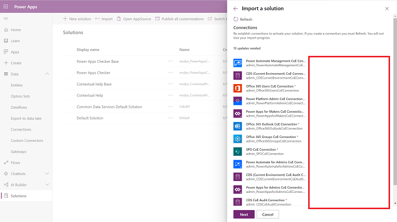](../media/import-solution-ssm.png#lightbox)

1. All of the connections were already established from a previous step. If you need to create a new connection, just select **Refresh** when you return to this screen. You won't lose your import progress.

1. Select **Next**.

1. For commercial cloud tenants, leave all the environment variables blank. For GCC, GCC High, or DoD, see [Microsoft Graph and Graph Explorer service root endpoints](/graph/deployments?azure-portal=true#microsoft-graph-and-graph-explorer-service-root-endpoints) to enter the value for **Graph URL Environment Variable**.

1. Select **Import**.

The import can take up to 15 minutes to complete.

   > [!div class="mx-imgBorder"]
   > [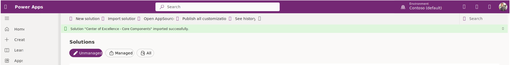](../media/core-components-successful.svg#lightbox)

## Open the Setup Wizard to complete the configuration

1. Once the solution imports, select **Solutions**.

1. Select the **Managed** tab.

1. Select **Center of Excellence - Core Components** display name to open the solution.

   > [!div class="mx-imgBorder"]
   > [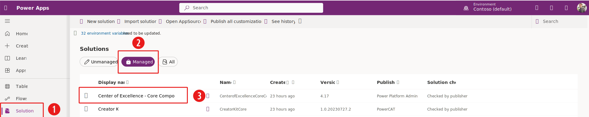](../media/open-core-component-solution.svg#lightbox)

1. Select **Apps** from the left menu.

1. Select **CoE Setup and Upgrade Wizard** to play the app.

   > [!div class="mx-imgBorder"]
   > [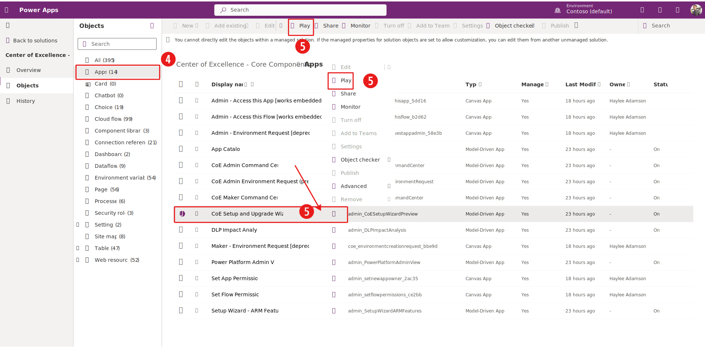](../media/core-components-open-upgrade-app.svg#lightbox)

1. A list of connections used by the app appears. Select **Allow** to continue.

1. The app provides a step by step process to configure the CoE Core Components. Review the prerequisites then select **Next** to continue.

   > [!div class="mx-imgBorder"]
   > 

### Configure communication methods

Assign a Microsoft 365 group for each type of persona that uses the Power Platform.

- **Admin persona**: Add your Power Platform admins to this group. This group is used to share apps with all admins, and to receive mail notifications and alerts regarding governance processes.

- **Maker persona**: Add your Power Platform makers to this group. This group is used to send notifications to makers and new makers are added to this group.

- **User persona**: Add your Power Platform users to this group. This group is used to send notifications to users.

> [!div class="mx-imgBorder"]
> 

> [!NOTE]
> If you create a group, but the group name still isn't an option to select in the app, you will need to find the Entra ID Object Number of the Group in the Azure Portal.

> [!div class="mx-imgBorder"]
> 

Once you assign the Microsoft 365 groups, select **Next** to continue.

### Configure mandatory settings

Review the information on the screen and select **Next** to continue.

> [!div class="mx-imgBorder"]
> 

### Configure inventory data source

Verify that **Cloud Flows** is selected then select **Next**. This configures the CoE Kit to use Cloud Flows to collect the inventory data. For most organizations this is the recommended option. The **Data export (Preview)** option is an alternative data collection method that saves the inventory data directly to Azure Data Lake Storage and is intended for large tenants. This method is in preview and outside the scope of this exercise. For more information about the data export option, see [What data source should I use for my Power Platform inventory?](/power-platform/guidance/coe/setup?azure-portal=true#what-data-source-should-i-use-for-my-power-platform-inventory).

> [!div class="mx-imgBorder"]
> 

### Run setup flows

There are required flows that need to complete processing before continuing. This takes up to 15 minutes and you need to periodically check the status by clicking **Refresh**. Once the flows complete, select **Next** to continue.

> [!div class="mx-imgBorder"]
> 

### Run inventory flows

These are flows that need to be turned on to start collecting inventory data. Go through and turn on any flows that are turned off. As you turn on the flows, they disappear from the lists. Once you turn on all the flows, select **Next** to continue.

> [!div class="mx-imgBorder"]
> 

> [!NOTE]
> As of 12/22/2023, the Inventory flows may show as "Off" in the app, when they are actually turned on.

### Share apps

This step shares the CoE Kit apps with the admin persona group. Select **Share all** to grant access. Once the apps are shared, select **Next** to continue.

> [!div class="mx-imgBorder"]
> [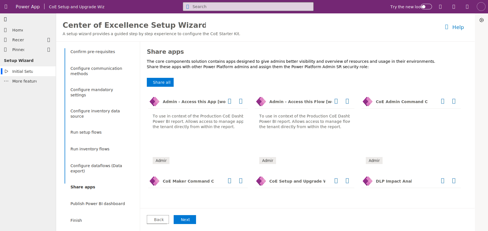](../media/share-apps.svg#lightbox)

### Publish Power BI dashboard

Instructions are provided to publish the Power BI dashboard. Review the instructions then press **Next** to continue.

> [!div class="mx-imgBorder"]
> [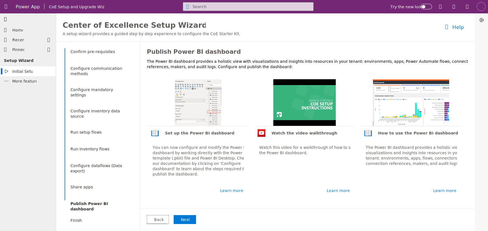](../media/publish-power-bi.svg#lightbox)

### Finish

Links are provided to provide more information about the features of the CoE Kit.

- What's in the Core components

- CoE Admin Command Center

- Explore more features

- Managed Environments overview

> [!div class="mx-imgBorder"]
> [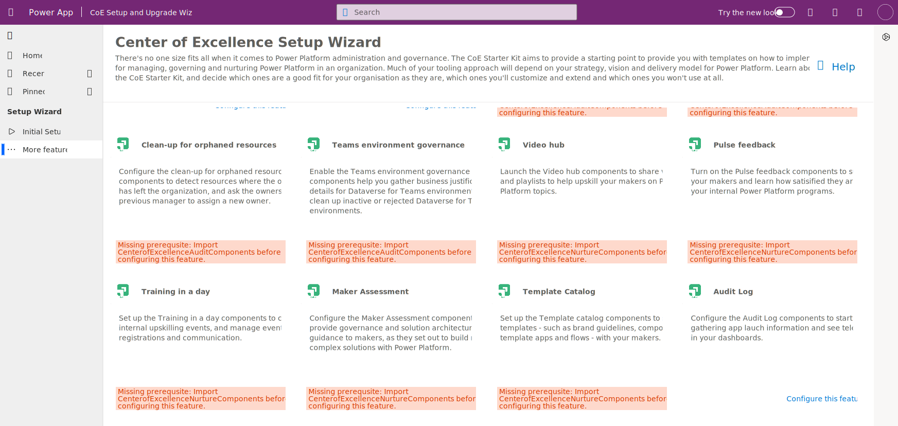](../media/more-features.svg#lightbox)
