The Audit Log Sync flow connects to the Microsoft 365 audit log to gather data such as unique users and launches for apps. The flow uses a custom connector to connect to the audit log. In the following instructions, you set up the custom connector and configure the flow.

> [!NOTE]
> The Center of Excellence (CoE) Starter Kit works without this flow, but the usage information in the Power BI dashboard is blank.

## Before you use the audit log connector

Before using the audit log connector, you need to meet the following prerequisites:

- Microsoft 365 audit log search must be turned on for the audit log connector to work. For more information, see [Turn audit log search on or off.](/purview/audit-log-enable-disable?azure-portal=true&preserve-view=true&view=o365-worldwide)

- Your tenant must have a subscription that supports unified audit logging. For more information, see [Microsoft 365 guidance for security & compliance](/office365/servicedescriptions/microsoft-365-service-descriptions/microsoft-365-tenantlevel-services-licensing-guidance/microsoft-365-security-compliance-licensing-guidance/?azure-portal=true).

- A global admin is required to configure the Microsoft Entra app registration.

The Office 365 Management APIs use Microsoft Entra ID to provide authentication services that you can use to grant rights for your application to access them.

## Create a Microsoft Entra app registration for the Office 365 Management API

Using these steps, you can set up a Microsoft Entra app registration for an HTTP call in a Power Automate flow to connect to the audit log. For more information, see [Get started with Office 365 Management APIs](/office/office-365-management-api/get-started-with-office-365-management-apis/?azure-portal=true).

1. Sign in to [portal.azure.com](https://portal.azure.com/?azure-portal=true).

1. Go to Microsoft Entra ID, and then search for and select **App registrations**.

   > [!div class="mx-imgBorder"]
   > [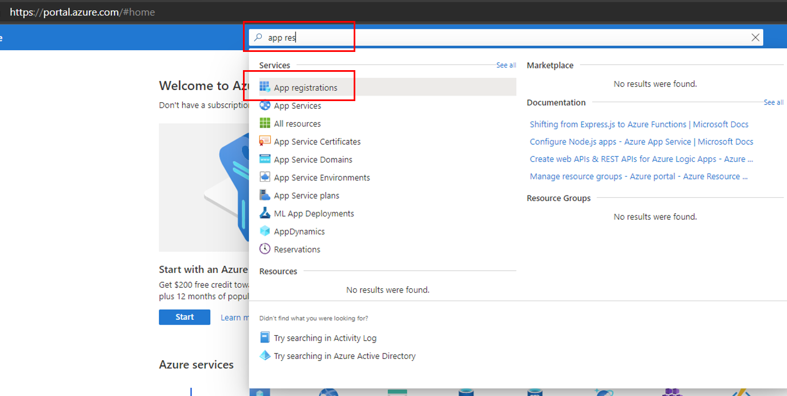](../media/azure-app-registeration-ssm.png#lightbox)

1. Select **New Registration**.

1. Enter a name (such as **Microsoft 365 Management**), but don't change any other setting. Select **Register**.

   > [!div class="mx-imgBorder"]
   > [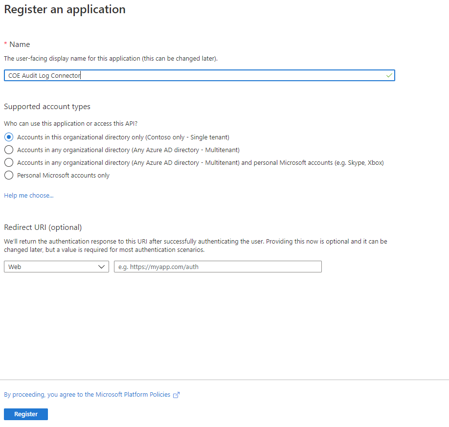](../media/new-app-register-ss.png#lightbox)

1. Select **API permissions > Add a permission**.

   > [!div class="mx-imgBorder"]
   > [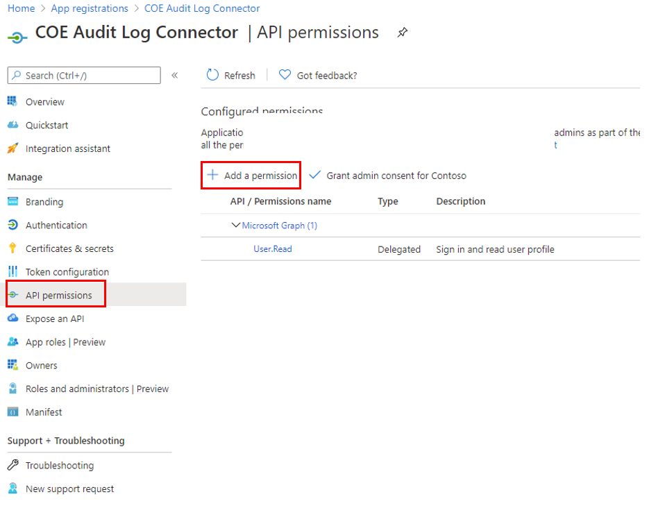](../media/app-api-permission-ssm.png#lightbox)

1. Select **Office 365 Management APIs** and then configure permissions as follows:

    a. Select **Delegated permissions** and then select **ActivityFeed.Read**.

   > [!div class="mx-imgBorder"]
   > [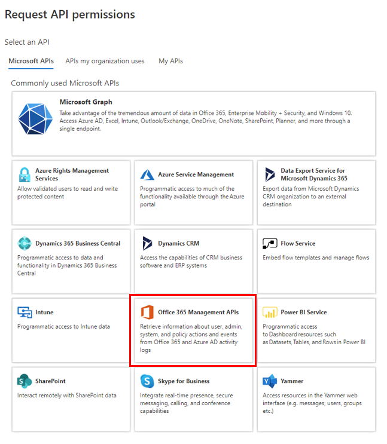](../media/office-365-management-api-ssm.png#lightbox)

   b. Select **Application permissions** and then select **ActivityFeed.Read** and **ServiceHealth.Read**.

   > [!div class="mx-imgBorder"]
   > [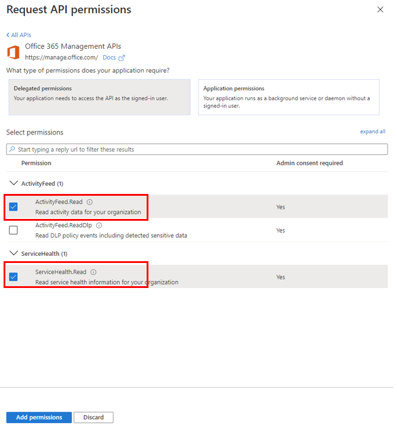](../media/request-api-permissions-ssm.png#lightbox)

   c. Select **Add permissions**.

1. Select **Grant admin consent for (your organization)**.

    The API permissions now reflect delegated ActivityFeed.Read and application ActivityFeed.Read and ServiceHealth.Read permissions, with a status of **Granted for (your organization)**.

   > [!div class="mx-imgBorder"]
   > [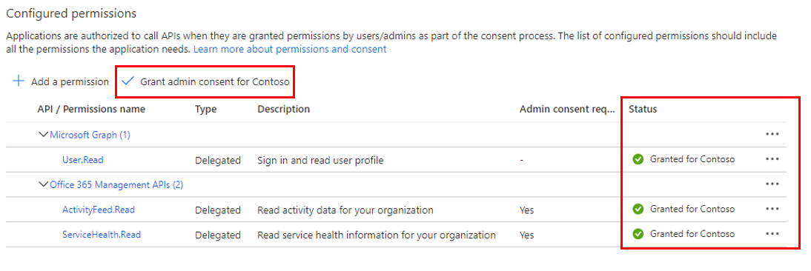](../media/request-api-permissions-2-ssm.png#lightbox)

1. Select **Certificates & secrets**.

1. Select **New client secret**.

   > [!div class="mx-imgBorder"]
   > [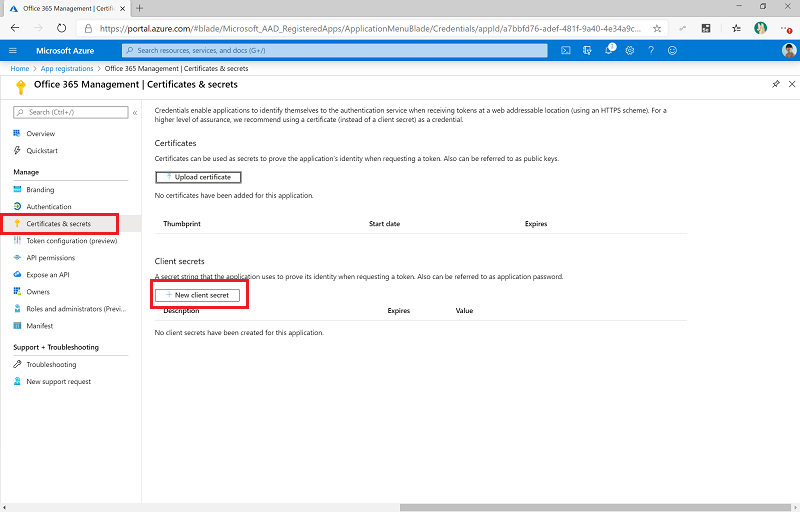](../media/client-secret-ssm.png#lightbox)

1. Add a description and expiration (in line with your organization's policies), and then select **Add**.

1. Copy and paste the secret to a text document in Windows Notepad for now.

1. Select **Overview** and then copy and paste the application (client) ID to a text document.

### Update environment variables

Environment variables are used to store the Client ID and secret for the app registration. They also store the audience and authority service endpoints depending on your cloud (commercial, GCC, GCC High, DoD) for the HTTP action. Update the environment variables before turning on the flows.

> [!NOTE]
> You can store the client secret either in plain text in the **Audit Logs - Client Secret** environment variable, or you can store the client secret in Azure Key Vault and reference it in the **Audit Logs - Client Azure Secret** environment variable. These steps outline using a client secret, although Azure Key Vault is the recommended Microsoft method.

1. Go to [Power Apps](https://make.powerapps.com/?azure-portal=true).

1. Go to **Solutions**.

1. Select to the **All** tab and select the **Center of Excellence - Core Components** solution to open it.

1. Select **Apps** from the left hand menu and play the **CoE Admin Command Center** app.

1. Select **Environment Variables** from the left hand menu of the app.

   > [!div class="mx-imgBorder"]
   > [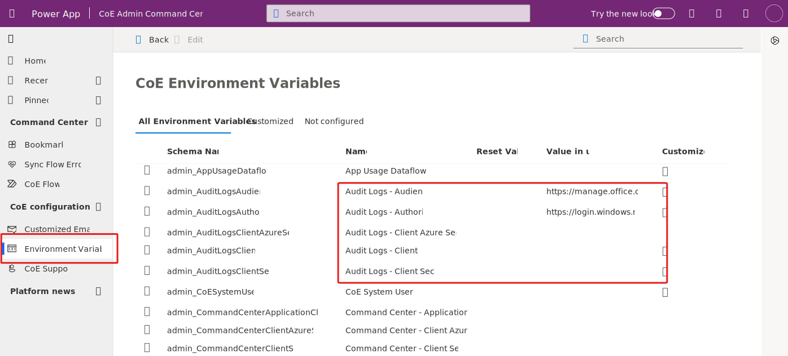](../media/command-app.svg#lightbox)

1. Find the **Audit Logs - Audience** environment variable and make sure the value matches the audience service endpoint for your cloud type.

    You can find the audience values for your cloud type in the table below. If the value doesn't match your cloud type, select the row in the Command Center app and select **Edit** from the command bar.

1. Enter the secret value that was copied from the previous section.

1. Find the **Audit Logs - Authority** environment variable and make sure the value matches the authority service endpoint for your cloud type.

   You can find the authority values for your cloud type in the table below. If the value doesn't match your cloud type, select the row in the Command Center app and select **Edit** from the command bar.

1. Find the **Audit Logs - Client ID** environment variable and enter the client ID that was copied from the previous section.

   > [!div class="mx-imgBorder"]
   > [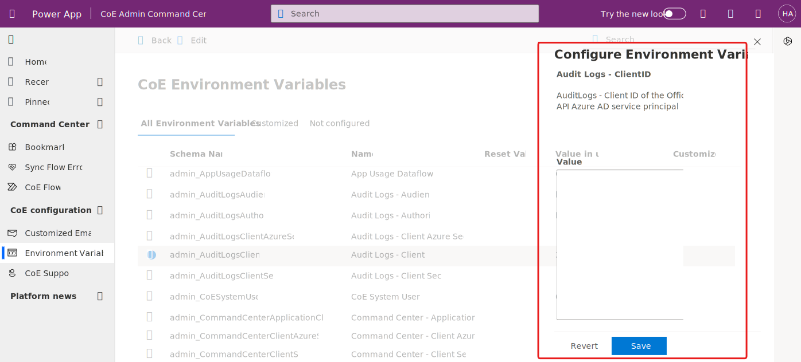](../media/editing-environment-variable.svg#lightbox)

1. Find the **Audit Logs - Client Secret** variable and enter the Client Secret that was copied from the previous section.

   > [!NOTE]
   > The flow using this environment variable is configured with a condition to expect either the **Audit Logs - Client Secret** or the **Audit Logs - Client Azure Secret** environment variable. It is not necessary to edit the flow to work with Azure Key Vault.

| Name | Description | Value |
|------|-------------|-------|
| Audit Logs - Audience | The audience parameter for the HTTP calls. | Commercial (Default): `https://manage.office.com`    GCC: `https://manage-gcc.office.com`    GCC High: `https://manage.office365.us`   DoD: `https://manage.protection.apps.mil`  |
| Audit Logs - Authority | The authority field in the HTTP calls. | Commercial (Default): `https://login.windows.net`    GCC: `https://login.windows.net`   GCC High: `https://login.microsoftonline.us`   DoD: `https://login.microsoftonline.us` |
| Audit Logs - ClientID | App registration Client ID. | The application client ID from the Create a Microsoft Entra app registration for the Office 365 Management API step. |
| Audit Logs - Client Secret | App registration client secret in plain text. | The application client secret from the Create a Microsoft Entra app registration for the Office 365 Management API step. Leave empty if you're using Azure Key Vault to store your client ID and secret.  |
| Audit Logs - Client Azure Secret | Azure Key Vault reference of the App registration client secret. | The Azure Key Vault reference for the application client secret from the Create a Microsoft Entra app registration  for the Office 365 Management API step. Leave empty if you're storing your client ID in plain text in the  Audit Logs - Client Secret environment variable. This variable expects the Azure Key Vault reference, not the secret. Learn more: Use Azure Key Vault secrets in environment variables |

### Start a subscription to audit log content

1. Go to [PowerApps](https://make.powerapps.com/?azure-portal=true)

1. Select **Solutions** from the left hand menu.

1. Select the **All** Tab to see all the solutions.

1. Open the **Center of Excellence – Core Components** solution.

1. Turn on the **Admin | Audit Logs | Office 365 Management API Subscription** flow and run it, enter **start** as the operation to run.

   > [!div class="mx-imgBorder"]
   > [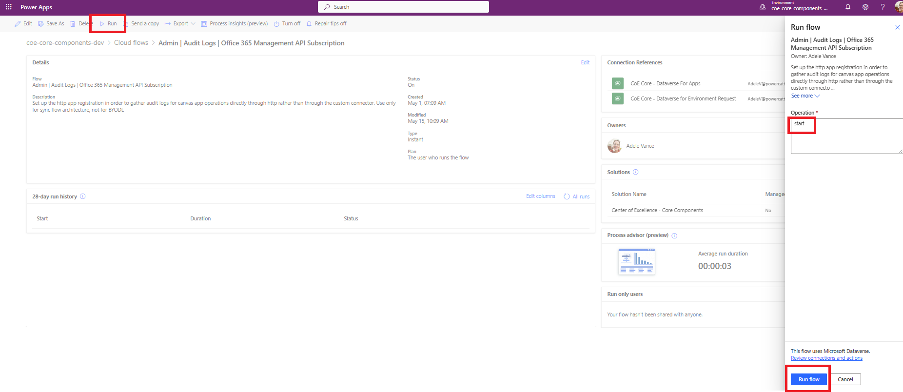](../media/start-subscription-ssm.png#lightbox)

1. Open the flow and verify that the action to start the subscription passes.

   > [!div class="mx-imgBorder"]
   > [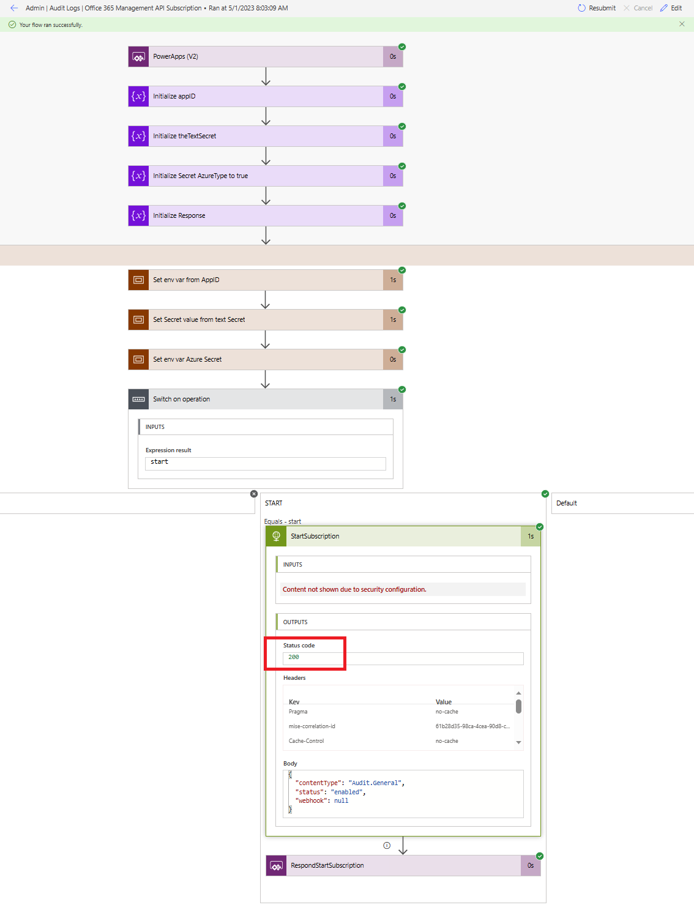](../media/status-code.png#lightbox)

> [!IMPORTANT]
> If you have previously enabled the subscription, you will see a *(400) The subscription is already enabled*  message. This means the subscription has successfully been enabled in the past. You can ignore this error and continue with the setup. If you don't see the above message or a (200) response, the request may have failed. There could be an error with your setup that's keeping the flow from working. Common issues to check are:
>
> - Are audit logs enabled, and do you have permission to view the audit logs? Check by seeing if you can search in Microsoft Compliance Manager.
> - Have you enabled the audit log very recently? If so, try again in a few minutes, to give the audit log time to activate.
> - Validate that you correctly followed the steps in Microsoft Entra app registration.

Validate that you correctly updated the environment variables for these flows.

### Turn on flows

1. Go to [make.powerapps.com](https://make.powerapps.com/?azure-portal=true).

1. Select the **All** tab to see all the solutions.

1. Open the **Center of Excellence – Core Components** solution.

1. Turn on the **Admin | Audit Logs | Sync Audit Logs (V2)** flow. This flow runs on an hourly schedule, and collects audit log events into the Audit Log table.
