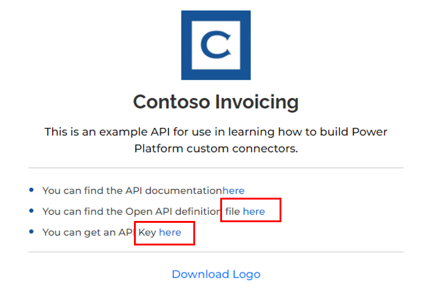
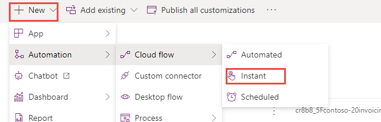
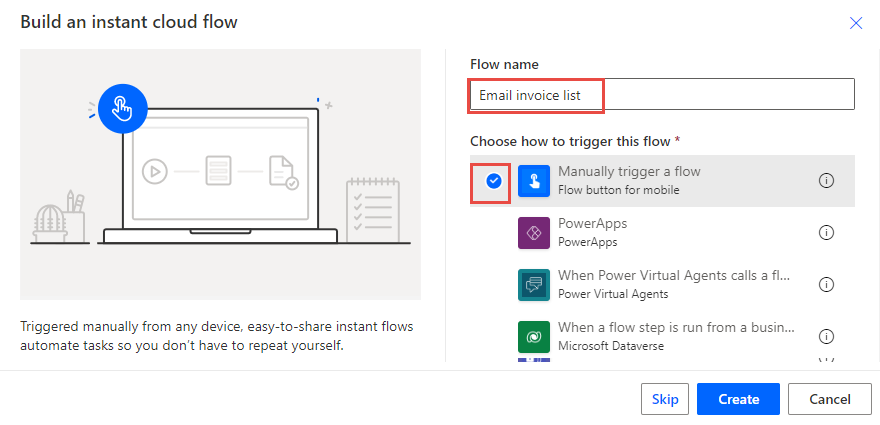
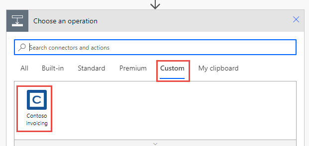
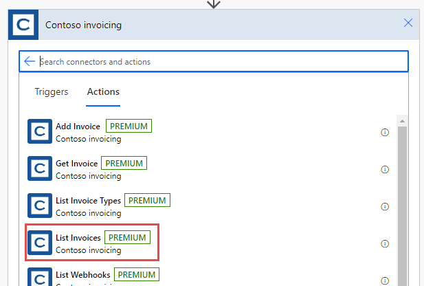
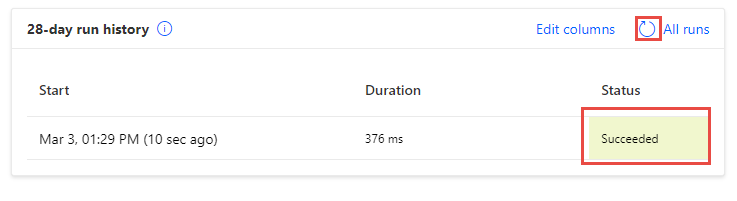
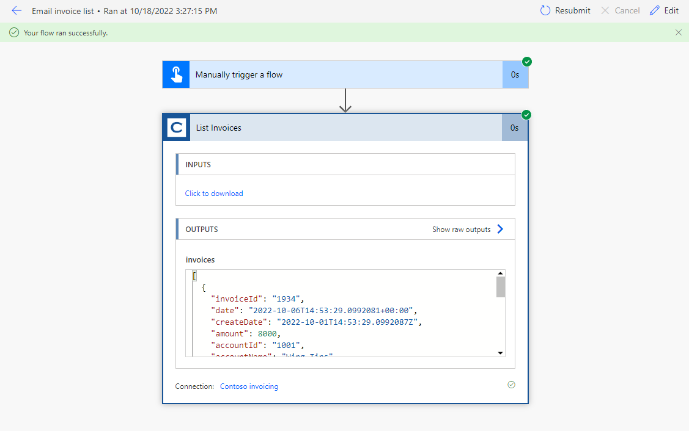

In this exercise, you'll create a manually triggered Power Automate cloud flow that will use the Contoso invoicing custom connector that you created in the previous exercise in this module.

> [!IMPORTANT]
> Complete the **Exercise: Create a new connector in a solution** unit before starting this exercise.

### Task 1: Create a Power Automate cloud flow

In this task, you'll create a Power Automate flow inside the Contoso invoicing solution that you previously created.

1. Get an API key from [Contoso Invoicing](https://contosoinvoicing.azurewebsites.net/?azure-portal=true).

    > [!div class="mx-imgBorder"]
    > [

1. Select the **API Key** link.

1. Copy and save your API key because you'll need it later.

    > [!NOTE]
    > If you still have the API key that you previously used, it would still be usable at this time. If not, you can get a new one.

1. Go to [Microsoft Power Platform maker portal](https://make.powerapps.com/) and select the environment that you used in the **Exercise: Create a new connector in a solution** unit.

1. Select **Solutions** and then select to open the **Contoso invoicing** solution.

1. Select **+ New > Automation > Cloud flow > Instant**.

    > [!div class="mx-imgBorder"]
    > 

1. Name the flow **Email invoice list**, select **Manually trigger a flow**, then **Create**.

    > [!div class="mx-imgBorder"]
    > 

1. Select **+ New step**.

1. Select the **Custom** tab and then select the **Contoso invoicing** custom connector. Using the **Custom** tab to locate custom connectors is the fastest way to find them.

    > [!div class="mx-imgBorder"]
    > 

1. Select **List invoices** for the action.

    > [!div class="mx-imgBorder"]
    > 

    > [!IMPORTANT]
    > Leave the *List Invoices** fields blank. This will allow us to pull all the information.

1. Enter **Invoice connection** as Connection name.

12. Paste your API Key. and select **Create**

14. Select **Flow check** to confirm there are no mistakes.

1. Select **Save**.

1. Select the arrow button located next to the flow name.

1. Select **OK** if prompted.

1. Don't navigate away from this page.

### Task 2: Test the cloud flow

In this task, you'll test the cloud flow that you created in **Task 1: Create a Power Automate cloud flow**.

1. Open the **Email invoice list** cloud flow if not already open.

2. Select **Run**.

1. Select **Continue**.

1. Select **Run flow**.

1. Select **Done**.

1. Refresh the run history.

   The flow run should succeed.

   > [!div class="mx-imgBorder"]
   > 

   > [!div class="mx-imgBorder"]
   > 
