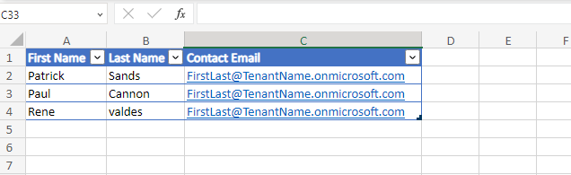
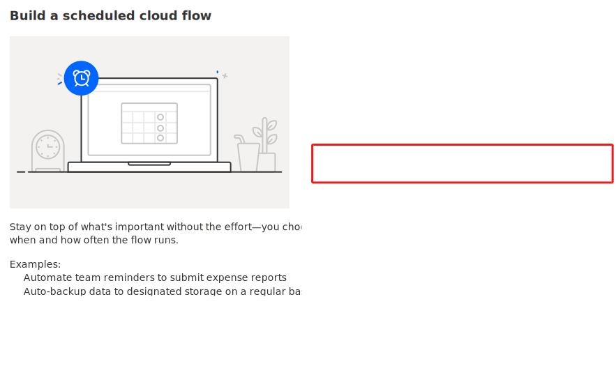
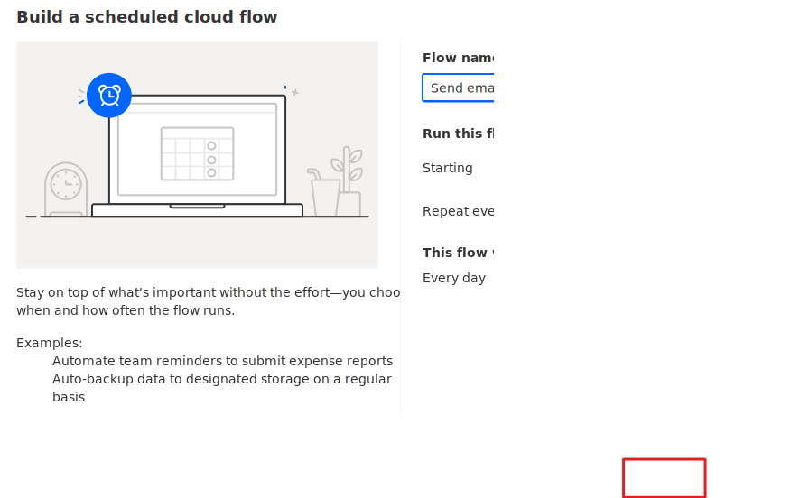
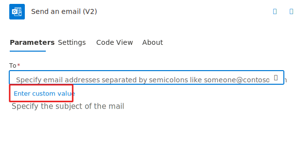
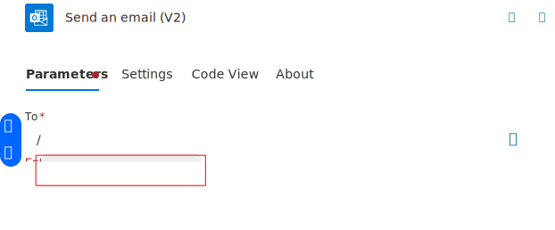
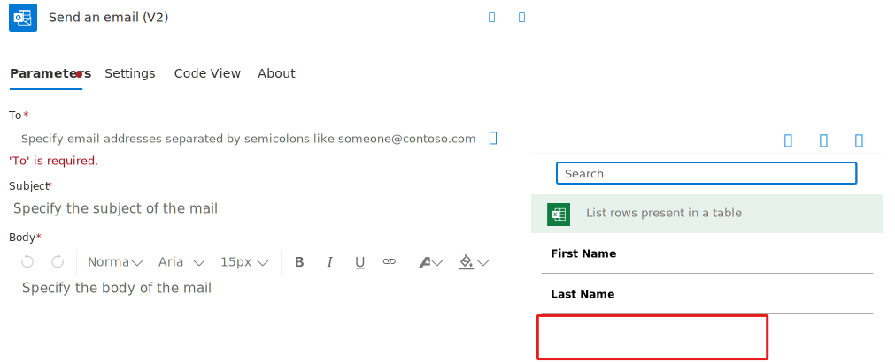
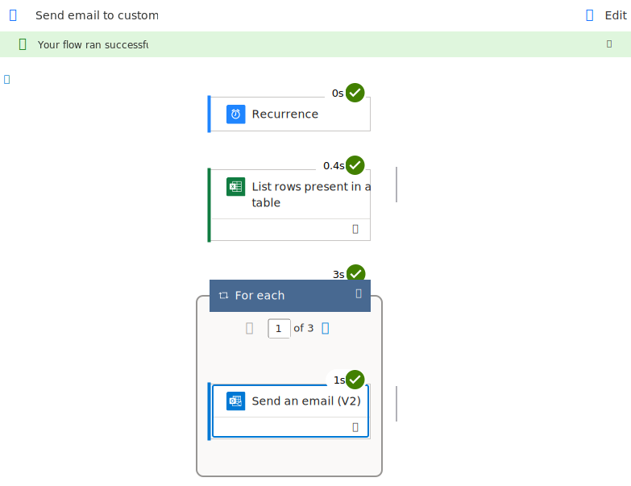

In this unit, you'll learn how to build prescheduled flows by using a trigger called *recurrence*. Contoso has an annual event and they receive phone calls inquiring on the details. The Contoso team answering the phone calls places the contact information in a Microsoft Excel workbook on Microsoft OneDrive. You'll build a flow for the Contoso event team that automatically pulls customer email addresses from a Microsoft Excel workbook on Microsoft OneDrive. You'll then set up the flow so that any email addresses that anyone adds to the workbook will receive an event information email once a day.

## Prerequisites

For this scenario, you’ll need to make an Excel file with a table that contains the following columns: ContactEmail, FirstName, and LastName. Save the Excel file in OneDrive for Business. You'll connect to this file in step 9. Use your organization email address as the ContactEmail, using your email will make testing the flow easier.

> [!NOTE] 
> Be sure to format your Excel data as a table. This is the table referenced in step 11.

Here’s what the Excel table looks like:

## Create a scheduled flow

1. Sign in to [Power Automate](https://make.powerautomate.com/) by using your organizational account.

1. Select the correct environment.

1. Select **My flows**.

1. Select **New**, and then select **Scheduled cloud flow**.

    By default you have the option to repeat every 1 minute, however, you have the option to change it and the options available are **Minute**, **Week**, **Day**, **Hour** and **Second**.

    > [!NOTE]
    > Be mindful of the repeating module you select and how often you would like the flows to run.
  
      

      

1. Name your flow and under **Run this flow** set the flow to repeat every one Day.

1. Select **Create**.

    

1. Select the **Insert a new step** button and then select **Add an action**.

    

1. In the search field, enter *excel*, select the **Excel Online (Business) List rows present in a table** action.

1. Select **Sign in** and sign in with your organization credentials, if prompted.

1. In the **Location** field, select the drop-down arrow and select **OneDrive for Business**.

1. In the **Document Library** field, select the drop-down arrow and select **OneDrive**.

1. In the **File name** field, select the folder button, and then select the Excel file to use.

1. In the **Table name** box, select the drop-down arrow, and then browse to and select the worksheet to use.

    

1. Select the **Insert a new step** button and then select **Add an action**.

1. Search for Office 365 send and email and select **Office 365 Send an email (V2)**.

1. Select the To field and then select **Enter custom value**.

    

1. Type / and then select **Insert Dynamic Content**.

    > [!div class="mx-imgBorder"]
    > 

1. Select **Contact Email**.

    > [!div class="mx-imgBorder"]
    > 

    Your **Send an email** action will automatically be added inside a **For each**. This occurred because multiple emails need to be sent.

    > [!div class="mx-imgBorder"]
    > 

1. Enter **Contoso Event Information** for Subject.

1. Type **Dear** in the Body and then type /, and select the **Insert Dynamic Content button**.

    > [!div class="mx-imgBorder"]
    > 

1. Select **First Name** from the dynamic content pane.

1. Press **ENTER** and then type *Thank you for your interest in Contoso's annual event. As information becomes available, you'll be the first to know!*

1. The Send an email step should now look like the image below.

    > [!div class="mx-imgBorder"]
    > 

1. Select **Save** and wait for the flow to be saved.

1. Your cloud flow should now look like the image below. Select **Test**.

    > [!div class="mx-imgBorder"]
    > 

1. Select **Manually** and then select the **Test** button.

1. Select **Run flow**.

1. Select **Done**.

1. The flow should run successfully.

    > [!div class="mx-imgBorder"]
    > 

1. You should receive and email like to one below.

    > [!div class="mx-imgBorder"]
    > 

And there you have it!

This flow will now run once a day. It will:

- Get the new rows from the Excel worksheet

- Grab the email address and name from each row

- Enter the email address and name in the email step, and send them an event information email

- Save you from manually composing emails to each interested caller.
