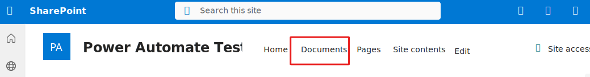
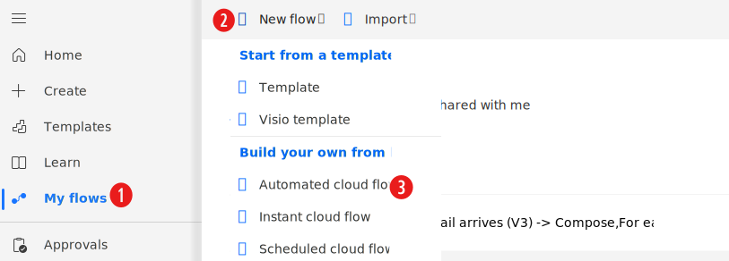
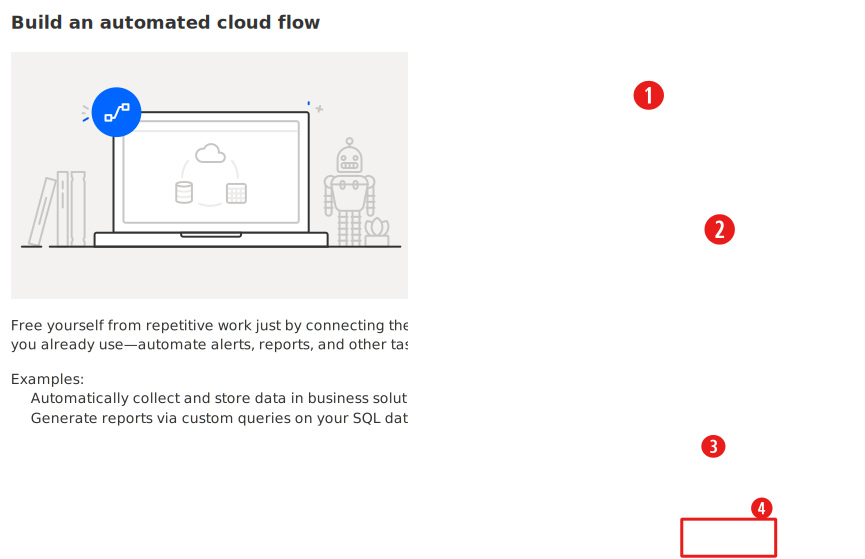
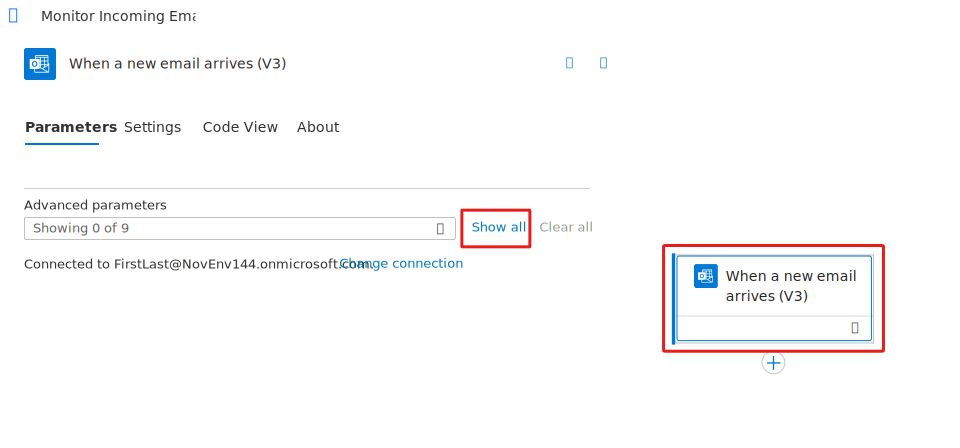
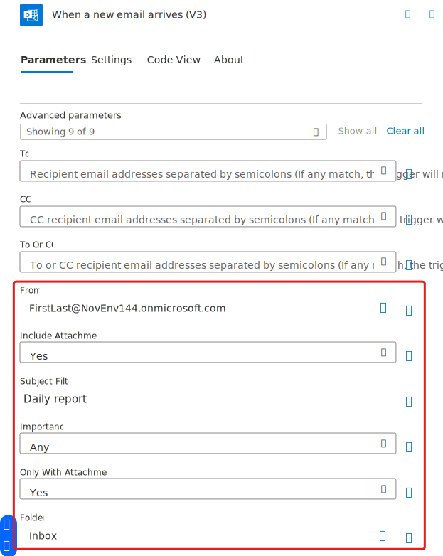
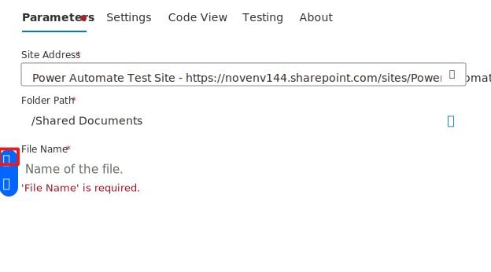
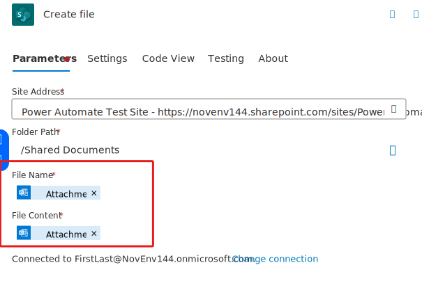

You can create a flow that automatically performs one or more actions after it's triggered by an event. For example, the flow can monitor your Outlook inbox and when an email with a specific subject line and email address arrives, the flow will take the attachment and save it to a SharePoint library.

## Prerequisites

Microsoft Office 365

## Specify the SharePoint site and library
You can use any SharePoint site of your choice and can also use an existing library.

In this scenario, we'll use the following SharePoint site and its default **Documents** library, which is available out-of-box.

## Specify an event to start the flow

First, you must select the trigger (event) that starts the flow.

1. Sign in to [Power Automate](https://flow.microsoft.com) by using your organizational account.

1. Select **My flows**.

1. Select **New flow**, and then select **Automated cloud flow**.

    

1. Under **Choose your flow's trigger**, enter *Outlook*, select the **When a new email arrives (V3)** trigger and select **Create**.

    

1. Select the trigger and then select the **Show all** button.

    

1. Add the following:

    **From** -  'your org email'

    **Include Attachments** - 'Yes'

    **Subject Filter** - 'Daily report'

    **Importance** - 'Any'

    **Only with Attachments** - 'Yes'

    **Folder** - 'Inbox'

    

## Specify an action

1. Select **Insert a new step** and select **Add an action**.

1. Search for *create file*, and then select the **SharePoint create file** action.

    

1. For **Folder Path** select **/Shared Documents**
 
1. Select the **File Name** field and then select the **Enter data from previous step** button.

    

1. Select **Attachments Name** from **Dynamic Content**.

    

1. Select the **File Content** field and then select the **Enter data from previous step** button.

1. Select **Attachments Content** from **Dynamic Content**

    

1. Once the **Attachments Name** is added the **Create file** action is automatically added in an **Apply to each**. This will take care of scenarios when an email comes in with multiple attachments.

    

You have successfully built a **Power Automate** flow, which will monitor your **Outlook** inbox for any emails that have the text **Daily report** in their **Subject line** and have **Attachments**.