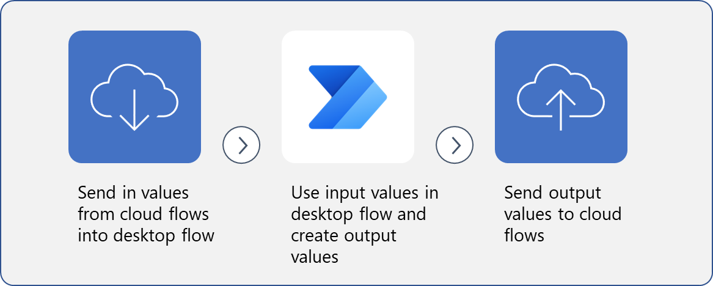

An important step to effectively automate desktop actions is to define the action and then the action's inputs and outputs. Input variables include data that's entered into the flow before or during the run, and output variables allow you to move data from other platforms to the Microsoft Power Automate Desktop or vice versa. Understanding how to define input and output variables and how to alter them will help you take advantage of desktop flows for automating repetitive tasks.

> 
**The process uses variables to put values into desktop flows, use them, and then send values out of flows to apps and cloud flows.**

> [!NOTE]
> This module builds on the [Build your first Power Automate desktop flow](/training/modules/build-first-desktop-flow/?azure-portal=true) module, where you recorded Power Automate for desktop actions. In this module, you'll build on the **Invoicing** flow in the **Define an input variable** unit.

In this module, you'll:

- Learn how to create a desktop flow with predefined inputs.

- Record actions that are performed in the Contoso invoicing desktop application by using your predefined inputs and capturing application data for output.

- Perform a test run of a new desktop flow with a new set of inputs.

If you don't already have a desktop flow from which you can set inputs and outputs, refer to the module on creating your first Power Automate for desktop flow.
