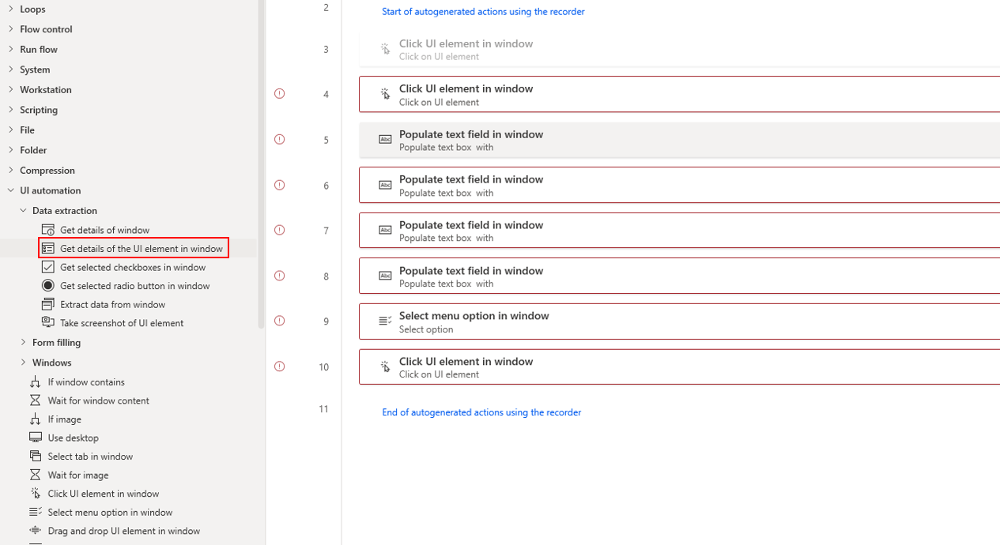
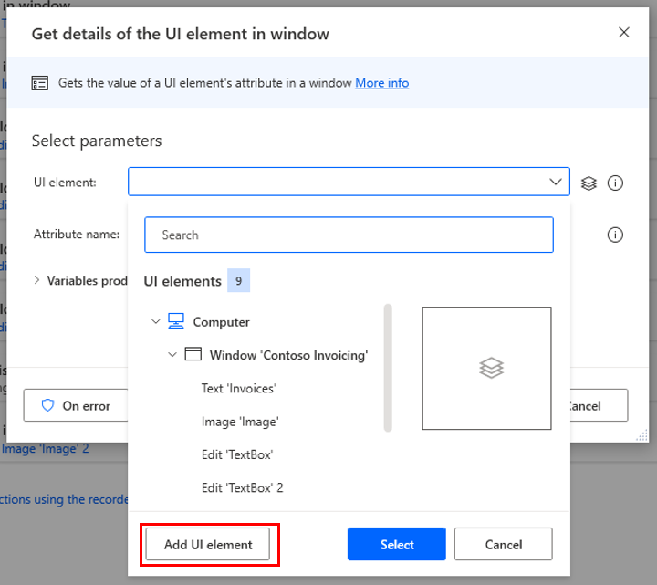
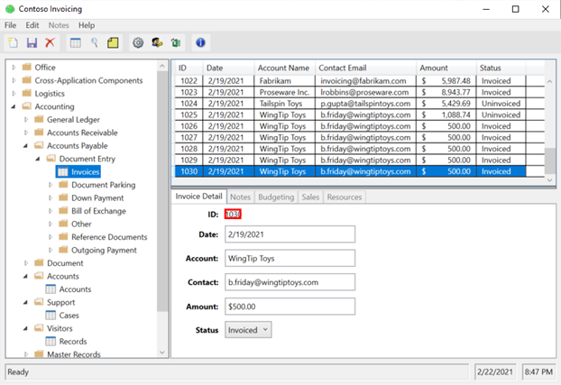
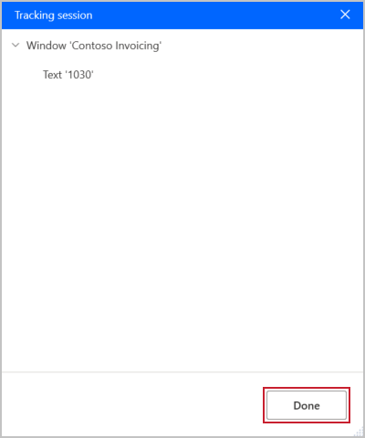
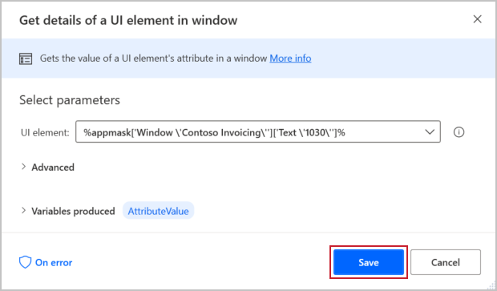
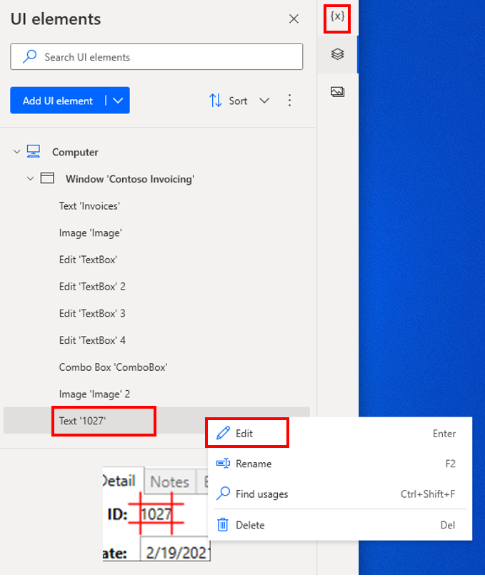
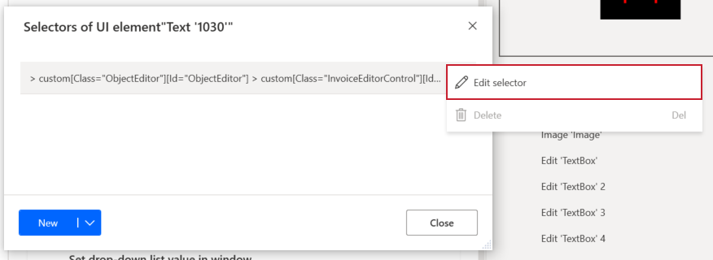
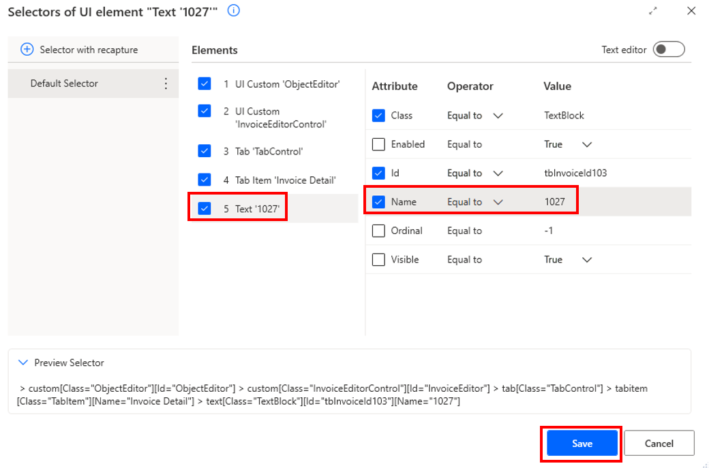
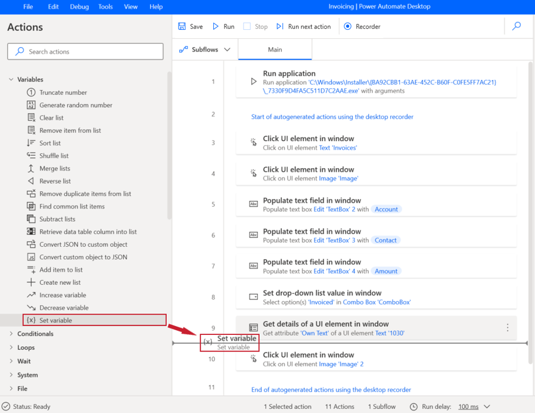
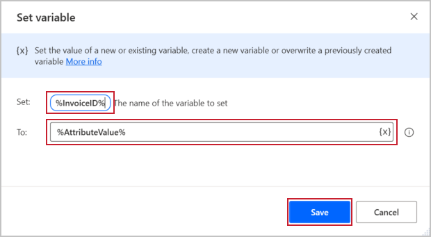

Now, you can set an output variable by using a UI element. The UI element will give you a value, but you’ll need to store it somewhere to use it later, which is what the output variable is for. 

The input variables already had associated steps, but it's difficult to define an output variable when you're recording actions because the goal is to get information rather than do an action, such as selecting. A new action within the process is required to set an output variable.

Watch the following demo video of the steps that you'll complete in this unit.

 > [!VIDEO https://www.microsoft.com/videoplayer/embed/RE5cV2N]

Ensure that the desktop application that's relevant to your flow is running during this process. On the Actions Pane, expand **UI automation** and **Data extraction**. Select and drag **Get details of the UI element in window** to the appropriate step in your flow (for the Contoso Invoicing flow, this placement will be between steps 8 and 9).

> [!div class="mx-imgBorder"]
> 

In the next dialog, select expand the **UI element** dropdown menu and then select **Add UI element**.

> [!div class="mx-imgBorder"]
> 

The Power Automate designer will minimize, revealing your desktop application and a small window that contains your tracking session. Unlike when you record actions, the tracking session is looking for you to select an element to capture. You can take actions without affecting the tracking session. To choose the element, hover your cursor over it until you see a red border, hold down the **Ctrl** key, and then select the element (in this case **Invoice ID**) to record it in the tracking session.

> [!div class="mx-imgBorder"]
> 

When the selected element displays in the **Tracking session** window, select **Done**.

> [!div class="mx-imgBorder"]
> 

The **Tracking session** window will hide, leaving the Power Automate designer and the edit dialog for the **Get details of a UI element in window** dialog. Select **Save**.

> [!div class="mx-imgBorder"]
> 

This action will automatically create a variable called AttributeValue as an output that you can refer to in later actions within Power Automate for desktop.

When you retrieved the element (**Invoice ID**) from the application, a specific value was returned based on a new invoice that was being created. To ensure that your value can be dynamic, you'll need to complete a few more steps.

Select the stacked paper icon on the right side of your screen. Find the element that you selected. The element should start with **Text**, and the text that you added should be encased in single quotation marks, as shown in the following screenshot. Select the ellipsis (**...**) and, in the menu, select **Edit**.

> [!div class="mx-imgBorder"]
> 

In the next dialog, if you hover your cursor over the text, the ellipsis (**...**) will show. Select the ellipsis and then select **Edit selector**.

> [!div class="mx-imgBorder"]
> 

Select the element that you want to edit and then ensure that the **Name Equal to 1030** (or your text) isn't selected. This factor allows the value to be dynamic instead of static. Select **Update** and then close the **Edit selector** dialog.

> [!div class="mx-imgBorder"]
> 

Now that you're gathering a dynamic UI element, you can set the output variable. On the Actions Pane, expand **Variables** and then select and drag **Set variable** after the **Get details of a UI element in window** step.

> [!div class="mx-imgBorder"]
> 

You can now set the output variable that you defined in the previous unit. Setting the output variable will allow you to use it in downstream processes, such as a cloud flow. To set the variable, put the variable name between two percentage symbols: **%InvoiceID%**. You can fill in the **To** field in a similar manner or by using the **{x}** button. Select **Save**.

> [!div class="mx-imgBorder"]
> 

If you forget the names of your variables, you can always view them by selecting **{x}** in the upper-right corner of Power Automate designer.

You now know how to define and set the input and output variables. These variables will allow you to make your desktop flows more powerful and dynamic.

**Save** and **Run** your flow to see your work in action.
