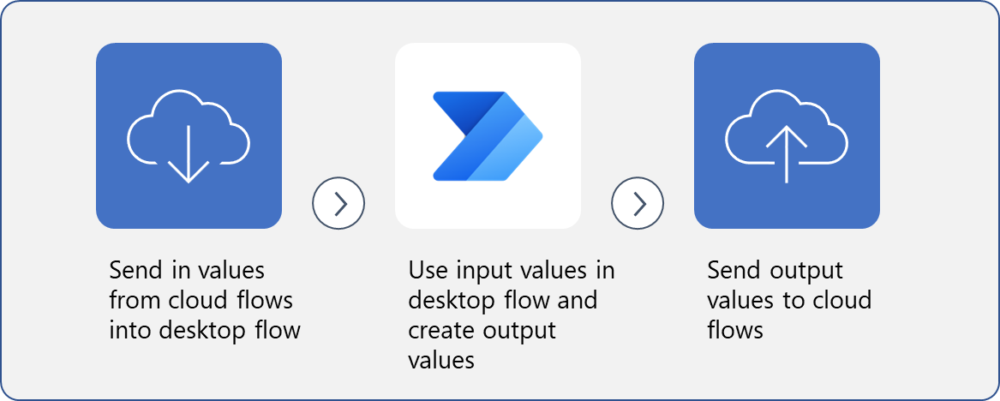

An important step to effectively automate desktop actions is to define the action and then the action's inputs and outputs. Input variables include data that's entered into the flow before or during the run, and output variables are defined along the process of the flow. Understanding how to define input and output variables and how to alter them will help you take advantage of desktop flows for automating repetitive tasks.

> 
**The process uses variables to put values into desktop flows, use them, and send values out of flows to apps and cloud flows**.

In this module, you've learned how to:

- Create a desktop flow with predefined inputs.

- Record actions that are performed in the desktop-based Contoso invoicing application by using these inputs and capturing application data for output.

- Perform a test run of a new desktop flow with a new set of inputs.

## Key takeaways

The key takeaways for this module are:

- Input variables allow you to feed information into your desktop flow.

- Output variables allow you to collect information from within your desktop flow to use later.

- Adding UI elements and setting variables will create exponential value for your desktop flows.
