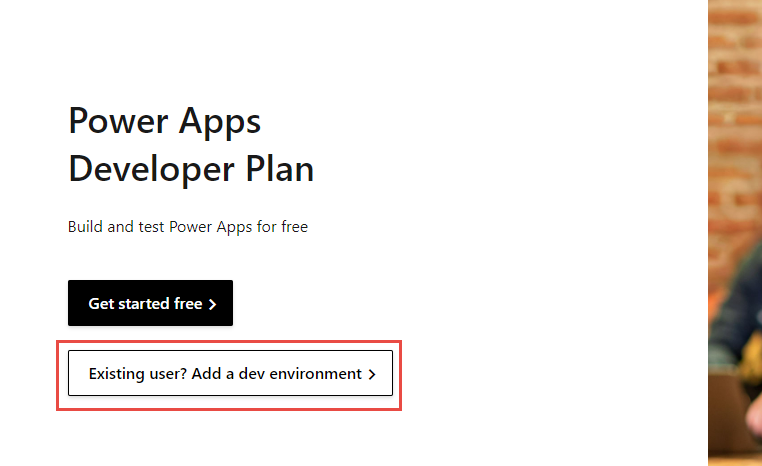
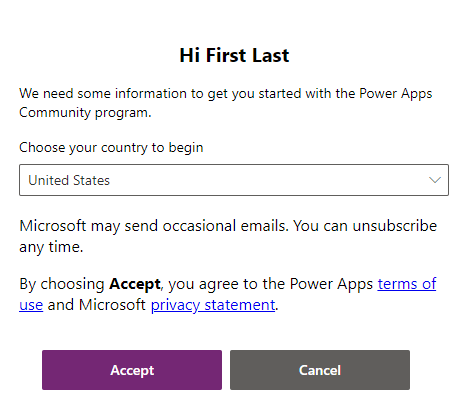

Skip this task if you already have a Power Apps trial environment.

1.  Go to [https://make.powerapps.com/](https://make.powerapps.com/?azure-portal=true) and make sure that you're signed in.

1.  Go to [Power Apps Developer Plan](https://powerapps.microsoft.com/developerplan/?azure-portal=true) and select **Existing user? Add a dev environment**.

	> [!div class="mx-imgBorder"]
	> 

1.  Select your region and then select **Accept**.

	> [!div class="mx-imgBorder"]
	> 

1.  You'll be redirected to the maker portal. Wait a few minutes for the environment setup to complete.

1.  Select the environment name. The new dev environment should display. Select the dev environment.

	> [!div class="mx-imgBorder"]
	> 
