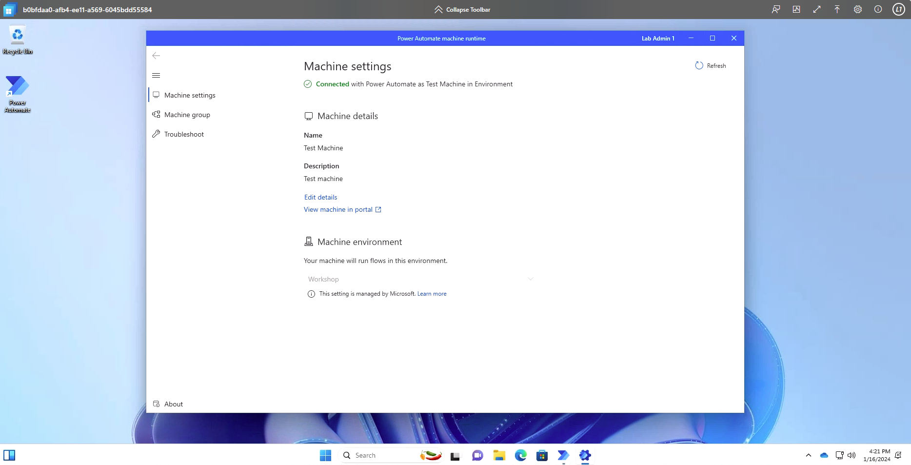

This optional task is to create a hosted machine with Power Automate. Hosted machines allow you to build, test, and run attended and unattended desktop flows without providing or setting up any physical machines.

## Licensing requirements

To use hosted machines, you need the following licensing options:

- Use your existing Power Automate Premium plan (previously Power Automate per user plan with attended RPA) or Power Automate Process plan (previously Power Automate per flow)

- The Power Automate hosted RPA add-on

## Prerequisites

- Microsoft Entra ID

- A valid and working Intune and Microsoft Entra ID tenant

- Ensure that Intune device type enrollment restrictions are set to Allow Windows (MDM) platform for corporate enrollment

To find more information about the Microsoft Entra ID and Intune requirements, go to [Windows 365 requirements](/windows-365/enterprise/requirements?azure-portal=true#azure-active-directory-and-intune-requirements).

## Create a hosted machine

To create a hosted machine:

1. Sign in to [Power Automate](https://make.powerautomate.com/?azure-portal=true).

1. Navigate to **More** on the left navigation and select **Machines**.

1. Select **New** > **Hosted machine**.

1. In the **Create new hosted machine** wizard:

    1. Enter a name for your hosted machine and optionally add a description. Then select Next.

    1. Select the VM image to use for your hosted machine. A proposed default Windows 11 image called **Default Windows Desktop Image** is available.

    1. Alternatively, you can select a [custom VM image](/power-automate/desktop-flows/hosted-machines?azure-portal=true#use-custom-vm-images-for-your-hosted-machine) that is shared with your account.

    1. Optionally, select the [custom network connection](/power-automate/desktop-flows/hosted-machines?azure-portal=true#use-custom-vnet-for-your-hosted-machines) you want your hosted machine to be provisioned with Microsoft Entra ID. Otherwise, you automatically connect to the Microsoft Hosted Network

    1. Review and create your hosted machine.

    > [!div class="mx-imgBorder"]
    > 

    > [!NOTE]
    > The time needed to provision a hosted machine varies depending on the configuration of the hosted machine. It can take over 30 minutes for the machine to be ready for access.

# Access a hosted machine

1. Go to **Monitor** > **Machines**.

1. Select the **Machines** tab.

1. Select your hosted machine from the list of machines.

1. In the machine details page, you should observe the following details:

    - **Machine type**: Hosted Machine

    - **Connectivity status**: Connected

    > [!div class="mx-imgBorder"]
    > 

1. Select **Open in browser**.

1. A new tab in the browser should open and load the hosted machine access. Sign in with your work or school account.

    > [!NOTE]
    > Sign-in access is only available to the creator of the hosted machine.

1. The hosted machine is preregistered into the Power Automate environment.

    > [!div class="mx-imgBorder"]
    > 

1. The hosted machine is now ready for use.
