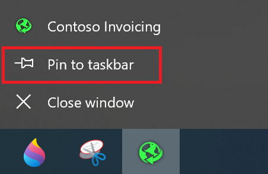
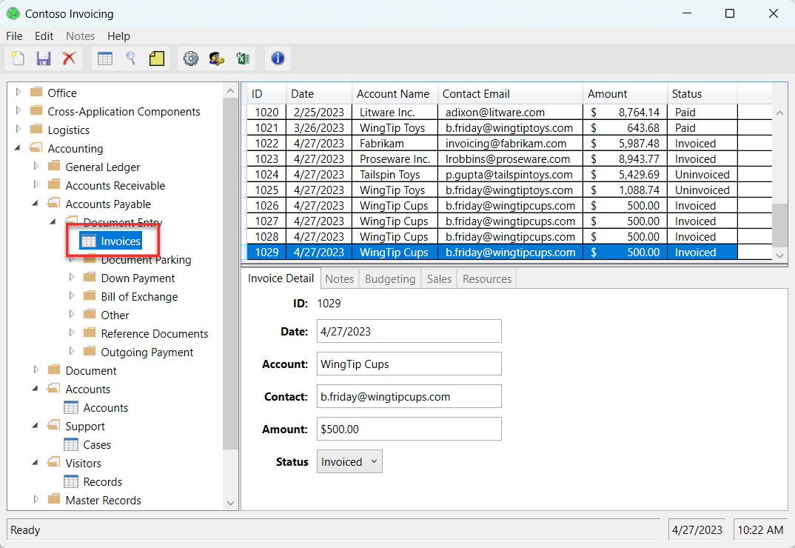
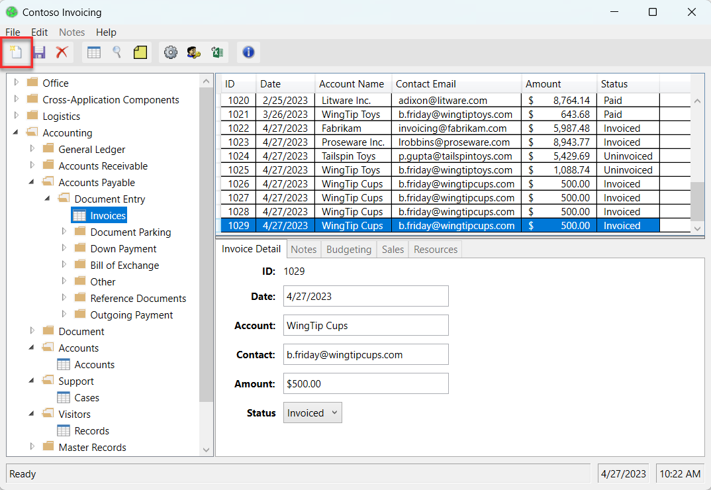
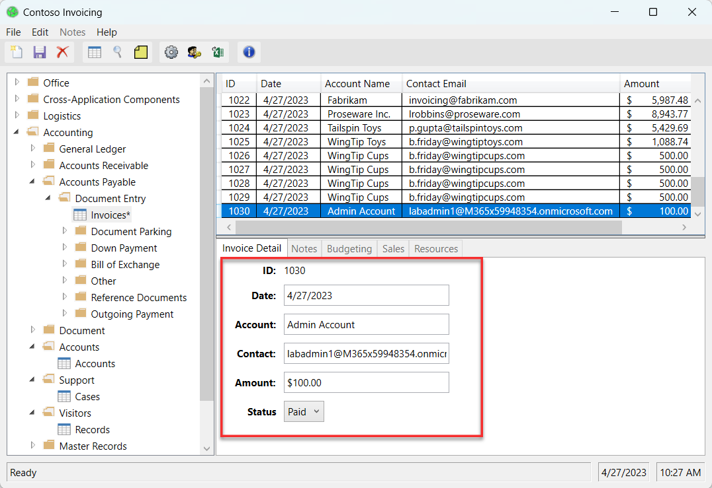
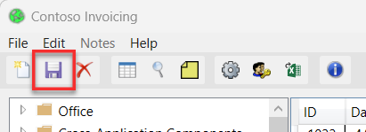

This lab uses a coffee shop company business scenario to demonstrate how to automate manual invoice processing steps by using Power Automate desktop flow and cloud flows. This coffee shop company uses a Win32 application to manually manage their invoice system. Your first task is to download and install this application to prepare for the lab.

> [!NOTE]
> To complete the exercises, you'll need to use a few
> files. Download the [Automation in a Day files](https://pahandsonlab.blob.core.windows.net/documents/AutomationIAD-Learn-student-files.zip)
> for use in this module. Extract the contents of this download to your local computer.

1. Download [**ContosoInvoicingSetup.exe** and **ContosoInvoicingSetup.msi**](https://pahandsonlab.blob.core.windows.net/documents/AutomationIAD-Learn-student-files.zip) from the **Prerequisite Lab #1 Install Contoso Coffee Shop Invoicing management app** folder from the downloaded files. Double-click the .exe file to install the **ContosoInvoicingSetup** application.

   > [!NOTE]
   > You'll need to select **More Information** and **Run it anyway** during the installation of the Contoso app *if* Windows Defender prompts that the app is coming from an untrusted source.

1. After the installation is fully complete, launch the **Contoso Invoicing app** from the **Start** menu by using the search bar in the lower part of your Windows desktop. Within the search bar, type **Contoso Invoicing**.

1. Right-click the app icon located in the lower task bar of your desktop and then select the option to **pin** the app icon to the **task bar** for quick launch. You use this app in subsequent labs, for the Process advisor and the robotic processing automation recordings.

   > [!div class="mx-imgBorder"]
   > 

   Next, you spend time getting familiar with the Contoso Invoicing app. These steps explore how the Contoso Coffee shop employee manually enters a new invoice record into the company application 
   system when a new invoice is received. This exercise helps you better prepare for the following lab exercises.

1. With the **Contoso Invoicing App** open, select **Invoices** from the left pane.

   > [!div class="mx-imgBorder"]
   > 

1. Select the **New record** icon from the ribbon in the upper-left corner of the screen to create a new invoice.

   > [!div class="mx-imgBorder"]
   > 

1. You can fill in any information for the new invoice in the text boxes that appear in the center of the screen. For this example, enter the following information:

   - **Date** - (Current date)

   - **Account** - Admin Account

   - **Contact** - (Email that you used to sign in to the accounts)

   - **Amount** - \$100.00

   - **Status** - Paid

   > [!div class="mx-imgBorder"]
   > 

1. Select the **Save** icon from the ribbon in the upper-left corner of the screen to save your new invoice.

   > [!div class="mx-imgBorder"]
   > 
