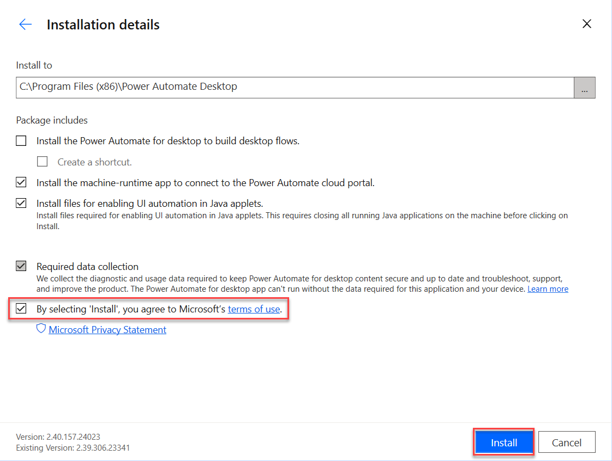

Your next task is to install the Power Automate for desktop app.

1. Go to [https://powerautomate.microsoft.com/](https://powerautomate.microsoft.com/?azure-portal=true) and sign in with the account that you're using for the labs.

1. Select **My flows** from the left menu.

   > [!div class="mx-imgBorder"]
   > 

1. Select the **Install** dropdown menu to the right of the screen and then select **Power Automate for desktop**.

   > [!div class="mx-imgBorder"]
   > 

   > [!NOTE]
   > Pay attention to the bar at the bottom of your browser where it shows the downloading progress.

1. After the download completes, select the .exe file to open and run the installer: Setup.Microsoft.PowerAutomate.exe

   > [!div class="mx-imgBorder"]
   > 

1. Within the **Install Power Automate package** dialog, select the **Next** button.

   > [!div class="mx-imgBorder"]
   > 

1. Select the checkbox to agree to Microsoft terms of use and then select the **Install** button.

   > [!div class="mx-imgBorder"]
   > 

   > [!NOTE]
   > If you're asked about allowing this app to make changes to your computer, select **Yes**.

1. The installer installs the following components on your computer:

   - Power Automate for desktop app

   - Power Automate for desktop browser extension for Microsoft Edge Chromium and Google Chrome

   - Power Automate machine-runtime management app

1. After the installation is finished, select the **hyperlinks** in step 1 within the **Installation successful** dialog to navigate to a chosen browser(s) to enable Power Automate for desktop extensions. After your extensions are set up, you can launch Power Automate for desktop in step 2 within the **Installation successful** dialog.

   > [!div class="mx-imgBorder"]
   > 

1. If the prompt doesn't appear, you can still manually enable the extension. Depending on what browser you're using, follow these steps to confirm that the extension is enabled.

   - Enable in Microsoft Edge (Chromium).

     - Open edge://extensions URL in the Microsoft Edge (Chromium) browser.

     - Find the **Microsoft Power Automate** extension.

     - Switch the toggle to **enable extension**.

     > [!div class="mx-imgBorder"]
     > 

      - Select **Details**.

      > [!div class="mx-imgBorder"]
      > 

   - Select the **Allow in InPrivate** checkbox.

     > [!div class="mx-imgBorder"]
     > 

   - Enable in Google Chrome.

     - Open chrome://extensions URL in the Chrome browser.

     - Find the **Microsoft Power Automate** extension.

     - Switch the toggle to **enable extension**.

     > [!div class="mx-imgBorder"]
     > 

     - Select **Details**.

     - Switch the toggle for **Allow in Incognito** to be on.

     > [!div class="mx-imgBorder"]
     > 

1. Launch **Microsoft Power Automate** on your desktop. In the opened window, select **Sign in** and enter the account details of the account you're using for the labs.

   > [!div class="mx-imgBorder"]
   > 

1. Select your region and then select **Get started**.

1. Select **Go premium** if you don't already have Power Automate Premium.

   > [!div class="mx-imgBorder"]
   > 

1. Select **Start trial**.
