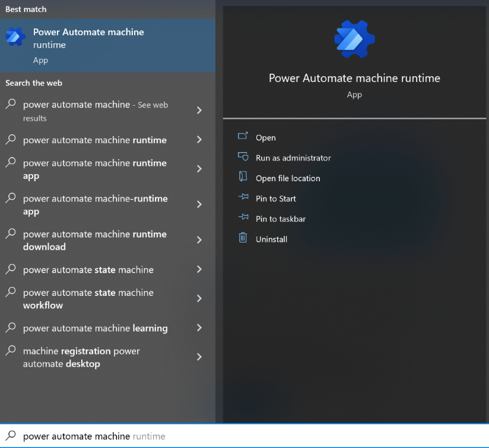
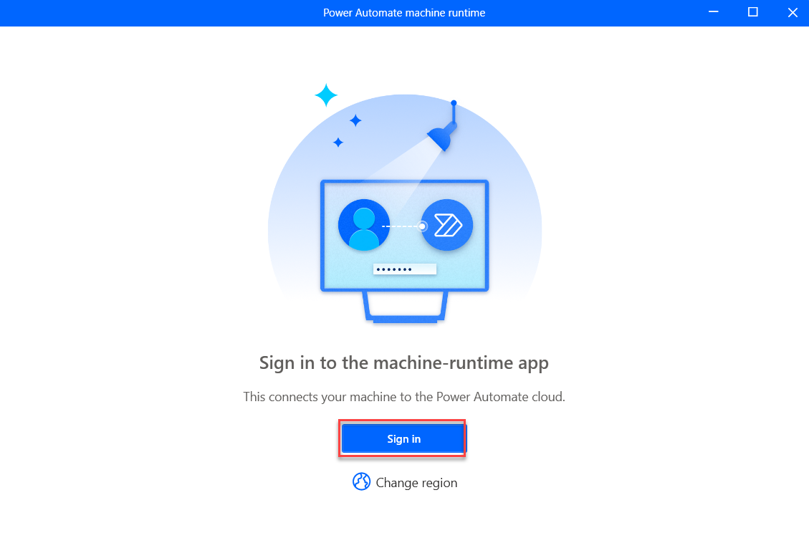
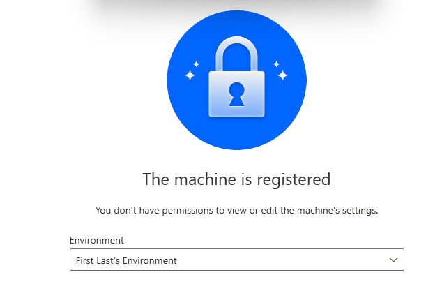
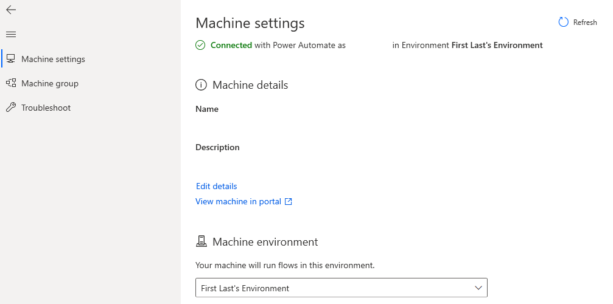

> [!NOTE]
> If you haven't previously registered your machine to another environment, Power Automate Desktop will automatically register your machine to the default environment at installing time, so you don't need to do the following steps manually. However, we still recommend that you try to follow the subsequent steps.

To register your machine, follow these steps:

1. Search for **Power Automate machine runtime** from the Windows search bar in the lower part of your desktop.

1. Select the **Power Automate machine runtime** app.

   > [!div class="mx-imgBorder"]
   > 

1. The **Power Automate machine runtime** app opens. **Sign in** if prompted.

   > [!div class="mx-imgBorder"]
   > 

1. Select the dev environment that you created.

   > [!div class="mx-imgBorder"]
   > 

1. You can select the **Register machine** button to register your machine to the default environment. If you have multiple environments and want to register your machine to a different environment than the default one, you can use the **Environment** dropdown menu to select the desired environment and then select **Register**.

   > [!NOTE]
   >  Power Automate will only allow the cloud flows in the registered environment to trigger desktop flows to run on your machine.

   > [!NOTE]
   >  If your environment does not register properly, select the **Learn More** button within the notification ribbon that appears at the top of the window. Follow the steps within to then ensure that you can now register your machine to the desired environment.

1. After you register successfully, information displays in the machine runtime app, as shown in the following screenshot.

   > [!div class="mx-imgBorder"]
   > 

1. In the future, you can also use the **Machine group** settings to add more machines to one machine group and then manage them together. For more information, see [Manage machine groups](/power-automate/desktop-flows/manage-machine-groups/?azure-portal=true).
1. Close the Power Automate machine runtime application.

> [!NOTE]
> Users will need an Environment Maker or desktop Flow Machine Owner role permission to register machines. Before registering a machine, make sure that you have the required permissions and that an available environment is present for you to register the new machine in.
