> [!NOTE]
> To use the functionality in this lab, you'll need to own a paid or trial version of [premium per-user plan with attended RPA](/power-automate/desktop-flows/manage-machines/?azure-portal=true). If you've completed the lab 1 prerequisite, you should already have a premium trial.

1.  Open a new window browser and then go to [https://make.powerautomate.com](https://make.powerautomate.com/?azure-portal=true). Sign in if needed.

1.  Select **Create** and then select the second option under Start from blank titled **Instant cloud flow**.

	> [!div class="mx-imgBorder"]
	> [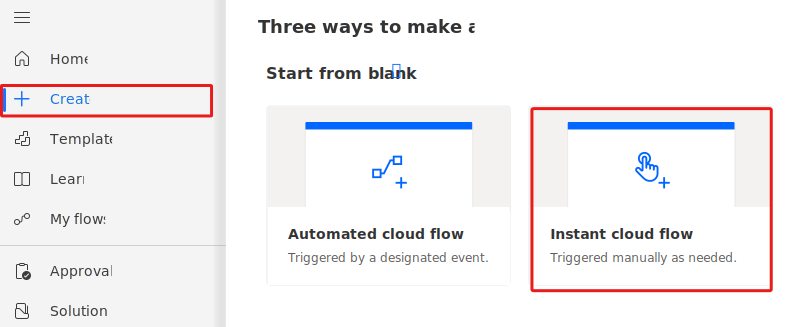](../media/instant.svg#lightbox)

1.  This will cause the Build an instant cloud flow dialogue box to pop up. Name the flow `Manual trigger desktop flow to enter invoice` then select **Manually trigger a flow**. Select **Create**.

	> [!div class="mx-imgBorder"]
	> [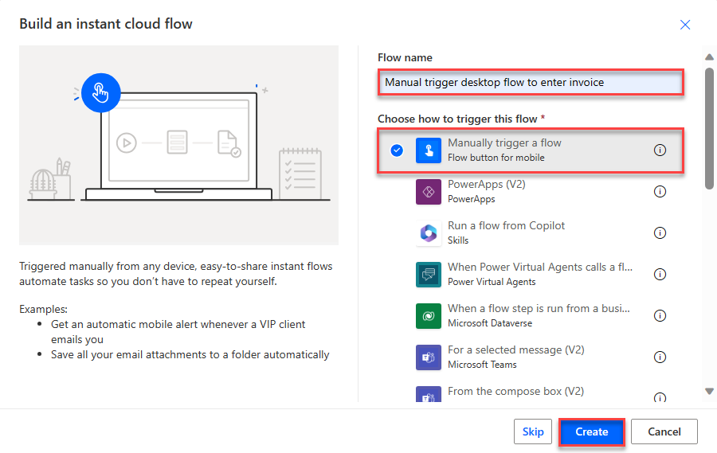](../media/manually-trigger-flow.png#lightbox)

1.  Add a step by selecting the **+** icon under the **Manually trigger a flow** action card.

	> [!div class="mx-imgBorder"]
	> [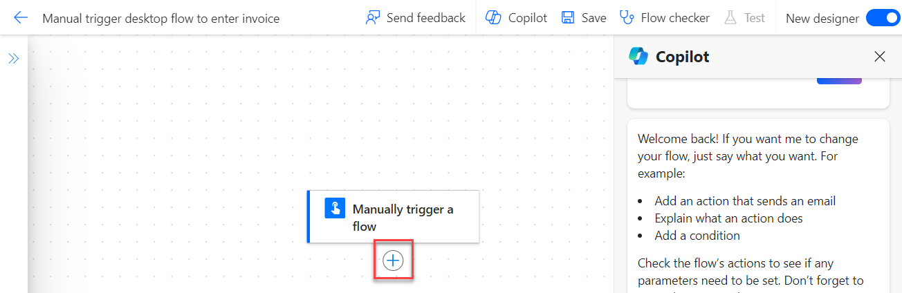](../media/new-step.png#lightbox)

1.  Enter `desktop flow` in the search box and then select **Run a flow built with Power Automate for desktop** located under Desktop Flows.

	> [!div class="mx-imgBorder"]
	> [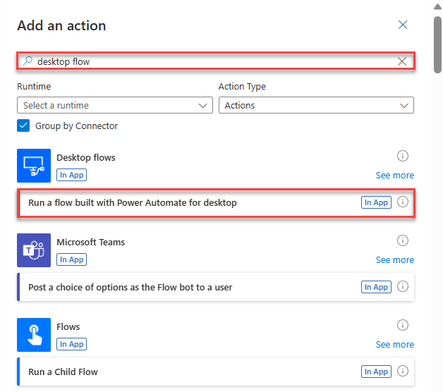](../media/run-flow-power-automate-desktop.png#lightbox)

1.  In the **Connection Name** box type `My Computer`. Select **Connect with username and password** from the **Connect** dropdown menu and then select the machine that you registered in the setup lab from the **Machine or machine group** dropdown menu.

	> [!div class="mx-imgBorder"]
	> [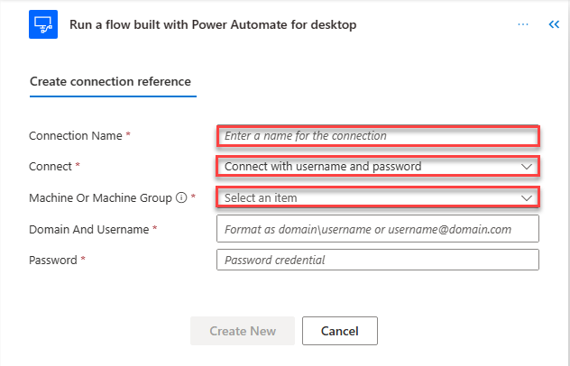](../media/directly-machine.png#lightbox)

1.  Provide your sign-in user and password information.

	> [!NOTE]
	> If you're uncertain of what to enter in the **Domain and username** field, you can use the **Command Prompt** window (open Windows **Start** menu, enter **CMD**, and then press the **Enter** key). Enter the **whoami** command and press the **Enter** key to locate the domain and username. Fill in the textbox with **USERDOMAIN\USERNAME**.

	If this account isn't a domain account, then use the **Set computer** command to look for the computer name. Fill in the text with **COMPUTERNAME\USERNAME**.

	> [!TIP]
	> To make sure that you have the correct sign-in credentials, try signing out of the computer and using the username/password combination to determine if you can successfully sign in to this computer.

	> [!IMPORTANT]
	> The account that you plan to use must have local admin rights on your machine.

1.  Select **Create New**.

	> [!div class="mx-imgBorder"]
	> [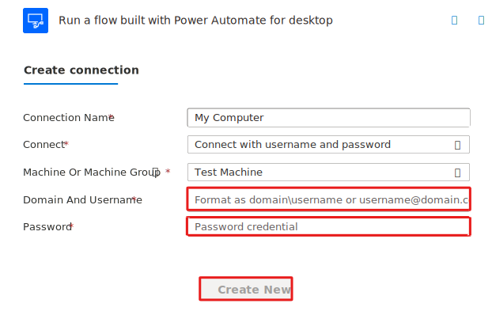](../media/create.svg#lightbox)

1. After setting up the connection, you can always view and select your connection by selecting the **Run a flow built with Power Automate for desktop** action card and then selecting **Change connection reference**.

	> [!div class="mx-imgBorder"]
	> [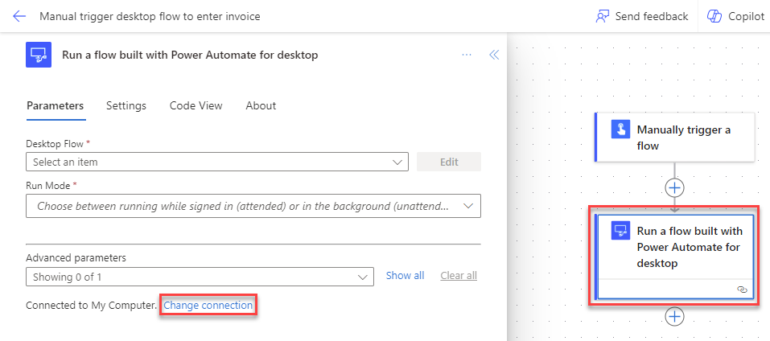](../media/connections.png#lightbox)

	> [!NOTE]
	> You can also create new connections here if needed. You can do this by selecting **Add New**. This step is not necessary for this lesson. 

1. Select **Enter an invoice** from the **Desktop flow** dropdown menu.

1. From the **Run Mode** dropdown menu, select **Attended (runs when you're signed in)**. This mode runs the desktop flow while you're signed in to the same machine. Unattended mode is for running automation on the server machines without users needing to sign in. 

	> [!div class="mx-imgBorder"]
	> [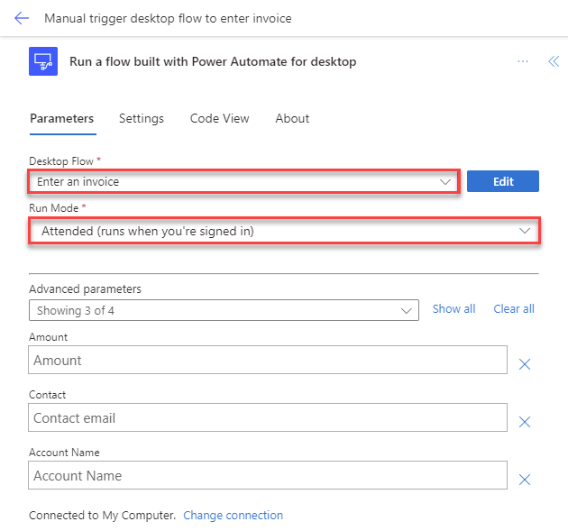](../media/run-mode.png#lightbox)

1. Fill in the **Amount**, **Contact** and **Accountname** boxes with the following sample input values (you're using static input values for now and will learn in the next labs how to use dynamic input values): 

	-   **Amount** - `$200`
	
	-   **Contact** - `b.friday@wingtipcups.com`
	
	-   **Account name** - `WingTip Cups`

	> [!div class="mx-imgBorder"]
	> [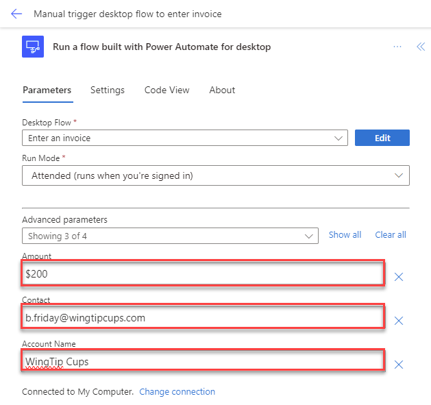](../media/save.png#lightbox)

1. Select **Save**, located at the top right-hand corner, and then wait for the flow to be saved.

	> [!div class="mx-imgBorder"]
	> [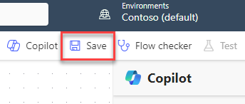](../media/new-save.png#lightbox)

1. Select **Test** in the upper-right corner of the screen.

	> [!div class="mx-imgBorder"]
	> [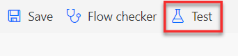](../media/test.png#lightbox)

1. From the **Test Flow** dialog, select **Manually** and then select **Test**.

	> [!div class="mx-imgBorder"]
	> [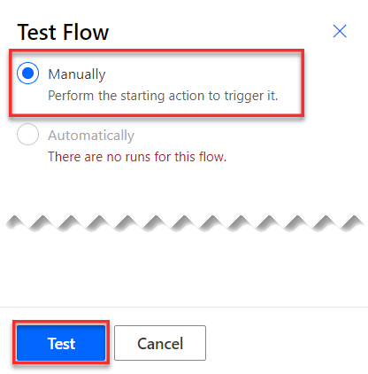](../media/test-flow.png#lightbox)

1. If a green check mark appears to the right of **Desktop flows**, then you're ready to continue. Select **Continue**.

	> [!div class="mx-imgBorder"]
	> [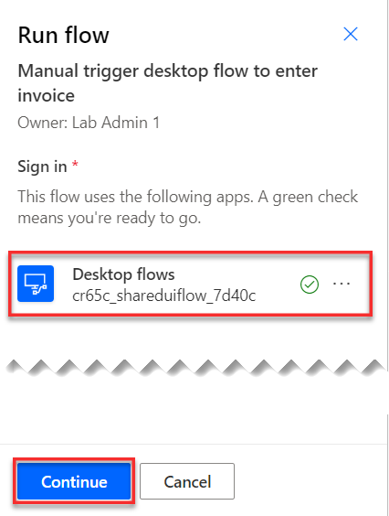](../media/continue.png#lightbox)

1. Select **Run flow**.

	> [!div class="mx-imgBorder"]
	> [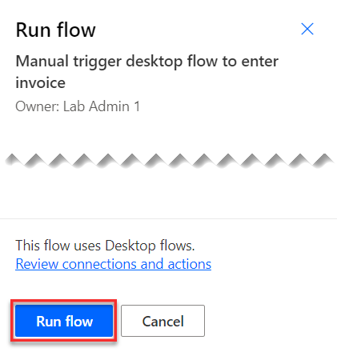](../media/run-flow.png#lightbox)

1. Select **Done** if your flow run has started successfully.

	> [!NOTE]
	> Don't interact with your device while testing.

1. Watch as your desktop flow will be triggered from the cloud and will run on your desktop.

	After your flow has run successfully, the run detail page will display.

	> [!div class="mx-imgBorder"]
	> [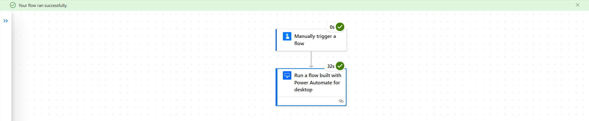](../media/success.png#lightbox)

1. Now we're going to connect the flow to the solution we previously created. To begin, select the back arrow at the top left of the screen next to the name of the flow. 

	> [!div class="mx-imgBorder"]
	> [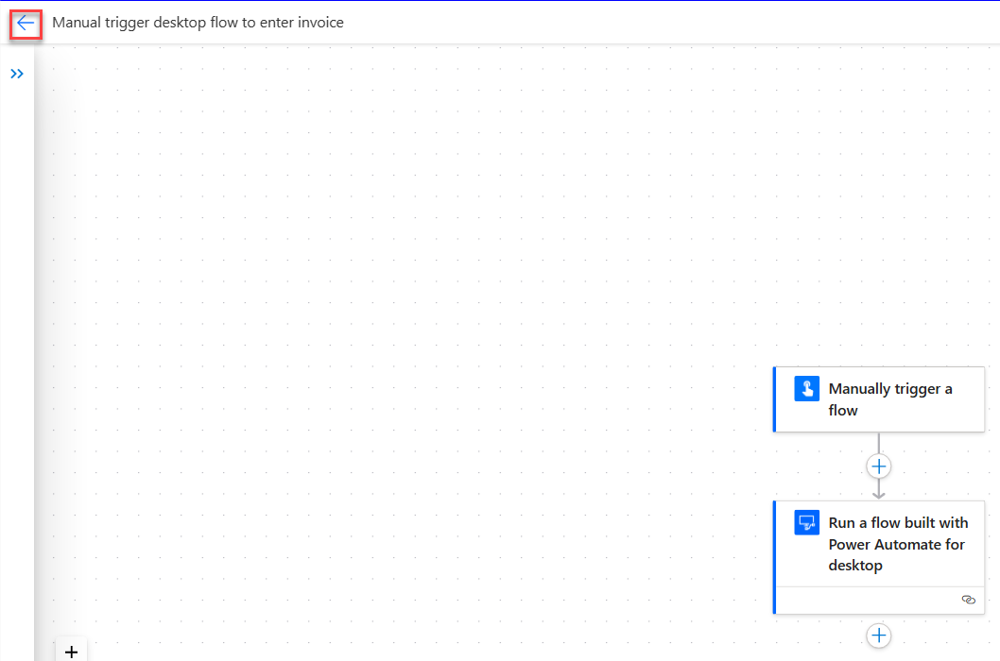](../media/back-arrow-solution.png#lightbox)

1. Select **Solutions** and then select the previously created **Invoice processing solution First Last**.

	> [!div class="mx-imgBorder"]
	> [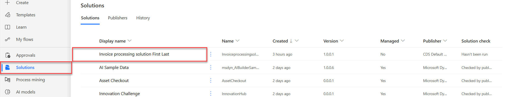](../media/solutions.png#lightbox)

1. After clicking on the solution, select the **Add existing** drop-down menu at the top of the page. Then select **Automation** and then **Cloud flow**. 

	> [!div class="mx-imgBorder"]
	> [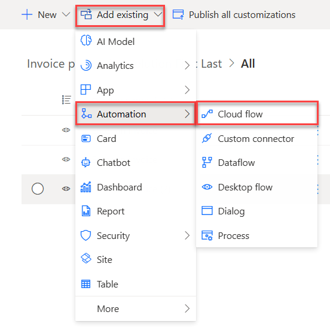](../media/add-existing-automation.png#lightbox)

1. The Add existing cloud flows dialogue box will pop up. Select the **Outside Dataverse** tab in the box. Then select the flow **Manual trigger desktop flow to enter invoice** and finally, select **Add**.

	> [!div class="mx-imgBorder"]
	> [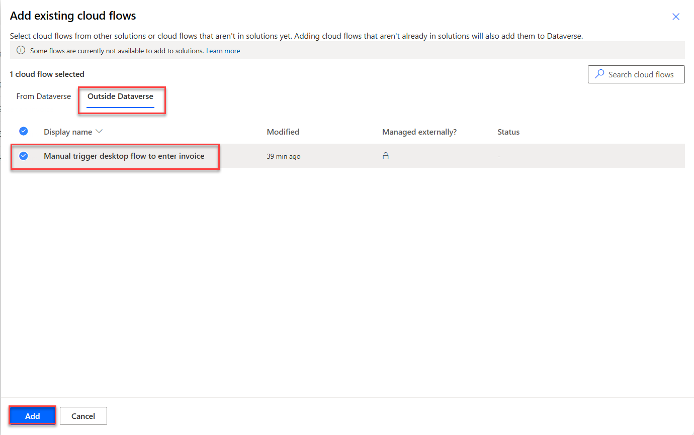](../media/add-flow.png#lightbox)

Now the flow is linked to the solution. 
