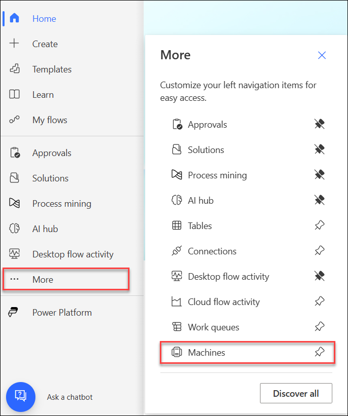
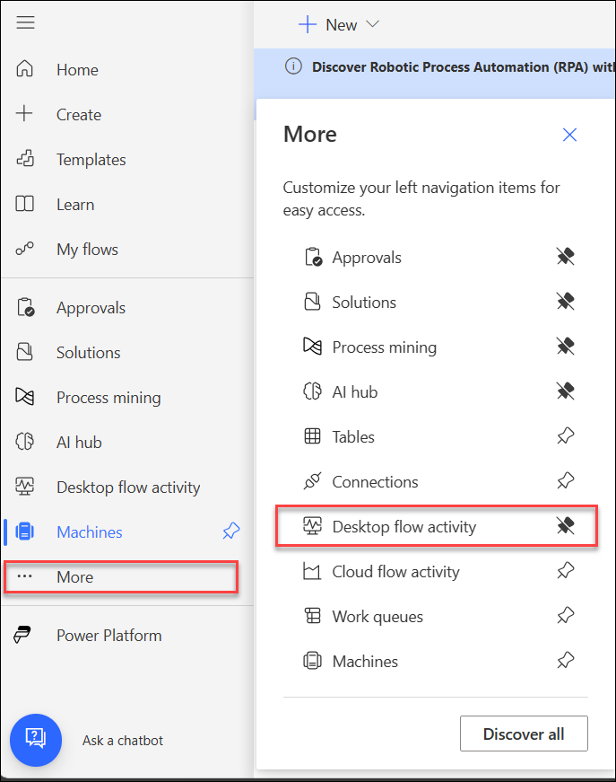
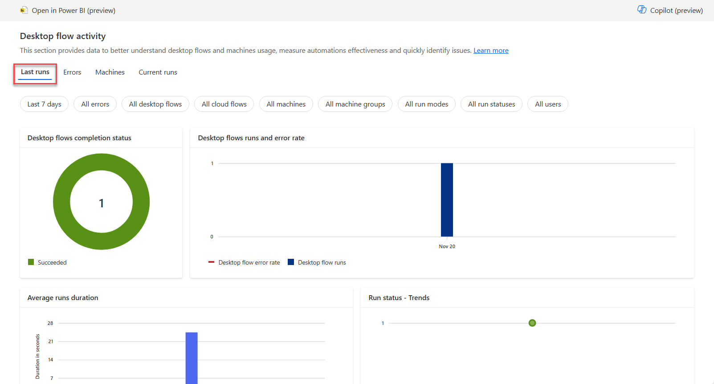
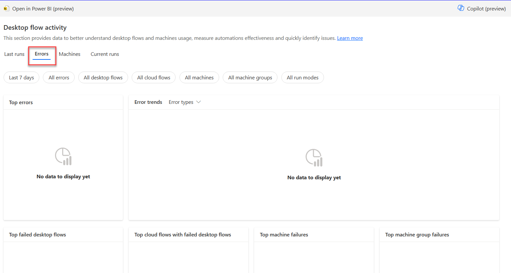
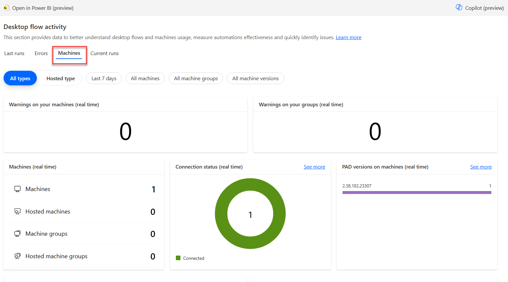
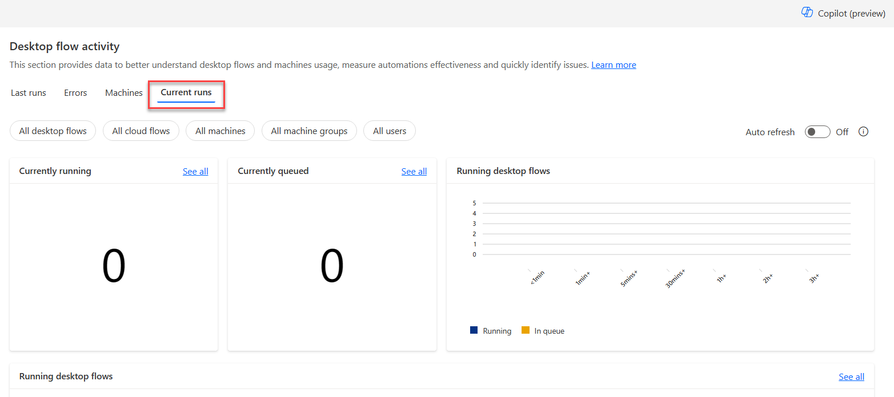

After a machine has been registered to an environment, you can view its details from the Power Automate website. You can also view all other machines that you have access to. To do so, follow these steps:

1. Select the **More** drop-down from the navigation menu and then select **Machines**.

1. View the following details for each machine from the list:

    - Name of the machine

    - Description of the machine

    - Group that the machine is a part of, if applicable

    - Status of the machine

    - Number of flows that are running on the machine

    - Number of flows that are queued on the machine, if applicable

    - Type of access that you have to the machine

    - Owner of the machine

	> [!div class="mx-imgBorder"]
	> 

1. Under the **More** drop down in the navigation pane, select **Desktop Flow Activity**.

	> [!div class="mx-imgBorder"]
	> 

1. Navigate through the tabs and view the information provided.

    - The **Last Runs** section provides graphs and tables to get meaningful insights about your desktop flow runs, such as the number of runs, the percentage of errors, and the run mode.

    > [!div class="mx-imgBorder"]
    > 

    - The **Errors** section can be used to identify the most common errors that occur while your flows run. These pivot tables provide information about desktop flows, cloud flows, and machines in which errors occurred, allowing you to view details to identify the source of errors.
    
        By default, this section displays the desktop flow run errors for the last seven days. Optionally, you can select another time period and filter on specific errors.

    > [!div class="mx-imgBorder"] 
    > 

    - The **Machines** section can be used to monitor your machines and machine groups. These pivot tables provide information about the number of machines, groups, connection status, Power Automate for desktop versions installed on machines, and lists of machines and machine groups.

    > [!div class="mx-imgBorder"] 
    > 

    - You can use the **Current Runs** section to monitor active desktop flow runs. These pivot tables provide information about the number of running and queued desktop flows, and lists with the running and queued desktop flows.

    > [!div class="mx-imgBorder"] 
    > 
