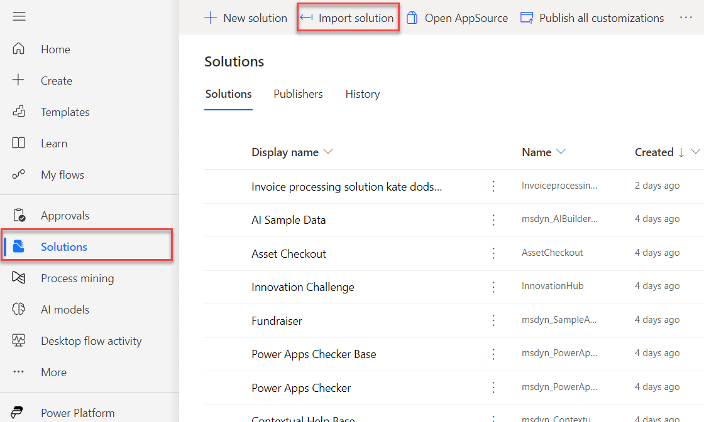
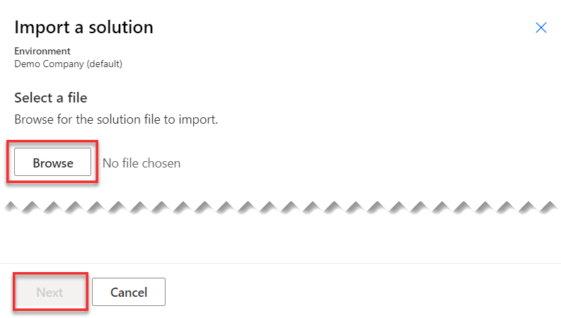

If you've completed lab 3, skip to the next task.

1.  Go to [https://powerautomate.microsoft.com](https://powerautomate.microsoft.com/?azure-portal=true) and select the environment that you want to use for this lab.

1.  Select **Solutions > Import solution**.

	> [!div class="mx-imgBorder"]
	> 

1.  Select **Browse**.

1.  Select the **InvoiceprocessingsolutionFirstLast_1\_0\_0\_2.zip** solution file located in the resources folder and then select **Open**.

1.  Select **Next**.

	> [!div class="mx-imgBorder"]
	> 

1.  Select **Import** and then wait for the solution to be imported.
