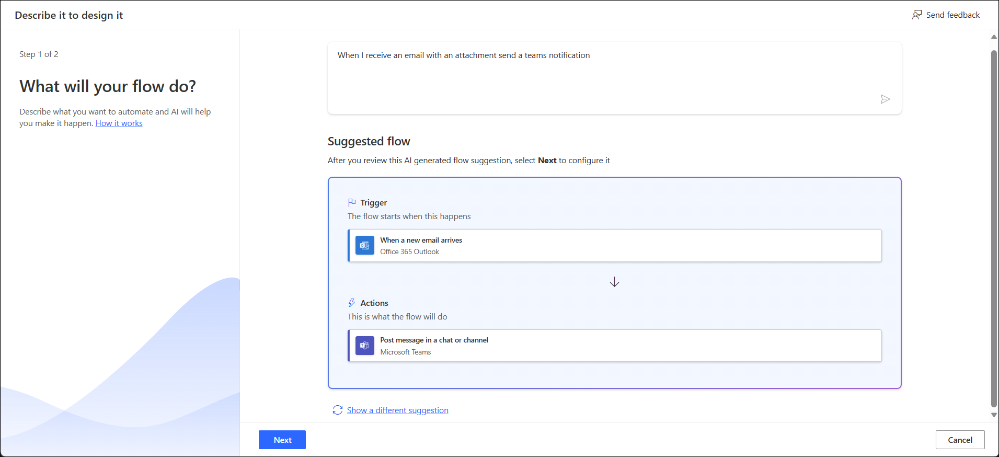

> [!NOTE]
> To use the functionality in this lab, you'll need to own a paid or trial version of [premium per-user plan with attended RPA](/power-automate/desktop-flows/manage-machines/?azure-portal=true). If you've completed the lab 1 prerequisite, you should already have a premium trial.

1.  Open a new web browser and navigate to [https://make.powerautomate.com](https://make.powerautomate.com/?azure-portal=true). Sign in if needed.

1.  Once in the Power Automate web browser, select **My Flows** from the navigation pane to the left of the screen.

1.  Next, select the **+ New Flow** drop-down from the ribbon at the top of the page.

1. From the drop-down, select **Describe it to design it (preview)**.

	> [!div class="mx-imgBorder"]
	> 

1.  If the **Welcome** pop-up dialog appears, select the **X** in the upper right corner to close out.

1. Within the text box at the top of the page, enter `When I receive an email with an attachment send a teams notification`. Then hit **Enter** on your keyboard.

1. Once the flow has loaded and you have checked to make sure it's the correct flow you would like to use, select **Next**.

	> [!div class="mx-imgBorder"]
	> 

	> [!div class="mx-imgBorder"]
	> 

1.  Check that you have the correct **connection** within the connected apps and services list, and then select **Create flow**. The connection should show as the same username that you used to sign in to Power Automate. Notice that to the right of the screen, you can also see a preview of the flow being created. 

	> [!div class="mx-imgBorder"]
	> 

	> [!NOTE]
	> If you receive error icon notifications within the connected apps and services list, select **Fix connection**. Use the same account you used to login to Power Automate to fix the connection.

1.  You should now be able to begin editing the flow. On the flow, within the **Post message in chat or channel step**, expand the **Post as** drop-down by selecting the trigger action card. 

1. From the drop-down, select the **Flow bot** option. Here you're indicating what is sending your automated message. 

	> [!div class="mx-imgBorder"]
	>  

1. Within the **Post In** field, select **Chat with Flow Bot**

	> [!div class="mx-imgBorder"]
	> 

1. Next, within the **Recipient** field, use **your account** user as the recipient. 

1. Then, within the **Message** text box field, enter the message `You have received a new email with an attachment.`

1. Lastly, select the **Save** button located at the top right of the page to save the changes that were just made to the parameters of the newly created flow. 

	> [!div class="mx-imgBorder"]
	>  

1.  You should now be viewing a page that displays the flow that you created with the new parameters. After saving in the last step, a green **success message** at the top of the screen will show. 

	> [!NOTE]
	> To the right of the screen, you can chat with a **Copilot** bot to make changes to your flow. You can also add to your flow by selecting the **plus** signs below each step. 

	> [!div class="mx-imgBorder"]
	> 	

You have now completed the flow!

If you desire, you can continue to test your flow by sending yourself an email with an attachment. 
