In previous labs, you created an end to end solution to enter an invoice to a legacy application. That solution, which runs a desktop flow from a cloud flow, provides the ability to automatically enter relevant data into the legacy application without having any manual process takes place.  When triggered, this flow will be placed in a queue with all other desktop flows that are set to run and will only run when its turn in the queue is up in the order.  But, a question remains - what if that order needs to be modified so a specific flow run takes higher priority than others?  

**Work queues** in Power Automate play a crucial role in improving the efficiency, scalability and resiliency of automations and help prioritize work, with the highest-priority items being completed first, regardless of whether they've been processed by digital workers, human workers, or through integrations.

Just as manufacturing assembly lines are designed to decouple different complex stages of production, work queues can help decouple different areas of a process allowing each part to operate independently and exchange prioritized inputs and outputs asynchronously.

## Task: Create a new work queue

1. Go to [Power Automate](https://make.powerautomate.com/) and sign in with your credentials.

1. Within the navigation menu to the left of the screen, select **More** with the ellipses next to it. Then, select **Work queues**. 

	> [!div class="mx-imgBorder"]
	> [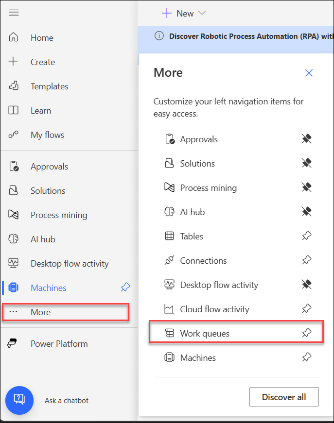](../media/work-queue-navigation.png#lightbox)

1. This will take the user to the work queues section. Select the **+ New work queue** button or select the **+New** button at the top of the screen to create a new work queue. 

	> [!div class="mx-imgBorder"]
	> [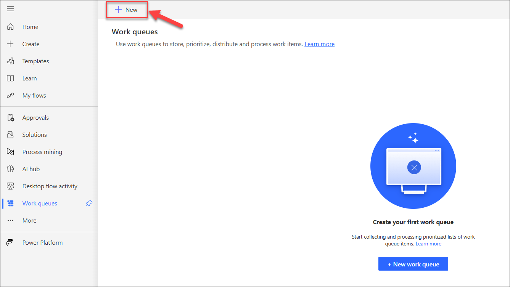](../media/work-queue-create-new.png#lightbox)

1. In the **New work queue** panel, enter the following information:

	- Work queue name: `Invoices`

1. Then, select **Create**.

	> [!div class="mx-imgBorder"]
	> [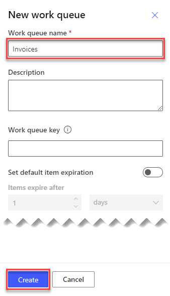](../media/work-queue-new-invoice-work-queue.png#lightbox)

	> [!NOTE]
	> If you set an expiration time for a work queue, any item added will expire after the time has elapsed. So if you set expiration time to 30 minutes, an item added at 2:00 PM will expire at 2:30 PM.
	
	> [!div class="mx-imgBorder"]
	> [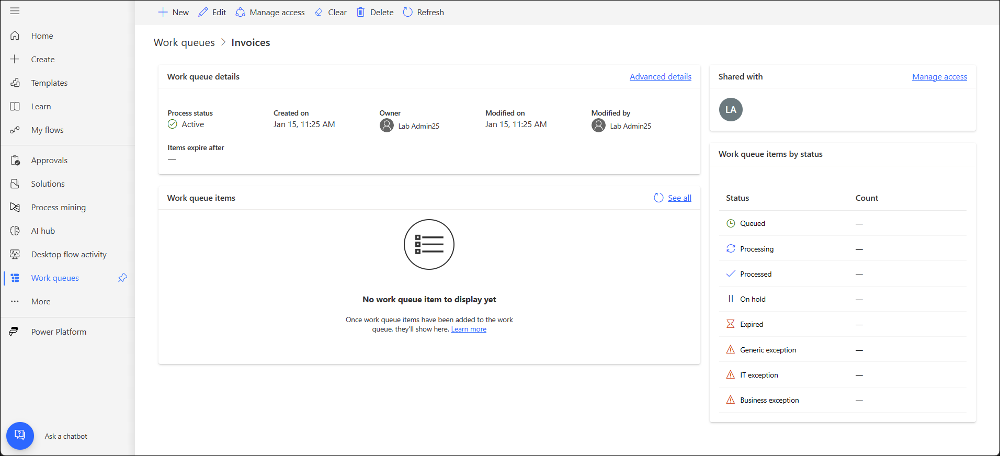](../media/work-queue-invoice-work-queue-empty-list.png#lightbox)

## Task: Create the *Work Queue Item Load* workflow

1. From within the **Invoice Processing Solution** created in a previous lab, select **+New** from the toolbar at the top. Then, select **Automation** and **Desktop Flow** to create a new desktop flow. 

	> [!div class="mx-imgBorder"]
	> [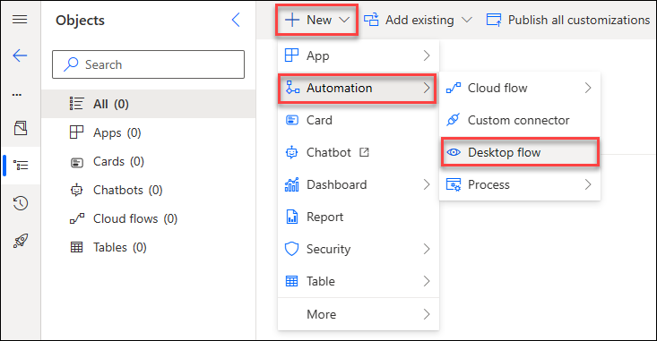](../media/work-queue-new-desktop-flow-solution.png#lightbox)

1. Name the flow ***Work Queue Item Load***, then select **Launch app**. You'll be taken to a new tab in your browser and might need to sign into Power Automate Desktop if prompted.

	> [!div class="mx-imgBorder"]
	> [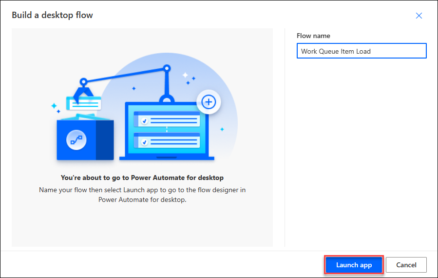](../media/work-queue-new-flow-work-queue-item-load.png#lightbox)

1. Once in the Power Automate Desktop designer, navigate to the **Excel** section and select the **Launch Excel** action to add as the first step of the workflow. 

	> [!div class="mx-imgBorder"]
	> [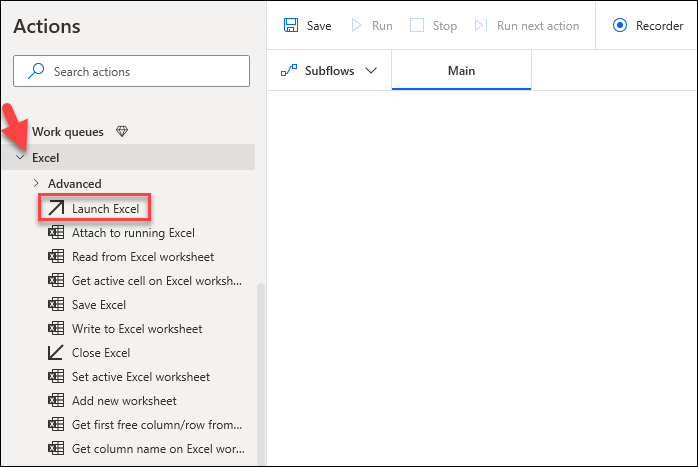](../media/work-queue-launch-excel.png#lightbox)

1. In the **Launch Excel** action, select the **Launch Excel** parameter dropdown menu and change it to **and open the following document**. 

	> [!div class="mx-imgBorder]
	> [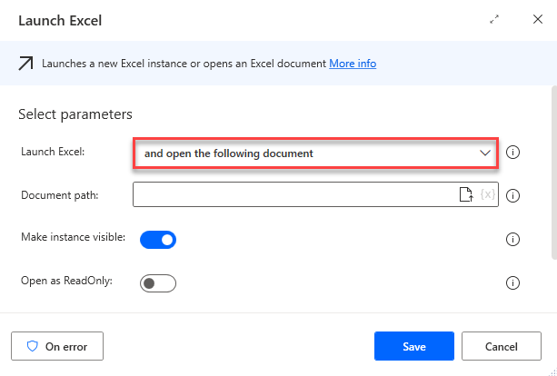](../media/launch-excel-drop-down.png)

1. Change the **Document path** and select the file named ***Work Queue Vendor Invoice Items*** from the folder **Lab #13 Excel file for Work Queues** in the course materials. 
	
	> [!div class="mx-imgBorder"]
	> [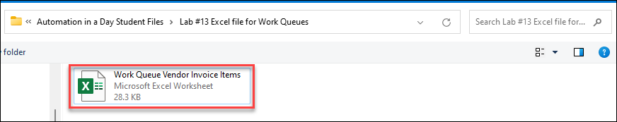](../media/work-queue-excel-file-path.png#lightbox)

1. Select the toggles as shown below to *turn off* **Make instance visible** and *turn on* **Open as ReadOnly**, then select Save.
	> [!div class="mx-imgBorder"]
	> [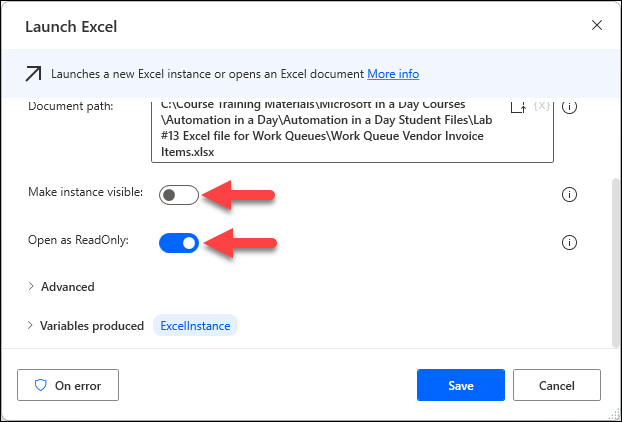](../media/work-queue-launch-excel-details.png#lightbox)

1. From within the Excel actions area, select the **Read from Excel worksheet** action and add as the next step. 

	> [!div class="mx-imgBorder"]
	> [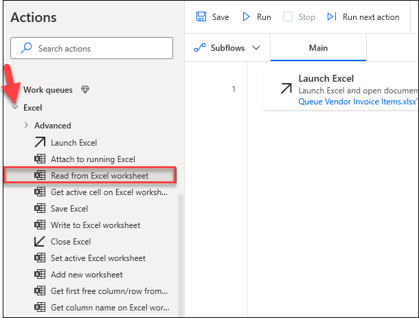](../media/work-queue-read-from-excel.png#lightbox)

1. Select the dropdown menu in the **Read from Excel worksheet** action for Retrieve and select **All available values from worksheet**. Then, select Advanced and toggle **First line of range contains column names** to *on*. Lastly, select the variable produced and add ***Invoices*** to the name of the variable to display as **ExcelDataInvoices**.

	> [!div class="mx-imgBorder"]
	> [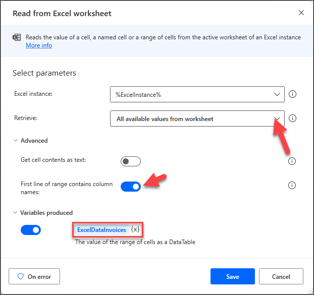](../media/work-queue-read-from-excel-details.png#lightbox)

	> [!NOTE]
	> It is a best practice to rename variables as necessary to make it easier to understand the purpose of the variable and how it is to be referenced. 

1. Navigate to the Loops actions section and select the **For Each** loop action.

	> [!div class="mx-imgBorder"]
	> [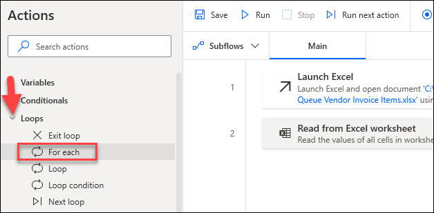](../media/work-queue-for-each-loop.png#lightbox)
	
1. Select the variable icon to choose the **ExcelDataInvoices** variable to iterate over, then edit the name of the variable that the data is stored into to be ***CurrentInvoice*** and select Save.

	> [!div class="mx-imgBorder"]
	> [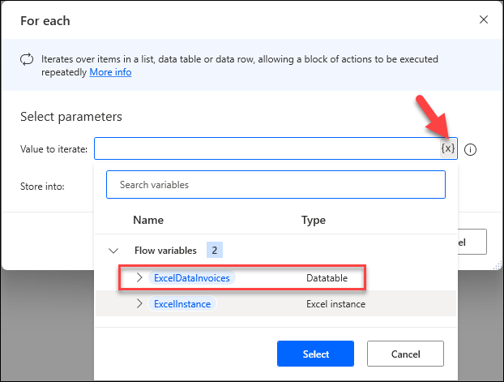](../media/work-queue-for-each-loop-variable-selection.png#lightbox)

	> [!div class="mx-imgBorder"]
	> [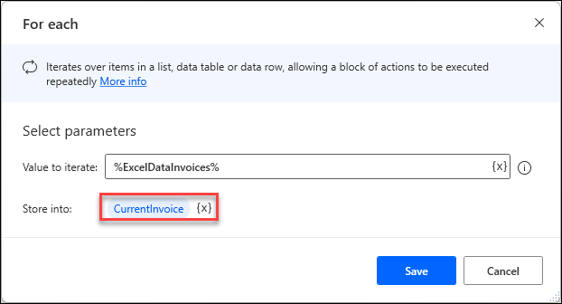](../media/work-queue-for-each-loop-details.png#lightbox)

1. Navigate to the Work Queues section in the Action pane and select the **Add work queue item** action. Ensure to drag the action ***inside of the For Each loop***. 

	> [!div class="mx-imgBorder"]
	> [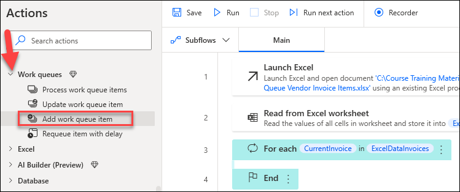](../media/work-queue-add-work-queue-item.png#lightbox)

1. Within the dialog box, add the following information, then select Save.
	- Work Queue: **Invoices**
	- Status: **Queued**
	- Priority: **Normal**
	- Name: `%CurrentInvoice['InvoiceItemID']%`
	- Input: 
	
	  		{
				"AccountName": "%CurrentInvoice['AccountName']%",
				"ContactEmail": "%CurrentInvoice['ContactEmail']%",
				"Amount": "%CurrentInvoice['Amount']%"
	  		}

	> [!div class="mx-imgBorder"]
	> [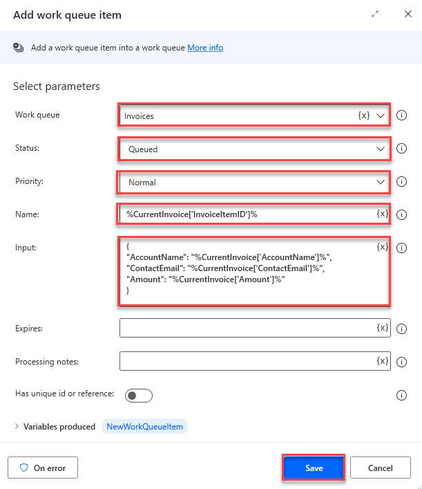](../media/work-queue-add-work-queue-item-details.png#lightbox)

	> [!NOTE]
	> The square brackets [ ] with single quote ' ' designate a column to be referenced.
	
	> [!NOTE]
	> The input in this case is a JSON object that is storing data in name/value pairs.

1. Navigate to the Excel section in the Actions pane and add the **Close Excel** action as the last step in the flow, outside of the For Each loop. You don't need to make any modifications to this action. 

	> [!div class="mx-imgBorder"]
	> [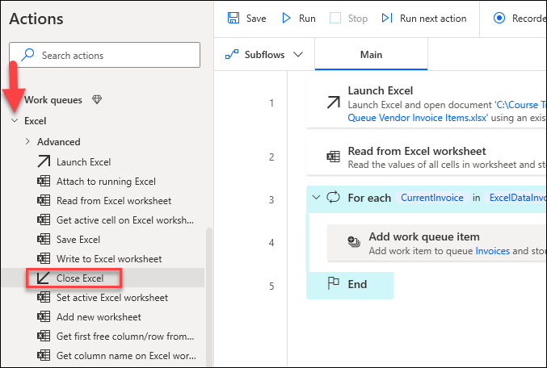](../media/work-queue-close-excel.png#lightbox)

	> [!div class="mx-imgBorder"]
	> [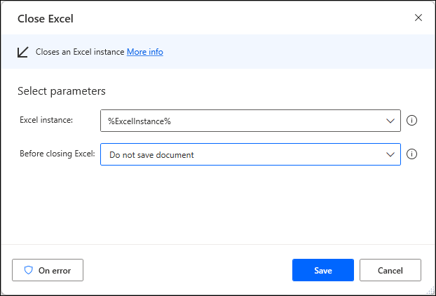](../media/work-queue-close-excel-details.png#lightbox)

1. Select the **Save** button and then select the **Run** button to run the workflow.

1. Close the Power Automate Desktop designer window. 

1. Navigate to the Power Automate cloud flow portal at make.powerautomate.com and select **More** and choose **Work Queues** from the menu.  Notice the 30 queued items for the Invoice work queue.

	> [!div class="mx-imgBorder"]
	> [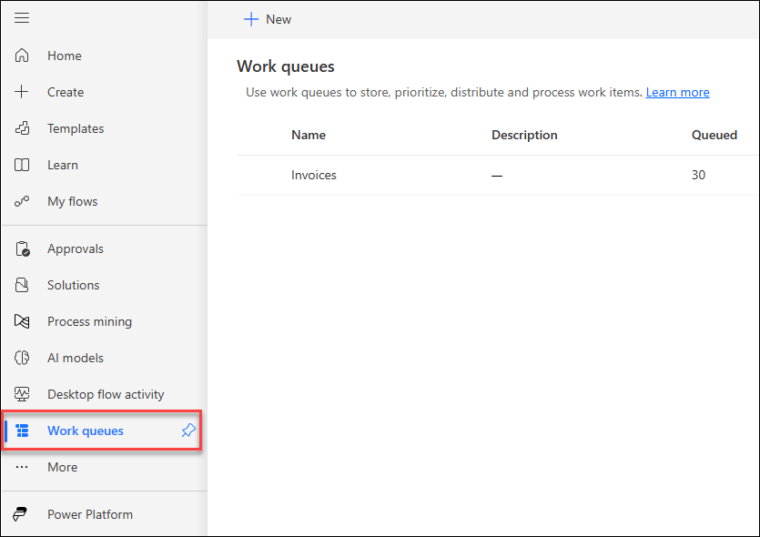](../media/work-queue-invoice-work-queue-30-queued.png#lightbox)

1. Select the Invoice work queue, and notice the list of items then choose **See all** to view the full list of items that have been queued by the recently run workflow. 

	> [!div class="mx-imgBorder"]
	> [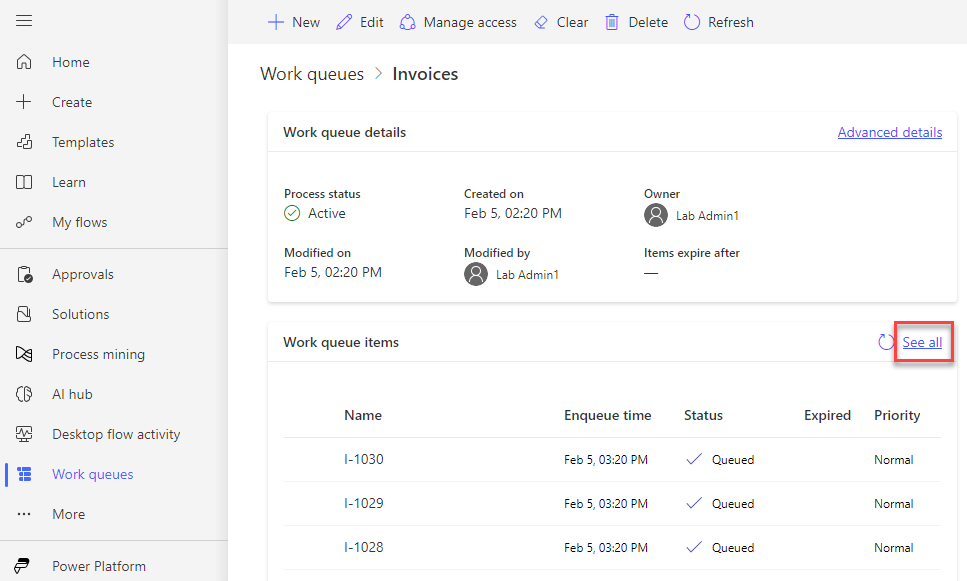](../media/work-queue-invoice-work-queue-30-queued-list.png#lightbox)

## Task: Create the *Work Queue Item Processor* workflow

1. Return back to Power Automate Desktop.

1. Select the ellipses for the **Enter an Invoice** flow created in an earlier lab and select **Create a copy** from the dropdown list. 

	> [!div class="mx-imgBorder"]
	> [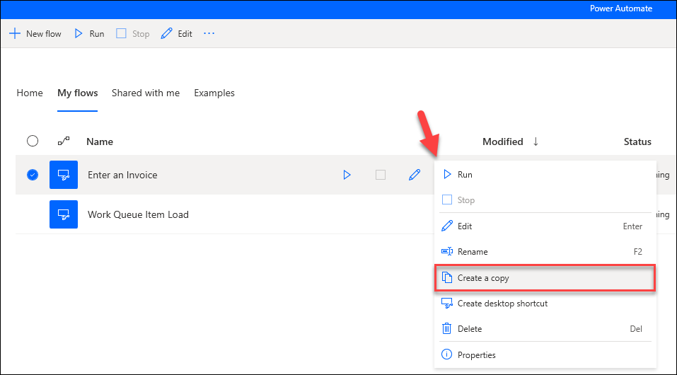](../media/work-queue-copy-enter-invoice.png#lightbox)

1. Rename the new flow to: **Work Queue Item Processor**

	> [!div class="mx-imgBorder"]
	> [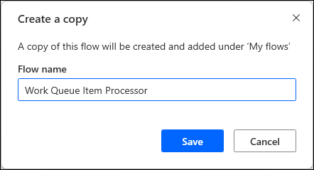](../media/work-queue-copy-rename-work-queue-item-processor.png#lightbox)

1. Select the new flow **Work Queue Item Processor** and select the **pencil** icon to edit it.

	> [!div class="mx-imgBorder"]
	> [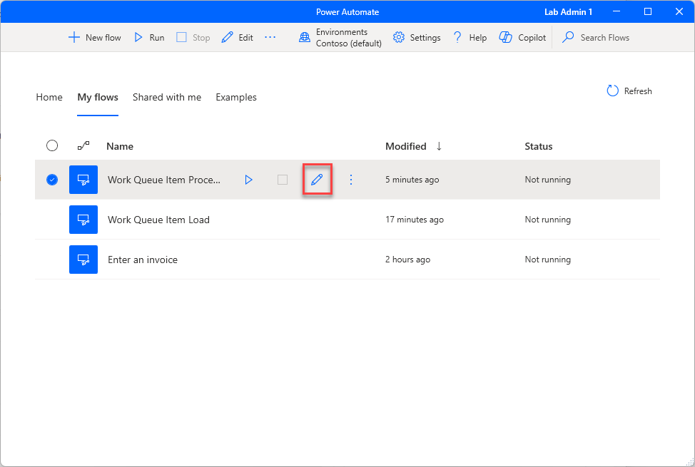](../media/edit-work-queue-item-processor.png#lightbox)

1. Navigate to the **Work Queues** section in the Action pane and select the **Process work queue items** action.  Insert this action after the **Run Application** step already included in the flow. 

	> [!NOTE]
	> This should be the new action 2 in the workflow. 

	> [!div class="mx-imgBorder"]
	> [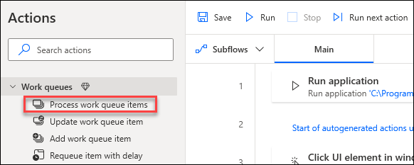](../media/work-queue-process-work-queue-items.png#lightbox)

1. Select the **Invoices** work queue from the dropdown. 

	> [!div class="mx-imgBorder"]
	> [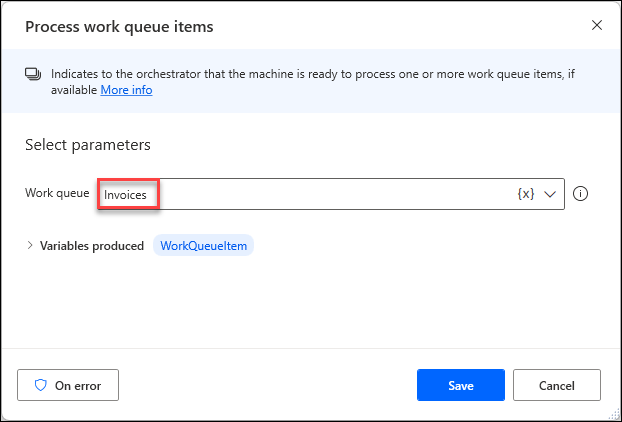](../media/work-queue-process-work-queue-items-details.png#lightbox)

1. In the Action pane, search for `Json` and select the **Convert JSON to custom object** action, making sure to add inside of the newly created Process work queue item loop. 

	> [!div class="mx-imgBorder"]
	> [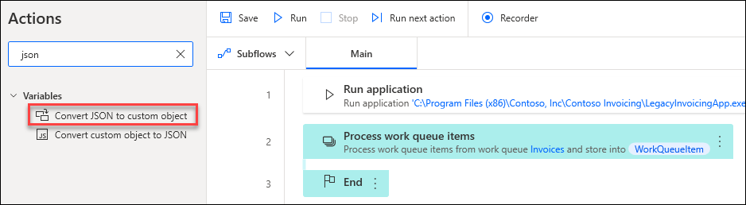](../media/work-queue-convert-json-custom-object.png#lightbox)

1. Select the variable icon **{x}** to choose the JSON value to convert.  From the dropdown list, scroll down and select the expand arrow for **WorkQueueItem**, then select the **.Value** option.  Click Select to add this to the parameter area. Once added, select Save.

	> [!div class="mx-imgBorder"]
	> [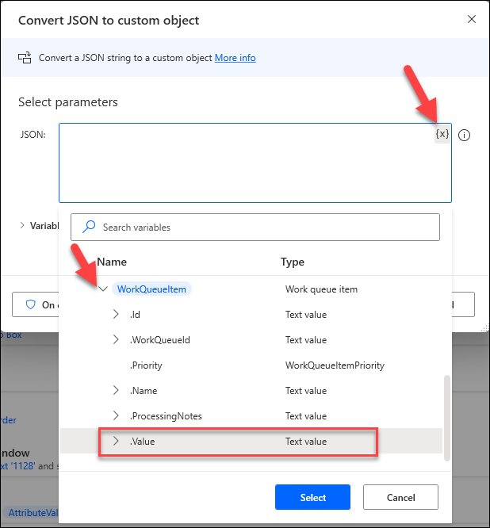](../media/work-queue-convert-json-custom-object-variable-selection.png#lightbox)
	
	> [!div class="mx-imgBorder"]
	> [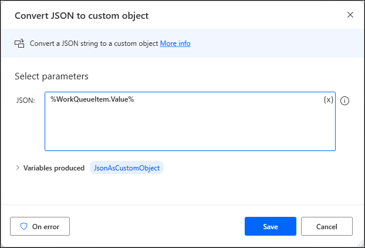](../media/work-queue-convert-json-custom-object-details.png#lightbox)

1. Select the **Save** button at the top of the window.

1. Select the number 4 in the list of actions to add a **Breakpoint** to the flow.  This Breakpoint will stop the flow at the action it's added to, and allows users to view the details of the flow at that stage. 

	> [!div class="mx-imgBorder"]
	> [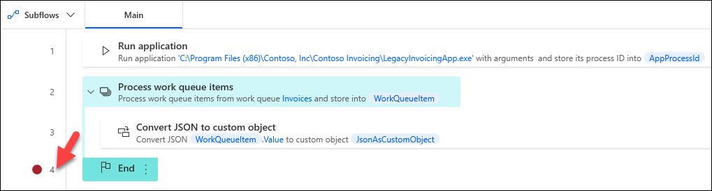](../media/work-queue-breakpoint.png#lightbox)

1. Select the **Save** and **Run** buttons at the top of the window. 

1. Double click on the **JsonAsCustomObject** variable from the Flow variables area in the Variables pane to view the output details from the flow that is running. 

	> [!div class="mx-imgBorder"]
	> 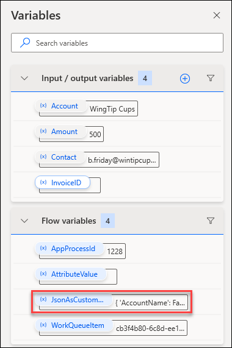

	Notice the data that was parsed from the JSON that can now be used as Name/ Value pairs. Select **Close** to close out of the window. 

	> [!div class="mx-imgBorder"]
	> [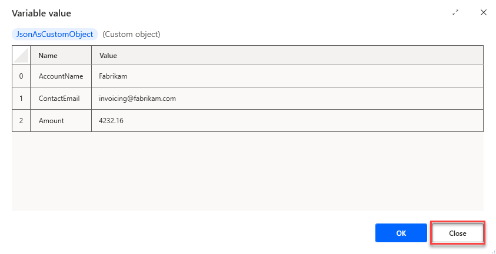](../media/work-queue-json-custom-object-variable-details.png#lightbox)

1. Select the **Stop** button at the top of the designer window.

	> [!div class="mx-imgBorder"]
	> [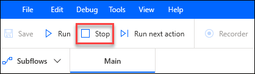](../media/work-queue-stop-flow-button.png#lightbox)

1. Within the Work Queues section in the Action pane, select the **Update work queue item** action and drag into the list of actions after the **Convert JSON to custom object** step inside the for loop. 

	> [!div class="mx-imgBorder"]
	> [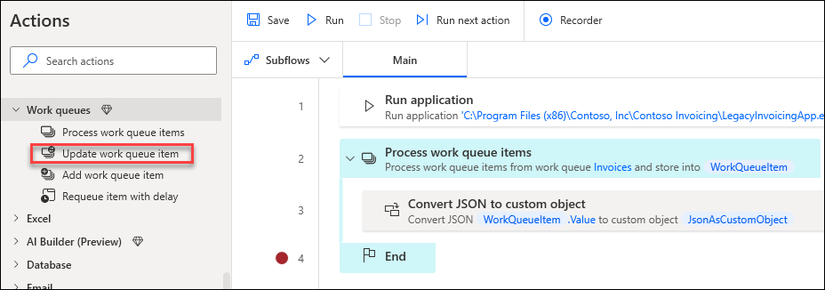](../media/work-queue-update-work-queue-item.png#lightbox)

1. Add the Processing result: **Success** into the dialog box for Update work queue item and select **Save**.

	> [!div class="mx-imgBorder"]
	> [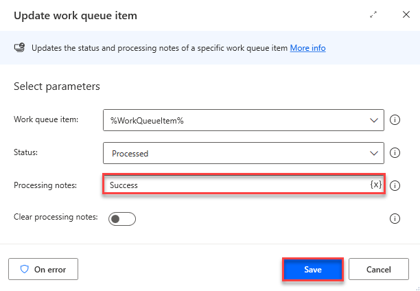](../media/work-queue-update-work-queue-item-details.png#lightbox)

1. Select the **Save** and **Run** buttons at the top of the window. 

1. Return to the **Power Automate** web browser at the Invoice Work Queue previously visited.  Refresh the browser tab and select **See all**.

	> [!div class="mx-imgBorder"]
	> [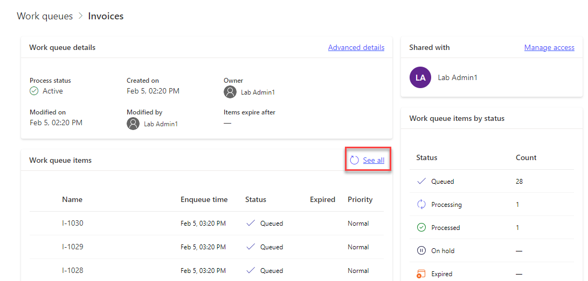](../media/work-queue-items-run-list-see-all.png#lightbox)

1. Scroll down to the bottom of the list and notice the item that has been processed during the previous desktop flow run.

	> [!div class="mx-imgBorder"]
	> [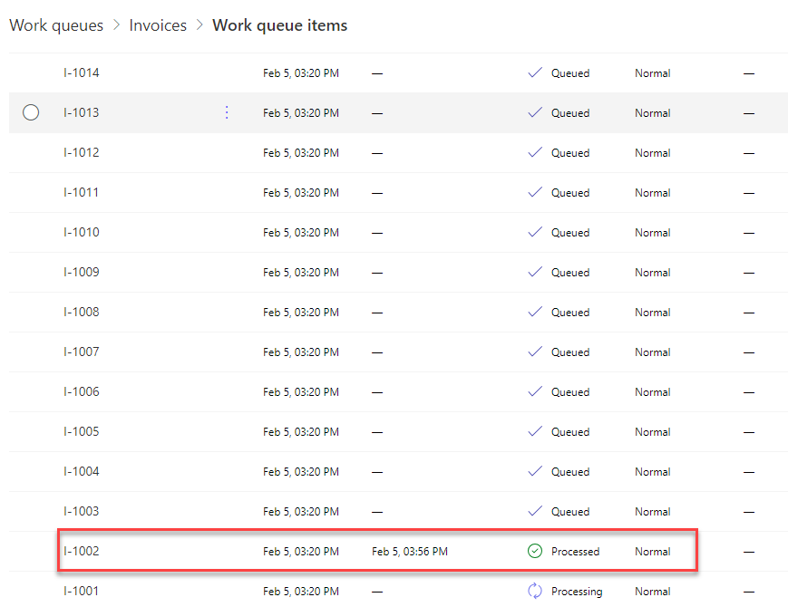](../media/work-queue-items-run-list-see-processed-success.png#lightbox)

1. Return back to the desktop flow designer and select the **Stop** button at the top of the window.  

1. Holding down the **Ctrl** key on your keyboard, select all of the actions from the original Enter an Invoice desktop flow then, drag all of those steps into the **Process work queue items** loop, between the Convert JSON to custom object and Update work queue item actions. 

	> [!div class="mx-imgBorder"]
	> [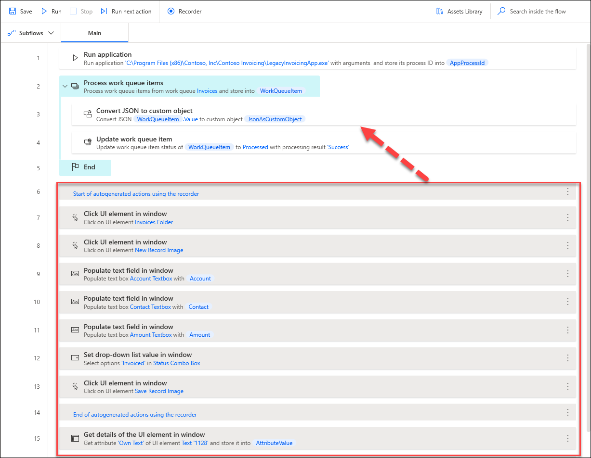](../media/work-queue-move-recorded-steps.png#lightbox)

1. Edit the three steps that **Populate text field in window** and remove the previously used Input variable to replace the *Text to fill-in* with a value from the parsed JSON stored in the **JsonAsCustomObject** variable. 

	> [!div class="mx-imgBorder"]
	> [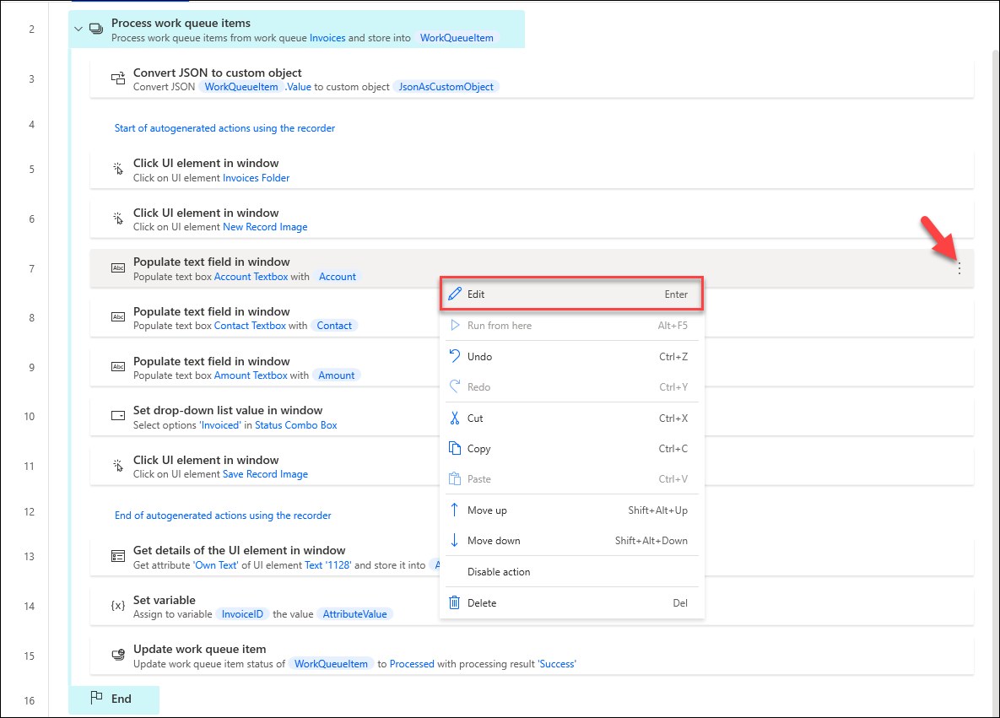](../media/work-queue-edit-populate-text-field-window.png#lightbox)

1. Use the following to replace the *Text to fill-in* for each action: 
	- Account Textbox: `%JsonAsCustomObject['AccountName']%`	
	- Contact Textbox: `%JsonAsCustomObject['ContactEmail']%`
	- Amount Textbox: `%JsonAsCustomObject['Amount']%`

	> [!div class="mx-imgBorder"]
	>[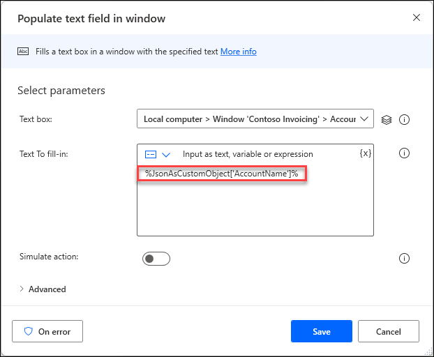](../media/work-queue-replace-populate-text-field-window-accountname.png#lightbox)

	> [!div class="mx-imgBorder"]
	> [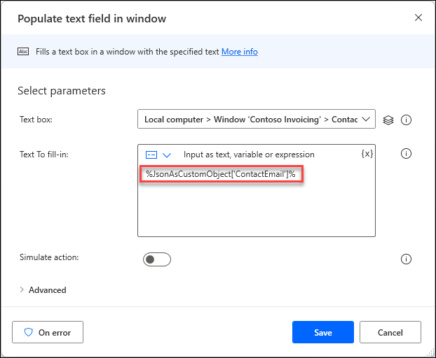](../media/work-queue-replace-populate-text-field-window-contactemail.png#lightbox)

	> [!div class="mx-imgBorder"]
	> [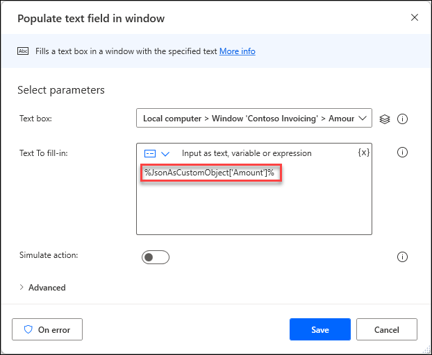](../media/work-queue-replace-populate-text-field-window-amount.png#lightbox)

1. If there's a **Breakpoint** on line 16, remove it. Select **Save** and **Run** one final time to see all of the work queue items processed by this flow.

	> [!div class="mx-imgBorder"]
	> [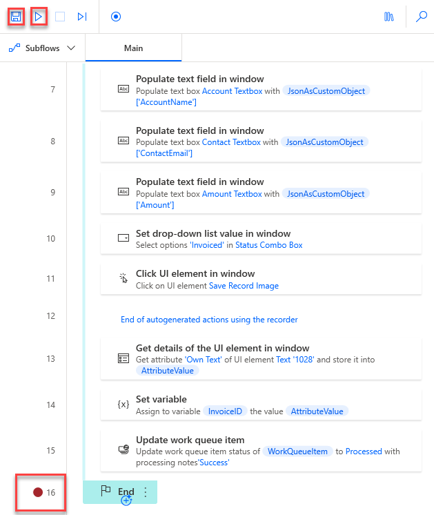](../media/remove-breakpoint.png#lightbox)

1. Return to the Power Automate cloud portal and notice the completed work queue item runs in the **Invoice** work queue.

	> [!div class="mx-imgBorder"]
	> [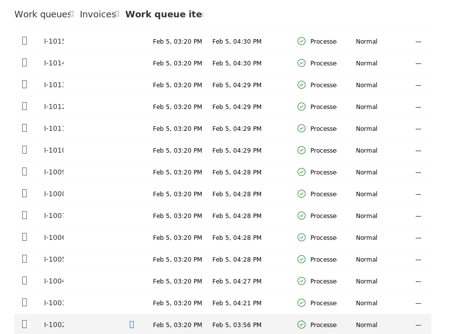](../media/work-queue-items-run-list-full-success.svg#lightbox)