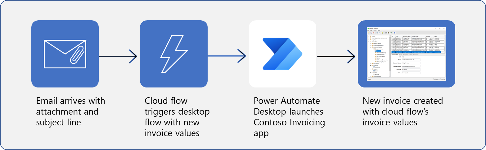

Creating a desktop flow enables you to automate tasks that use legacy applications on your desktop. This approach reduces the number of repetitive tasks that you perform daily, allowing you to redirect your focus toward creative or strategic tasks instead. However, manually initiating the trigger for your desktop application can be difficult, particularly if you're unavailable or incapable of doing so. Ideally, an event from your typical work process will trigger the start of your desktop flow. You can accomplish this task by building a cloud flow that's connected to a program, such as Microsoft Outlook, to trigger your process. 

**Create a new invoice in the Contoso Invoicing application from a received email.**

In this module, you'll:

- Create a new solution to package the complete invoice processing solution.

- Create a new cloud flow that initiates the invoicing process through the receipt of an email.

- Integrate an invoicing desktop flow into a new cloud flow.

- Test the new cloud flow.
