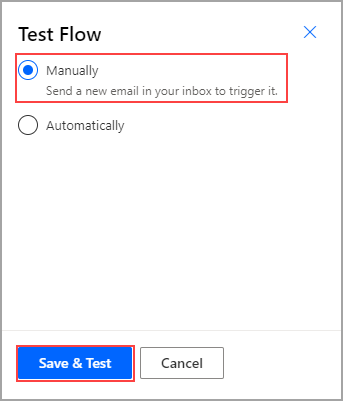
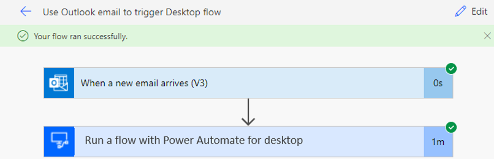

The simplest way to build robotic process automation (RPA) is to take one small step at a time and then build and test that step. First, you created the desktop flow to perform actions on the invoicing app. Second, you created the input and output variables, or the information that would change whenever the flow ran. Then, you set up a gateway and built a cloud flow that will allow you to connect to the other resources that exist in your organization. Finally, you've created a solution and a trigger starting in Outlook. Now, you'll test these new steps to ensure that everything is performing as expected.

Watch the following demo video of the steps that you'll complete in this unit.

 > [!VIDEO https://www.microsoft.com/en-us/videoplayer/embed/RE5cDAl]

Select **Test** in the upper-right corner of the screen. Select the **Manually** option and then select **Save & Test**.

> [!div class="mx-imgBorder"]
> 

Open the Power Automate for desktop application and then send yourself an email with an attachment and a subject line of **New invoice**. The flow will appear, with indications on each step to show where your flow is in the process. Avoid interacting with your mouse or keyboard while the flow is running because it might interrupt the process. When testing is complete, the following screen will appear to indicate that your flow ran successfully.

> [!div class="mx-imgBorder"]
> 

Now, you've completed the process to build a solution with a cloud flow that's triggered with Outlook.
