In this exercise, you'll Use Microsoft Teams to get approvals.

1. Open a new web browser and go to [Power Automate](https://powerautomate.microsoft.com/?azure-portal=true). Sign in if needed.

1. Select **Solutions** from the left menu and then open the **Invoice processing solution First Last**.

   > [!div class="mx-imgBorder"]
   > [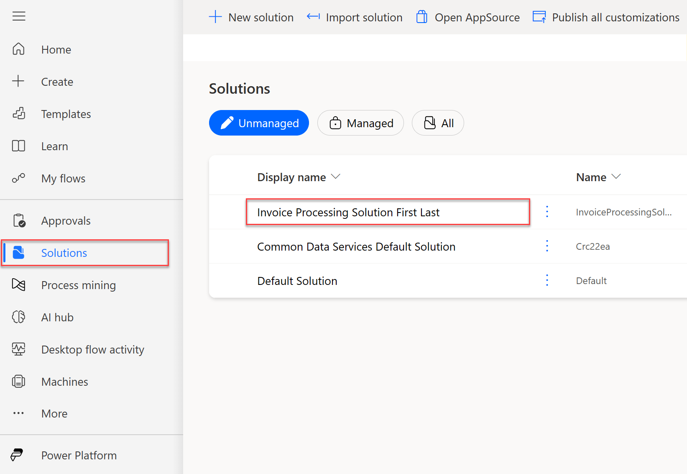](../media/solutions.png#lightbox)

1. Open the **Enter invoice information flow** that you created.

   > [!div class="mx-imgBorder"]
   > [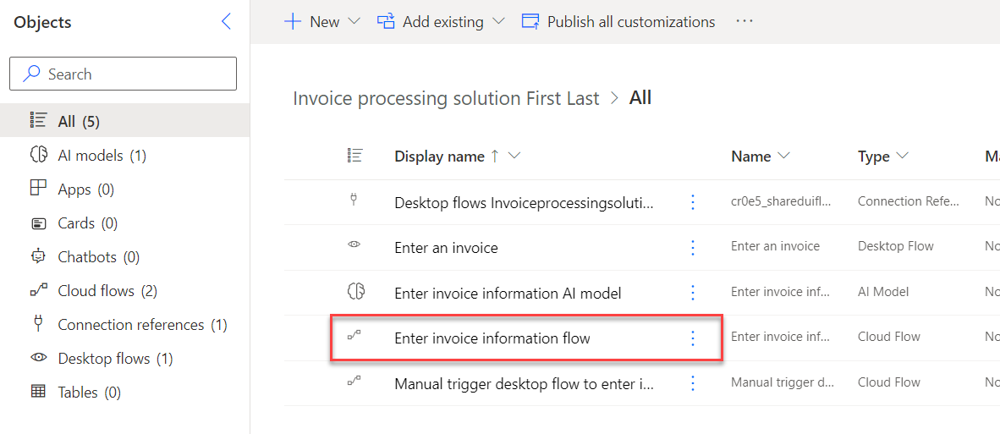](../media/enter.png#lightbox)

1. From the toolbar, select the **Edit** button.

   > [!div class="mx-imgBorder"]
   > [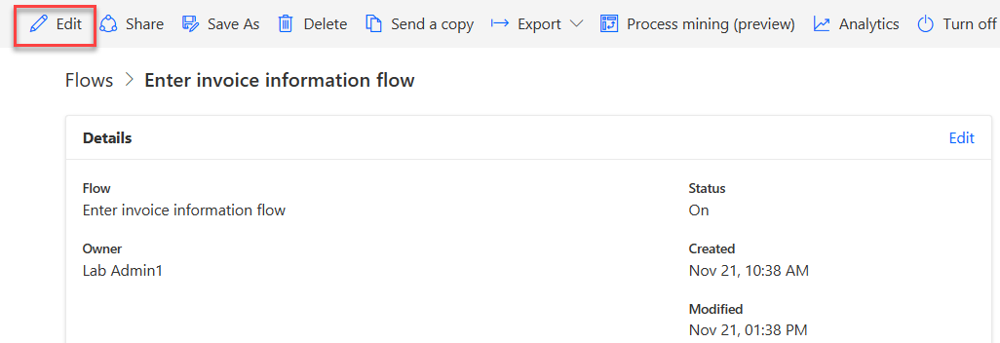](../media/toolbar-edit.png#lightbox)  

1. Expand the **Apply to each** box. Select the **Send an email (V2)** action, and after the parameters box pops up, select the ellipsis (**...**) and select **Delete** from the options menu.

   > [!div class="mx-imgBorder"]
   > [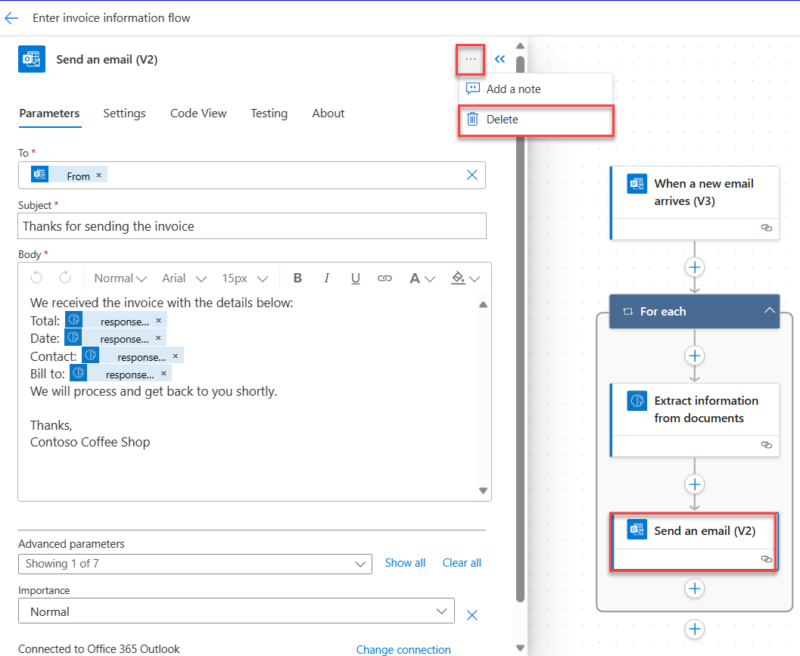](../media/delete.png#lightbox)

1. In the **Delete Step** dialog, select **OK**.

1. Below the **Extract information from documents** action, select **Add an action**.

   > [!div class="mx-imgBorder"]
   > [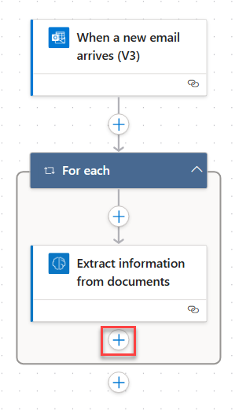](../media/add-new-action.png#lightbox)

1. In the search bar for the new action, search for `Teams post a choice`. From the search bar above the **Actions** list, then select **Post a choice of options as the Flow bot to a user** under the first **Microsoft Teams** set of actions.

   > [!div class="mx-imgBorder"]
   > [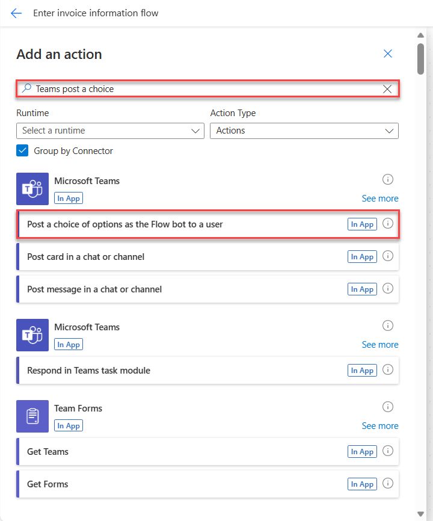](../media/post-choice-action.png#lightbox)

   > [!IMPORTANT]
   > You can take the next actions after following one of two approaches. In one approach, you can use a simple method that requires the **Post a choice of options as the Flow bot to a user** action. The other approach is to use a richer, more innovative approach that requires the **Post an Adaptive Card and wait for a response** action that uses the Adaptive Cards technology from Microsoft.

   > [!NOTE]
   > If you want to learn about the more advanced Adaptive Cards approach instead of using the basic approach, see the **Exercise - Advanced Power Automate Desktop features** unit near the end of the next module in this learning path. Otherwise, continue with the following steps.

1. A **Create connection reference** box will pop up only giving the option to sign-in. Select **sign-in** and use the same account as you've been previously using in the lab. 

   > [!div class="mx-imgBorder"]
   > [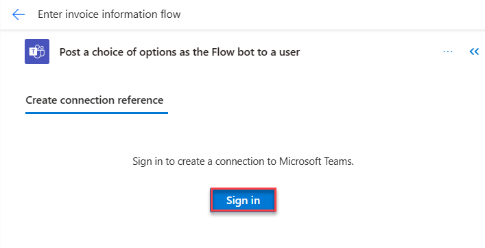](../media/sign-in.png#lightbox)

1. In the **Options Item - 1** box, enter `Yes`.

1. Select **Add new item**. In the **Options Item - 2** box, enter `No`. Then select **Show all** to see all of the parameters.

1. Use the following values to fill in the information for the **Recipient**, **Message**, and **Headline** boxes. Find the values for the **Message** field by searching for them within the **Dynamic content** pane (the blue lightning bolt button):

   **Recipient** - *Your username*

   **Message** - `We've received an invoice in the amount of` **Total value** *(from dynamic content under the **AI Builder** action)*`, on the date` **Date value** *(from dynamic content under the **AI Builder** action)*`. The contact person is` **Contact value** *(from dynamic content under the **AI Builder** action)*`. Would you like to approve this?`

   **Headline** - `Please approve this invoice.`

   > [!div class="mx-imgBorder"]
   > [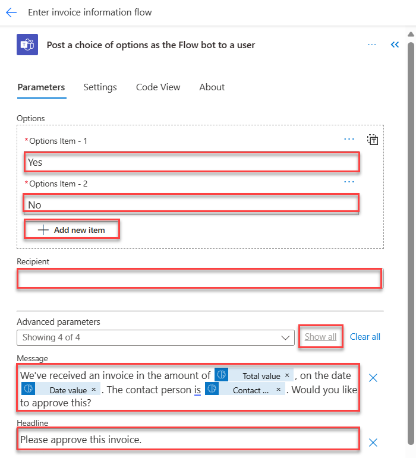](../media/message.png#lightbox)

1. Add a branch into your flow so that the automation will perform different action paths based on different approval return results. Select **Add an action**.

   > [!div class="mx-imgBorder"]
   > [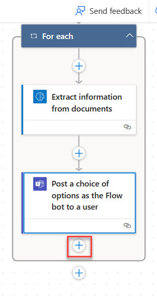](../media/add-action-again.png#lightbox)

1. In the search bar, search for `condition`. From the **Actions** tab, select **Condition**.

   > [!div class="mx-imgBorder"]
   > [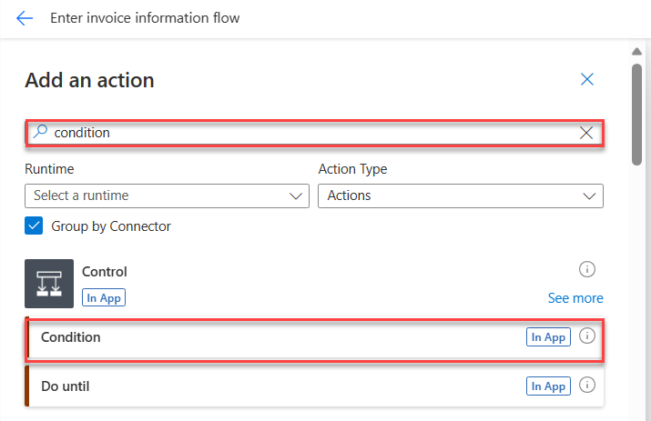](../media/add-condition.png#lightbox)

1. In the **Choose a value** field, select **selectedOption** (from dynamic content, under the previous action of ***Post a choice of options as the Flow bot to a user***).

   > [!div class="mx-imgBorder"]
   > [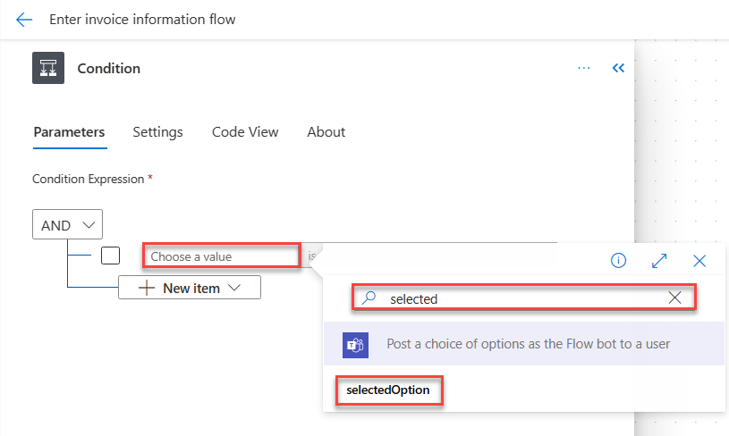](../media/selected-option.png#lightbox)

1. In the **Choose a value** field, enter the value of `Yes`.

   > [!div class="mx-imgBorder"]
   > [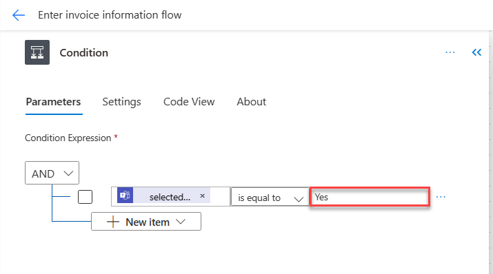](../media/condition-final.png#lightbox)

1. Navigate back to the flow model and select the **+** sign under **True**. Then select **Add an action** in order to add an action.

   > [!div class="mx-imgBorder"]
   > [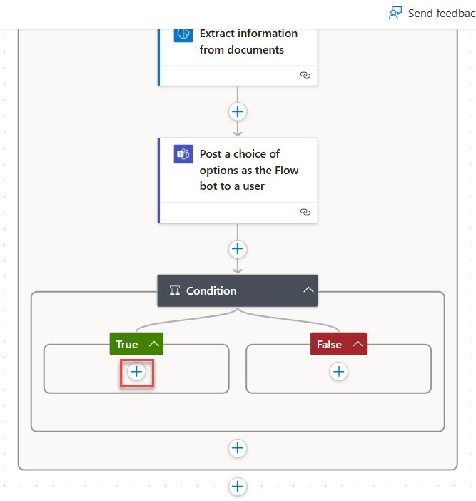](../media/add-true.png#lightbox)

1. In the **Add an action** dialogue pane, select the **search bar** and type in `run a flow`. Then select the **Run a flow built with Power Automate for desktop** action located under **Desktop flows**.

   > [!div class="mx-imgBorder"]
   > [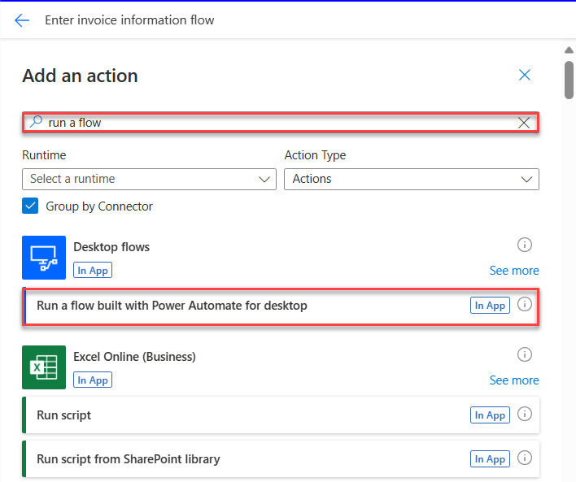](../media/run-flow.png#lightbox)

1. Select **Enter an invoice** from the drop-down menu in the **Desktop Flow** field. Next, select **Attended (runs when you're signed in)** from the drop-down menu in the **Run Mode** field.

   > [!div class="mx-imgBorder"]
   > [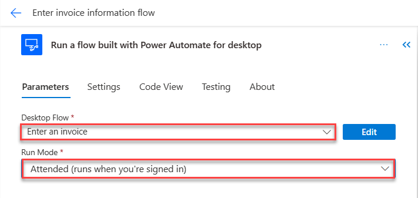](../media/parameters.png#lightbox)

1. The **Run a flow** step should be added. Select the **+** sign and **Add an action** to add another action to the flow.

   > [!div class="mx-imgBorder"]
   > [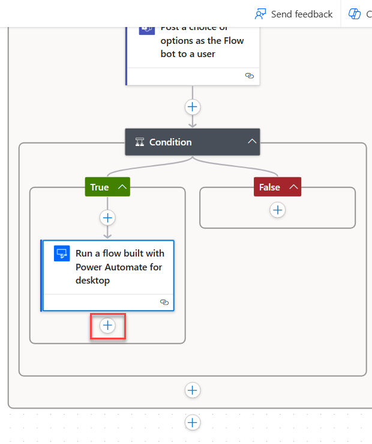](../media/add-another-action.png#lightbox)

1. Within the search bar, search for `reply to email`. Then, select the **Reply to email (V3)** action under the **Office 365 Outlook** group on the list.

   > [!div class="mx-imgBorder"]
   >   

1. Use the following information and value to fill in the fields within the new action.

   - **Message ID** - *Message ID (from dynamic content for the **When a new email arrives (V3)** action)*

1. Select **Show advanced options**.

   - **Body** - `Your invoice of amount` **Total value** (*from dynamic content under the AI Builder action*) `is approved.`

1. In the **Subject** field, enter `Your invoice is approved`.

   > [!div class="mx-imgBorder"]
   > [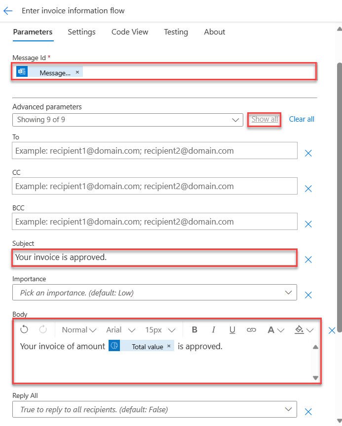](../media/more-parameters.png#lightbox)

1. **Collapse** the actions in the **If yes** branch by selecting the titles of the actions.

   Next, create the steps for the case if the approval result was **No**.

1. Select **Add an action** under the **False** branch.

   > [!div class="mx-imgBorder"]
   > [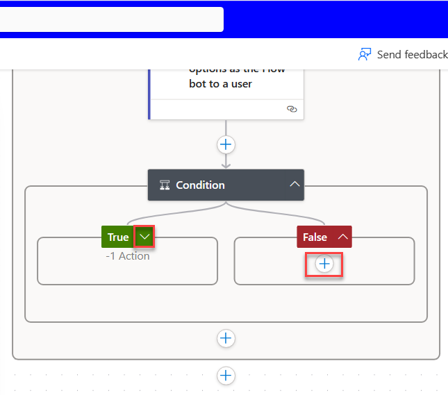](../media/if-no.png#lightbox)

1. Within the search bar, search for `reply to email`. Then, select the **Reply to email (V3)** action under the **Office 365 Outlook** group on the list.

   > [!div class="mx-imgBorder"]
   > 

1. Use the following values and information to fill in the fields in the newly added action. Use the **Dynamic content** pane to search for specific values that are needed for some fields.

   - **Message ID** - *Message ID (from dynamic content for the **When a new email arrives (V3)** action)*

1. Select **Show advanced options**.

   - **Body** - `Your invoice of amount` **Total value** (*from dynamic content from the AI Builder action*) `was rejected.`

1. In the **Subject** field, enter `Your invoice is rejected`.

   > [!div class="mx-imgBorder"]
   > [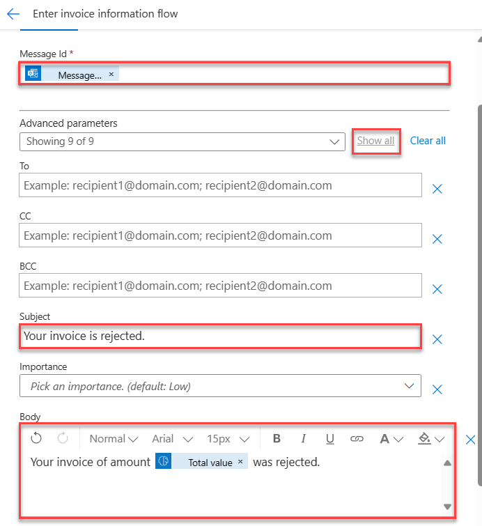](../media/invoice-rejected.png#lightbox)

1. From the toolbar, in the upper-right corner, select **Save**. Then, select **Test**.

   > [!div class="mx-imgBorder"]
   > [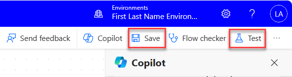](../media/test.png#lightbox)

1. On the **Test Flow** pane, select **Manually > Test**.

1. In a separate web browser tab, open the **Microsoft Teams** app (browser version, not desktop) and then sign in by using the same test account. You can find the web version of Microsoft Teams by going to [https://teams.microsoft.com](https://teams.microsoft.com/?azure-portal=true).

1. In another separate web browser tab, open the **Office 365 Outlook** app. You can find the web version of Microsoft Outlook by going to [https://outlook.office.com/mail](https://outlook.office.com/mail/?azure-portal=true).

1. In Outlook, compose a new email with the following settings:

   - **To** - *(email address of the user identity that you're using in this module)*

   - **Subject** - `New invoice`

   - **Attachments** - new-invoice.jpg *(from the module resource files)*

   > [!div class="mx-imgBorder"]
   > [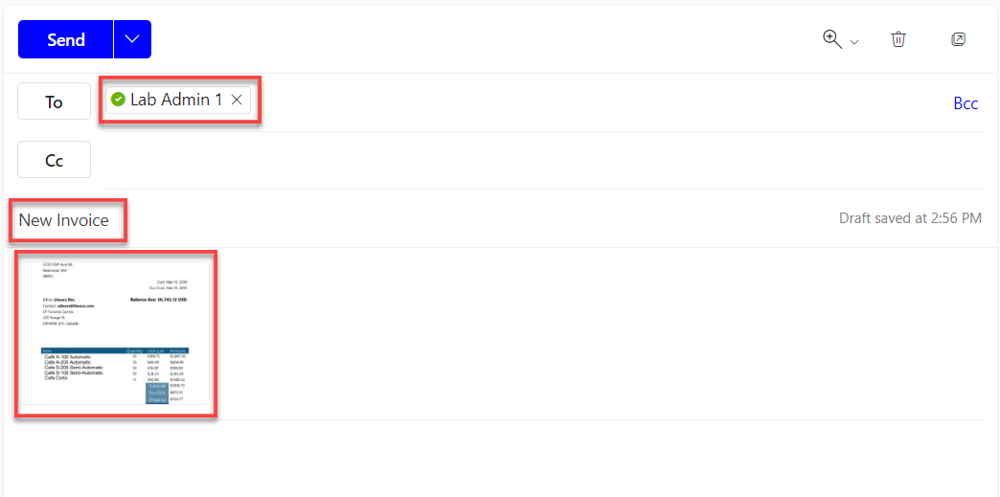](../media/email.png#lightbox)

1. Send the email and then wait for the flow to run.

1. Wait for an **approval request Adaptive Card** to appear in the **Teams** tab. Select **Yes** or **No**, and then select **Submit** to approve or reject the invoice as desired.

   > [!div class="mx-imgBorder"]
   > 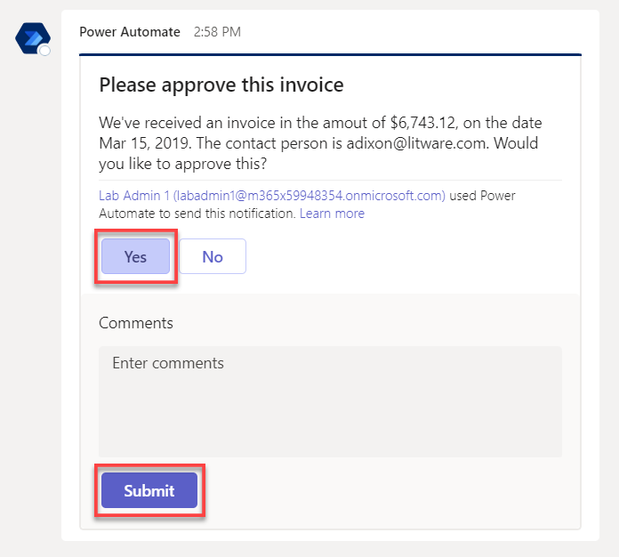

1. On the **Outlook** tab, check for a confirmation email that matches the option that you selected.

   > [!div class="mx-imgBorder"]
   > [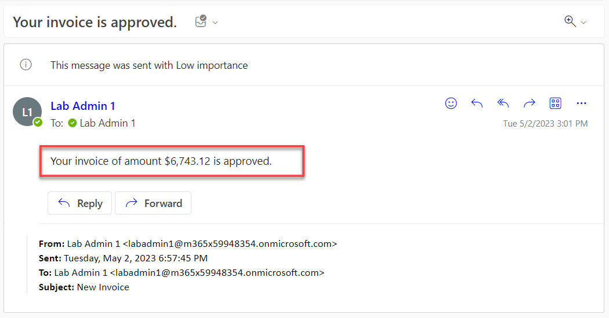](../media/confirm.png#lightbox)

1. Repeat the test by using the other test case (accept or reject).

1. Similar to previous modules, you can monitor the run status from the flow details page and run details page. Return to the **Enter invoice information flow**. Your flow should have run successfully.
