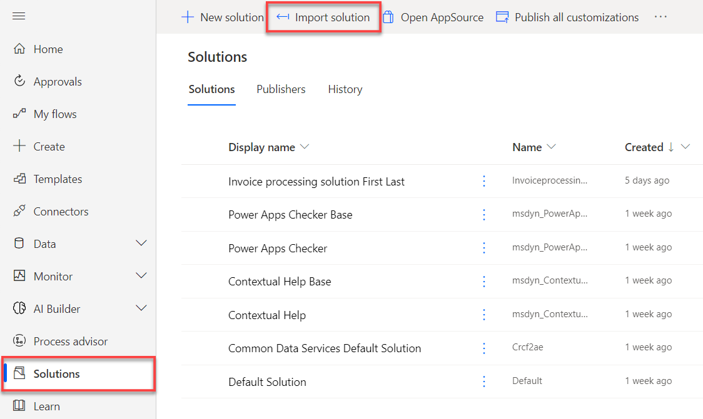
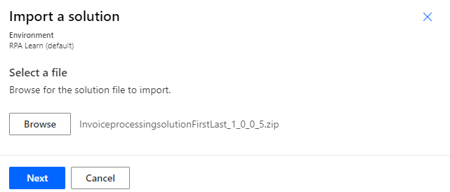
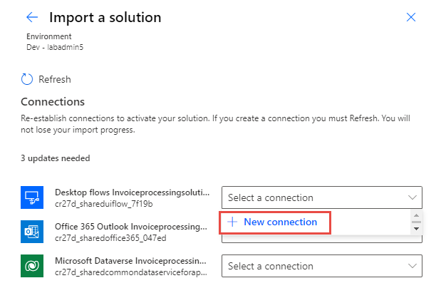
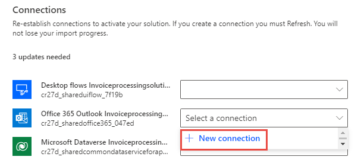
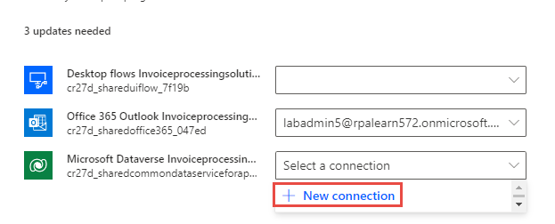
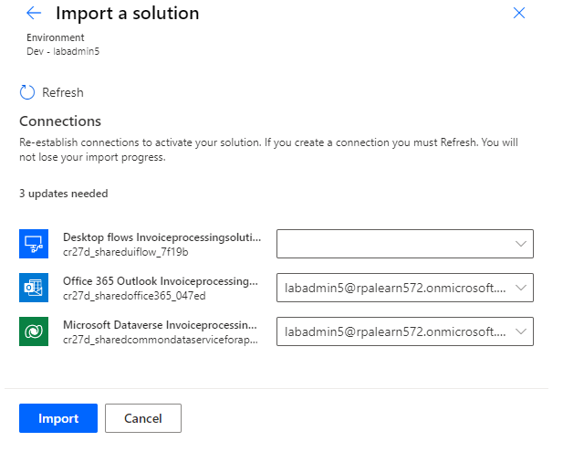

If you've already completed the module **learn-bizapps.add-ai-model-process-invoice-online-workshop**, skip to the next task.

To import the solution, follow these steps:

1. Go to [Power Automate](https://powerautomate.microsoft.com/?azure-portal=true) and select the correct environment.

1. Select **Solutions** and then select **Import solution**.

   > [!div class="mx-imgBorder"]
   > 

1. Select **Browse**.

1. Select the **InvoiceprocessingsolutionFirstLast_1_0_0_5.zip** solution file located in the resources folder and then select **Open**.

1. Select **Next**.

   > [!div class="mx-imgBorder"]
   > 

1. Select **Next** again.

1. Select **New connection** for the desktop flow.

   > [!div class="mx-imgBorder"]
   > 

1. Select **Direct to machine**, select the machine that you registered in the module **Install required software - Online workshop**, provide your sign-in information, and then select **Create**.

   > [!div class="mx-imgBorder"]
   > 

1. Close the connections browser window or tab.

1. Select **Refresh**.

   > [!div class="mx-imgBorder"]
   > 

1. Select **New connection** for Office 365.

   > [!div class="mx-imgBorder"]
   > 

1. Select **Create**.

1. Provide your credentials.

1. Close the connections browser window or tab.

1. Select **Refresh**.

1. Select **New connection** for Microsoft Dataverse.

   > [!div class="mx-imgBorder"]
   > 

1. Select **Create**.

1. Provide your credentials.

1. Close the connections browser window or tab.

1. Select **Refresh**.

1. You should now have desktop flow, Office 365, and Microsoft Dataverse connections. Select **Import**.

   > [!div class="mx-imgBorder"]
   > 

1. Wait for the solution to import.
