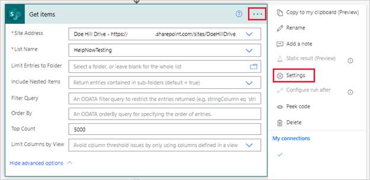
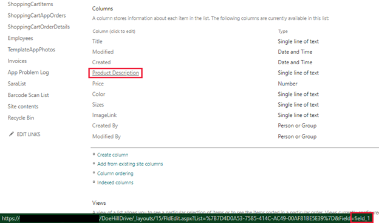

In this unit, we learn how to use OData (Open Data Protocol) filters when querying SharePoint lists and document libraries.

## Why use an OData filter?

Why would you want to use OData filters for SharePoint? Well, by default, the **Get items** action for lists or the **Get files** action for libraries only retrieves the first 100 items or files from SharePoint if you don't specify a **Top Count** or **Threshold** value. Though you can specify a **Top Count** of up to the default threshold throttling limit of 5000 items, if your list or library has greater than 5000 items or files, it doesn't return all your data using an entry under Top Count. Therefore, filtering your query helps you create results that are under the threshold limits.

Attempting to enter a number greater than 5000 results in a flow failure when you attempt to run it.

## Understand action settings for large lists or libraries

If your list or library that has greater than 100 items or files and up to 5000 items, then all you need to adjust is the **Top Count**. In Top Count, you can enter a value up to the default threshold limit of 5000. The threshold limit is meant to keep this step from ever returning more than 5000 items. Top Count is a performant way to retrieve up to 5000 items from your data.

If your list or library has more than 5000 items, or your query returns more than 5000 items, you need to enable the step's **Pagination**. What is Pagination? Each time the **Get items** action fetches values, it gets 100 items at a time. Just like if you scroll through your SharePoint list or library, you get to the bottom of the viewable items and SharePoint fetches another 100 items. So, pagination enables the fetching process (in batches of 100 items) to continue well beyond that. Bear in mind though, that Pagination takes time and slows down your flow. With Pagination enabled, your action repeats this process to return the manually entered value of the Threshold total (another necessary entry that we'll discuss momentarily).

To find the Pagination setting, select the ellipsis in the right corner of your Get items or Get files action to view the **Settings**.

> [!div class="mx-imgBorder"]
> 

On the action settings panel, toggle the **Pagination** option to **On**, and then here you must enter a value for **Threshold**. Pagination can return from 1 all the way through 100,000 items from your data source, but you only need to set it for the number of items you expect to return. Finally, select **Done** to return to the normal settings.

The **Threshold** setting in the settings panel is a little difficult to comprehend but look at it like this. It should match the number of items you *expect* to receive from your query, but it can't return more than 100,000 items. For example, if you set your Threshold for 500, and you have 2000 items matching the query, you only receive 500 items. In the same case, if you set your Threshold for 2000 you get all 2000 of the items you expect.

Why is this important? Why shouldn't you just max out the values for Top Count (5000) and Threshold (100000)? Because asking Power Automate to paginate takes time and slows your flow. If you can get all the data you expect with a Top Count value of 2500 (for example), there's no need to toggle Pagination and apply the maximum value to the threshold to continue to paginate all the way through your data.

One more thing to consider before we move on, always set the Top Count at 5000 if you expect to return more than 5000 items. Top Count is a quick way to return the first 5000 items and Pagination picks up at the end of that first 5000 items. They work in concert. Pagination by itself certainly works, but it has to continue fetching 100 items at a time to get the same work done.

## How to use OData in your filter query

Now that we've made a case for filtering your data, let's learn how to use OData filtering. When you're using OData filtering in your queries, the pattern in the **Filter Query** field is based on the type of data in the column. Let's start with a filter by a column. If the column value equals a string, we can use a filter that looks like this:

`StringColumn eq 'text'`

See how the OData statement uses the abbreviation **eq** for equals? That's OData code for the equals operator. Also, notice how our string value has single quotes around it.

We could use the same OData operator for a column with numeric value such as:

`NumericColumn eq 3`

Notice that when we're comparing numeric values, we don't need to use single quotes.

SharePoint doesn't perform every operation Power Automate asks it to do because of delegation constraints, meaning that SharePoint only performs certain types of query filters on its own. Here are the OData operators you can use to prompt SharePoint filtering:

| Operator | Abbreviation | Syntax |
|----------|--------------|--------|
| Equals | eq | `StringValueColumn eq 'text'` (or `NumericColumn eq number`) |
| Not equals | ne | `StringValueColumn ne 'text'` (or `NumericColumn ne number`) |
| Less than | lt | `NumericColumn lt number` (or `DateValueColumn lt date`) |
| Greater than | gt | `NumericColumn gt number` (or `DateValueColumn gt date`) |
| Less than or equal to | le | `NumericColumn le number` (or `DateValueColumn le date`) |
| Greater than or equal to | ge | `NumericColumn le number` (or `DateValueColumn le date`) |
| Starts with | startswith | `startswith(StringValueColumn, 'text')` |
| Substring of | substringof | `substringof('text', StringValueColumn)` |
| And | and | `FilterFormula and FilterFormula` |
| Or | or | `FilterFormula or FilterFormula` |

## Walk through text equals filter

Let's walk through an example together. Find a SharePoint list with multiple items that you can use, and then open a separate browser instance to the [Power Automate maker portal](https://make.powerautomate.com/?azure-portal=true).

1. From the Home screen of the Power Automate maker portal, select the **Create** tab from the left-side navigation menu.

1. Select **Instant cloud flow** from the options at the top.

1. Select **Manually trigger a flow** > **Create**.

1. Add a step under your trigger and search for *sharepoint*.

1. Find and select the SharePoint **Get items** action.

1. Add your SharePoint **Site Address**. This is the home page URL of the site where your SharePoint list resides. If you don't see your SharePoint list name in the dropdown for Site Address, you can grab your SharePoint site's home page by selecting **Home** from the left-side navigation rail, then copy the URL from your browser. Back in Power Automate, select the dropdown option to **Enter custom value** and paste your SharePoint home page URL.

1. Under **List Name** find and select the SharePoint list name from the dropdown.

1. Expand **Show advanced options** and find the **Filter Query** field. Notice that the hint text (you can view the entire hint by hovering over the field) tells you that it expects an ODATA filter statement, and it even provides syntax examples.

1. Let's start by filtering a SharePoint text value column using the equals (eq) function. Pick one of your columns that has text values under it. For the formula, enter in your column name **eq** and then a value from under that column within single quotes. Enter an exact value in the quotes that exists in the column data.

   If you don't match the column name/value exactly, the filter doesn't work. To see the values of your column names, you can navigate to your SharePoint list's **List Settings** by selecting the settings icon, then hover over the column name and look for the name of that column at the bottom of the screen. As you hover over the name, a URL appears with an equals sign and then your column name.

   See our example below. Our SharePoint column is called **Product Description** but the actual name in the data is *field_1*, so that's the name we would need to input for the column name.

   > [!div class="mx-imgBorder"]
   > 

1. So that we can see how many items return with our filter, let's add one more action under the **Get items** action. Add a **Compose** action. Select the **Inputs** field and switch to the **Expression** tab. Add the following formula in the Expression entry field:

   `length(outputs('Get_items')?['body/value'])`

   This action counts the number of rows that our **Get items** action returns.

1. Select **Update** to save this value.

1. Now let's test our flow. Select **Save** > **Test** > **Manually** > **Test**, and then once your connection is verified, select **Run flow**.

1. Once the flow has run, expand the **Compose** action in the flow results and view how many items returned. Was that what you were expecting? If you tested with a large list of items with more than one item matching your criteria, you may have returned only 100 items.

If your filter didn't quite work, check and make sure that you have the column name exact and the matching data exact within single quotes.

## Use the Top Count

Using the same flow, let's see what using Top Count does for us. Top Count is a great way to test if your list is filtering correctly, since you can limit the data returned to a few items and quickly view this data once the flow has run.

1. Put your flow back in **Edit** mode.

1. Expand the **Get items** action and select **Show advanced options**.

1. In the field to the right of **Top Count**, enter 1.

1. Test run your flow again.

   > [!TIP]
   > When testing your flow, you can use the option **Automatically** with a previous run, to quickly re-run the flow with fewer button clicks.

1. In the run results screen, if you expand your Compose action it should reflect the value of 1 in inputs/outputs.

1. If you expand your Get items action, you can select **Click to download** to portray the JSON code of your returned item.

1. Put your flow back into **Edit** mode, again.

1. Enter a top count value of what you expect to see in your query (up to 5000), but not larger than the number of items in your list.

1. **Save** and **Test** your flow, again. Did you get the results you were expecting? If not, go back and check your values, and try again.

## Use pagination

To test pagination, you need to have a list that is more than 100 items, since the **Get Items** function fetches 100 items at a time. A list with 101-200 items would call two fetches. Remember, you don't really need pagination if you expect to return 5000 items or fewer, Top Count is far more performant. But this provides you with the experience of how it works.

1. Put your flow into **Edit** mode again.

1. Erase whatever value you have for **Top Count** so that Top Count is blank. Realistically, you would always use Top Count for your filter because it can quickly call your first 5000 values. But in this case, we hope to demonstrate how pagination works, and how slow it can be on its own.

1. Go to the settings of the **Get items** action.

1. Toggle **Pagination** to **On** and enter the number of items you expect to retrieve in the **Threshold** input field.

1. Select **Done**.

1. **Save** and **Test** your flow. If you have a large list, notice that it takes the flow a long time to run. Imagine scrolling through your entire SharePoint list 100 items at a time!

## In summary

Hopefully you've gained a basic understanding of:

- Filtering SharePoint lists using OData filtering,

- Why you would want to filter SharePoint,

- And how you can modify your SharePoint actions to return the data you want.
