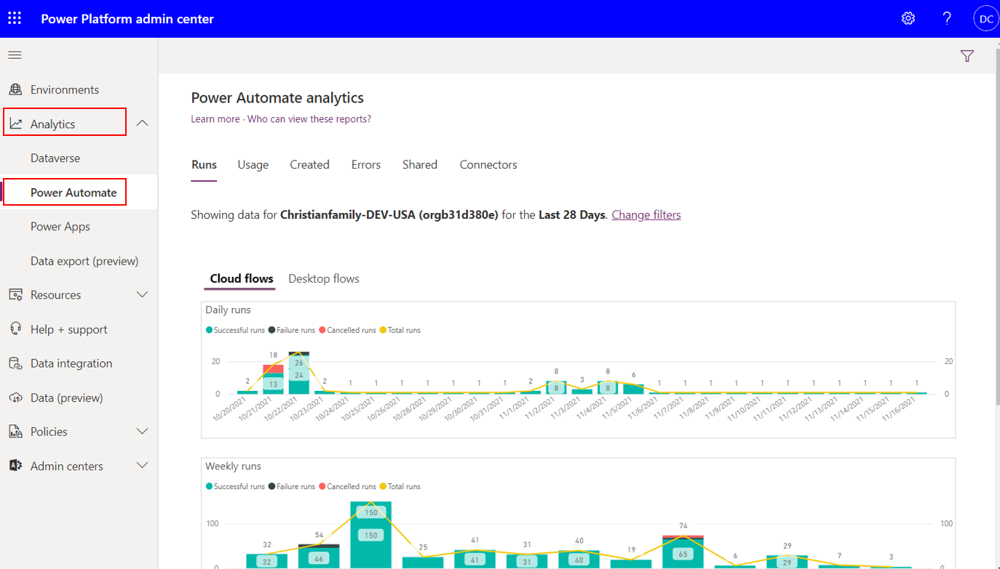
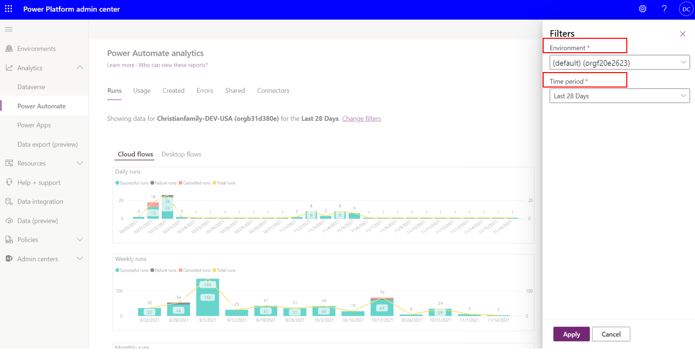
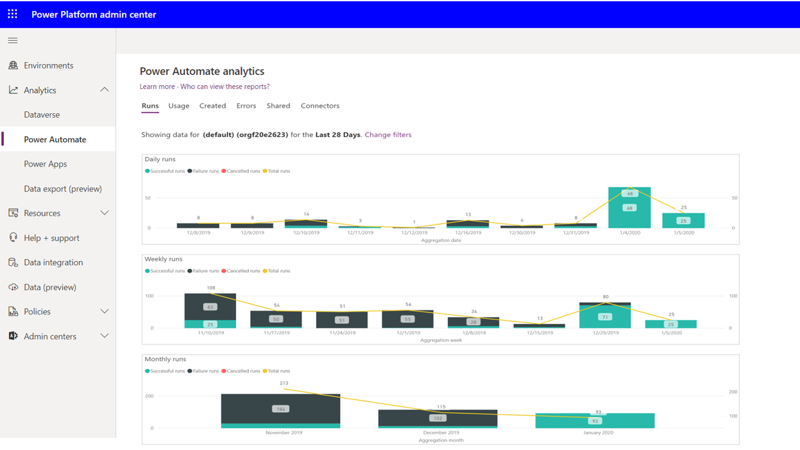
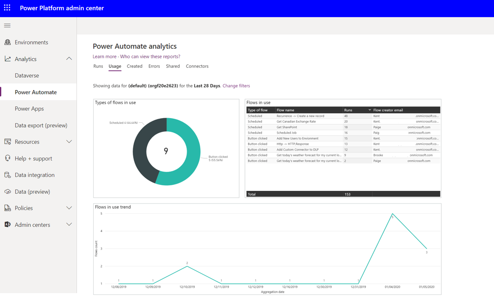
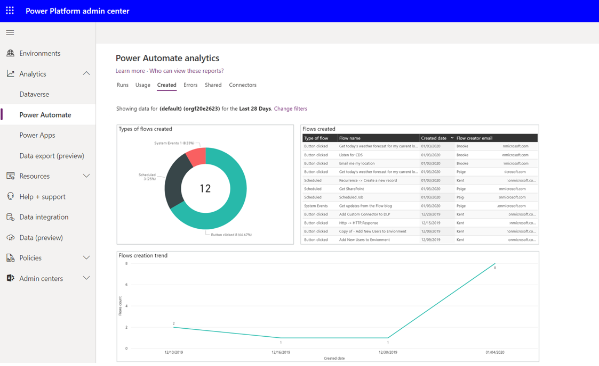
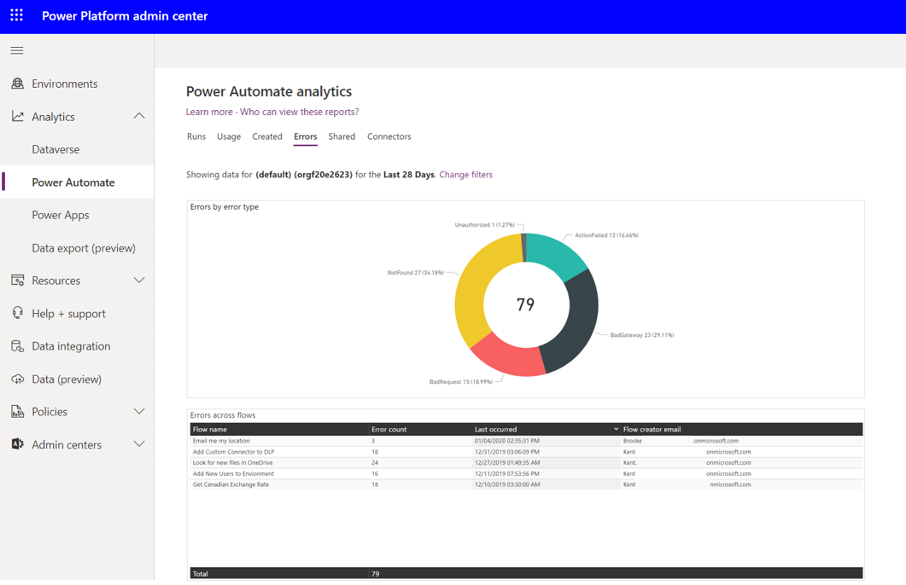
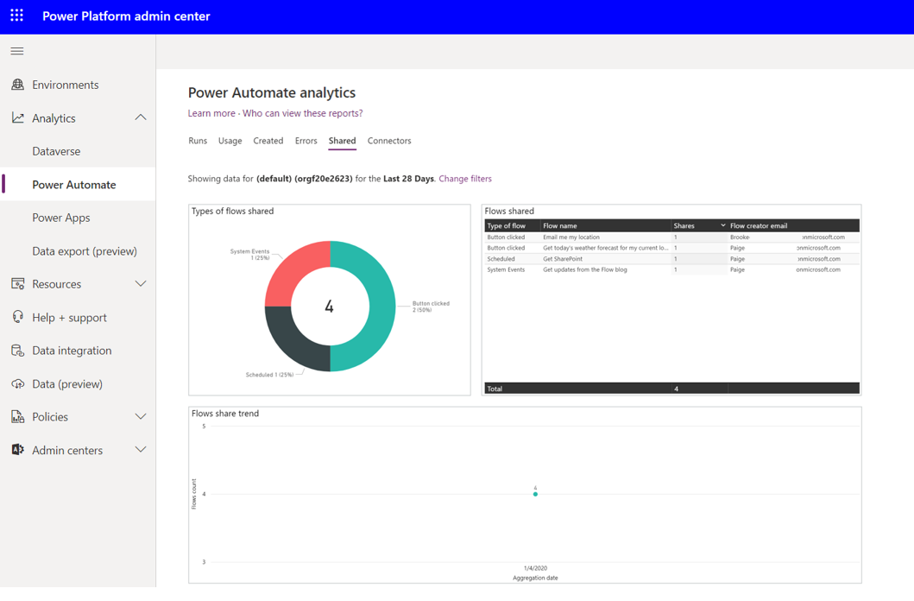
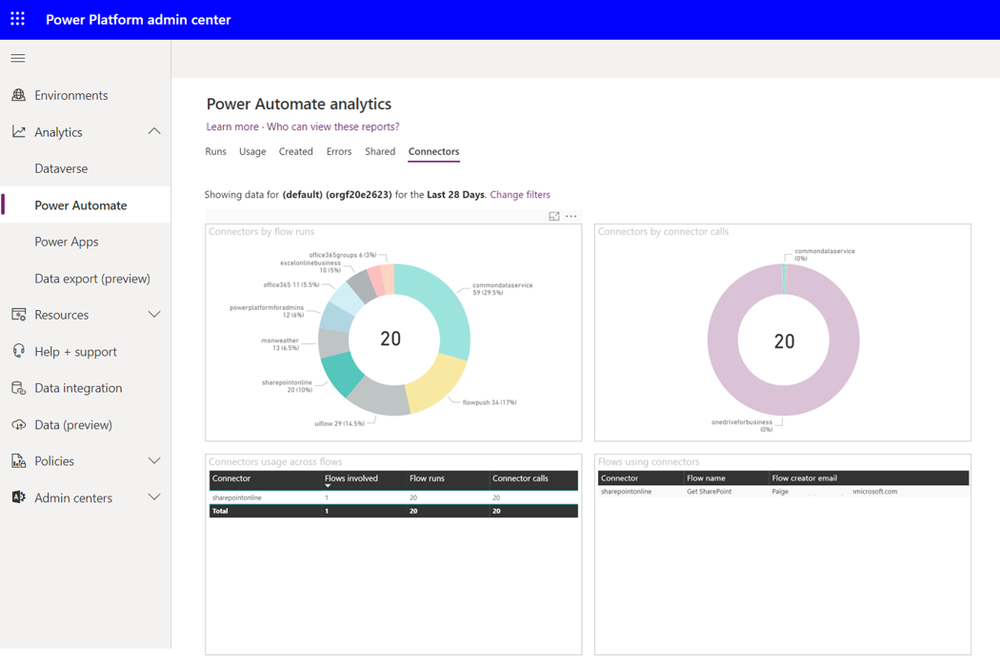

Previously, you learned about the steps that you can take to support communicating with users when you're ready to make governance changes. However, it's important to understand the impacts of an upcoming change before sending out communications. Microsoft Power Platform Admin Analytics feature can help administrators understand how Power Automate is being used in your organization to help you avoid undesirable impacts.

Six Power Automate reports are available in Microsoft Power Platform Admin center:

- Runs

- Usage

- Created

- Errors

- Shared

- Connectors

Administrators can use these reports to gain insight into how people are using Power Automate.

To access the Admin Analytics feature, go to the [Microsoft Power Platform Admin Center](https://admin.powerplatform.microsoft.com/?azure-portal=true) by using an account that has environment or tenant admin privileges. After you have signed in, expand the **Analytics** drop-down menu from the left navigation pane and select **Power Automate**.

A tenant administrator will be able to see analytics on an environment-by-environment basis. Environment administrators will only see analytics for the environments that they're admins in. To change the environment, an administrator can select the filter icon in the upper-right corner of the **Admin center** page, where they can select their desired **Environment** and the **Time period** that they want to see analytics for.

Microsoft Power Platform Admin center will store analytics for up to 28 days, but administrators can filter based on the last 14 and 7 days. In addition, the analytics aren't aggregated in real time. Administrators can expect up to a three-hour delay before the latest analytics are published.

Within the **Runs** report in the Power Automate Analytics feature, administrators will be able to determine the number of flow runs within that environment for each day, week, and month. In addition, Power BI embedded slicers allow an administrator to filter data based on whether the run was successful, failed, or canceled.

For organizations that are adopting Power Automate, this report can provide insights that help determine the level of adoption within the organization. People who are responsible for change management can use this data to help support training and adoption campaigns by being able to show measurable progress.

The **Usage** report outlines the types of flows in use, including whether the flow is **Scheduled**, **Button clicked**, or **System Events** driven or not. In addition, for each flow in use, the number of runs is aggregated so an administrator can see how frequently the flows run and what is the most frequently run flow. The **Flow creator email** is also captured so that if an administrator needs to contact this person, they have the correct email address. The **Usage** report also includes a trend that highlights the number of unique flows in use each day based on the **Time period** filter.

When you're looking to identify new flows, the **Created** flow report will identify these new assets. These flows will be broken down by their type: **Scheduled**, **Button clicked**, or **System Events**. The flows that have been recently created will also be listed in a table that includes the **Created date** and the **Flow creator email** address information. Additionally, this report displays a trend of when these flows were created.

The **Created** report is useful for people who are responsible for change management. Perhaps the organization has recently provided Power Automate training and wants to see if people are putting these new skills to use.

For administrators, detecting when makers are experiencing errors with their flows can become a great concern if a flow continues to fail and supports an important business process. The **Errors** report will help administrators identify flows that are failing and will display the **Error count**, the **Last occurred** timestamp, and the **Flow creator email** information. In addition, a pie chart will break down the error types that will highlight the different types of errors that makers have been experiencing.

The **Shared** report will identify the types of flows shared, including **System Events**, **Button clicked**, and **Scheduled**. In addition, a table will be displayed that includes the **Flow name** that was shared, the number of **Shares**, and the **Flow creator email** information. This report also displays a trend of what day the flow was shared on within the configured time period.

The **Shared** report is useful for identifying makers who are sharing their work with others within the  organization. These makers are often referred to as champions who should be empowered so they can drive further business results.

Often, **Connectors** is the most important report to consider when evaluating DLP changes. The **Connectors** report identifies all the connectors that have been involved in flow runs and how many connector calls have been made. Much like you would expect with a Power BI embedded experience, an administrator can filter out connectors as required.

Let's dive into a scenario: Imagine an administrator who's planning to make some changes to a DLP connector, particularly the SharePoint connector. They start by clicking on the SharePointOnline connector in the Connectors by flow runs section. As if by magic, the Connectors by connector calls section get an update. And guess what? There's a brand-new table on the block called 'Flows using connectors.' This table spills the beans on all the flows that rely on the SharePoint connector, along with the email addresses of the folks who created them. This intel is like a treasure map, showing you all the makers you should talk to before messing with DLP.

The **Connectors** report isn't interesting; it's incredibly useful for keeping things in check and managing change. It's like a superhero cape for administrators, helping them spot connectors that might not be the best fit for the organization. They can then have a friendly chat with the folks using those connectors to understand why and figure out if there's a better way.

And here's the flip side: If an administrator finds a connector that's getting much attention, say Microsoft Forms, they might want to spread the word. It's like discovering a hidden gem and wanting to share it with the whole organization to unlock even more benefits.

