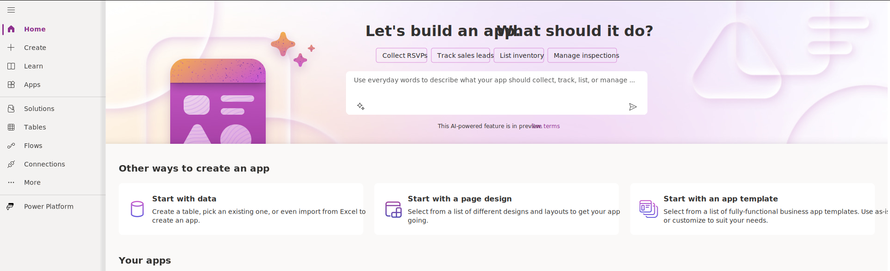
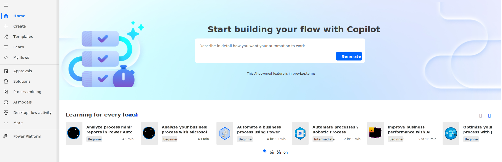
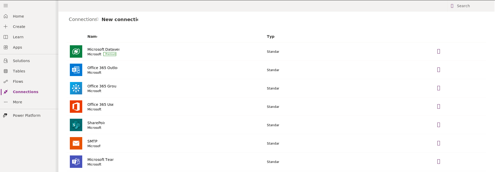
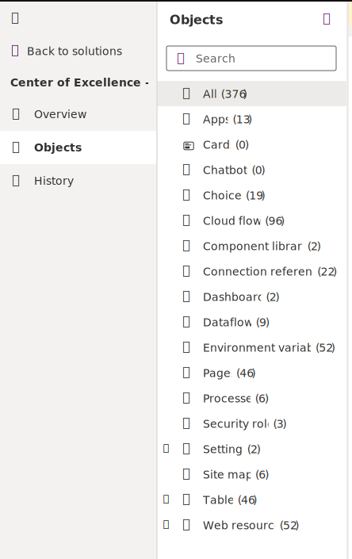

Solutions allow you to package features, such as apps in Microsoft Power Apps (canvas and model-driven), site maps, flows, entities, forms, custom connectors, web resources, choices, charts, and fields, to transport from one environment to another. Only the metadata, such as entities and their columns and configuration data, are transported. No business data is transported.

Solutions are part of the overall application lifecycle management (ALM) practice of Microsoft Power Platform. Solutions are important mechanisms for implementing ALM. For more information, see [Solutions for implementing ALM](/power-platform/alm/overview-alm/?azure-portal=true).

## Learn the basics

### Power Apps

> [!div class="mx-imgBorder"]
> 

Power Apps is a user-friendly platform that lets you create apps without needing to be a coding expert. It's a bit like working with Excel formulas, such as SUM and TEXT, which many people are familiar with. With Power Apps, you can make simple tools like vehicle inspection forms and status reports, or more complex solutions for tasks like managing purchases and inventory. If you have an idea for an app that could solve a business problem, you can bring it to life using your existing skills. While Power Apps is designed for business users who aren't tech experts, it also offers advanced features for experienced developers to build intricate applications effortlessly.

Power Apps gives you three types of apps to choose from: canvas, model-driven, and portals, depending on your needs.

Canvas apps are perfect when you want to start from scratch and create an app on a blank canvas. You pick the screen size (tablet or mobile), and you get a clean slate to work with. You can connect your app to data sources, drag and drop various elements, and make it work the way you want using Excel-like formulas. Canvas apps provide the ultimate flexibility for app building.

Model-driven apps are built around data stored in Microsoft Dataverse. Power Apps automatically generates a fully functional app for tasks like adding, editing, and viewing data. These apps are responsive, meaning they adapt to work on both mobile and tablet devices without extra effort on your part. You can define relationships, forms, views, business rules, and more at the data level in Dataverse, giving you control without needing to write all the formulas yourself.

Portals let you create websites for external users without any coding skills. Using the Power Apps interface, you can build anonymous or authenticated websites that allow people to interact with data stored in Dataverse. It's as easy as dragging and dropping elements, just like when you're building apps.

### Power Automate flows

> [!div class="mx-imgBorder"]
> 

Microsoft Power Automate, formerly known as Flow, is a handy tool that lets you create workflows. These workflows can be set up to run automatically or started by a user when needed. You have various options to get started, like using ready-made templates that might fit your needs perfectly or require just a few tweaks. You can also create workflows using a Microsoft Visio template, a user-friendly interface (UI), or business process flows.

The design feature in Power Automate is easy to use. Sometimes, sketching out your workflow on a Visio diagram can help you plan a more efficient workflow. That's why Power Automate can be integrated with Visio. In Visio, you can use BPMN Basic Shapes to map out your flow, export it, and then import it into Power Automate. This gives you the flexibility to fine-tune your workflow further.

UI flows are a cool feature that brings robotic process automation (RPA) right into Power Automate. It lets you record actions like mouse clicks and keyboard inputs in desktop or web apps. This is useful for dealing with older applications that don't have APIs.

Business process flows are created using Microsoft Power Platform and Dataverse. These flows guide users through a series of steps in a specific order. It's like a visual map that helps users move through different stages. You can easily make these flows using Power Automate, and there are plenty of templates available to get you started. You can use existing entities or create custom ones to suit your needs.

Flows that you create within a solution in Power Automate are called 'solution-aware flows.' You can create a new flow right within a solution, and you can also edit or delete it from there.  

### Connection references

> [!div class="mx-imgBorder"]
> 

A connector is a user-friendly way to allow a service to connect with Power Automate. Each connector comes with a set of operations that are classified as **actions** and **triggers**. After you have connected to the service, these operations can be used within your Power Automate workflow.

Three separate categories of connectors are: Standard, Premium, and Preview. Custom connectors and connectors for Microsoft Azure Logic Apps fall under the Premium category.

You can add connectors to a solution, and you can add existing connectors to a solution or create new ones that automatically become part of that solution.

### Environment variables

Previously, it was a common practice for all stored data to be available in a single environment only. Now, thanks to environment variables, you have the flexibility to transport your configuration data from one environment to another within the same tenant. After creating environment variables in Dataverse for apps, you can consume them by retrieving data from the **Environment Variable Definition** and **Environment Variable Value** entities.

You can add environment variables in a solution, and you can add an existing environment variable in a solution or create a new one that automatically becomes part of that solution.

## Managed and unmanaged solutions

> [!div class="mx-imgBorder"]
> 

Solutions are like organizing tools in Power Apps and Power Automate, helping you manage your work. There are two types: managed and unmanaged.

Unmanaged solutions are like your workbench when you're designing, building, and testing in your development environment. Think of them as your source for all things Microsoft Power Platform. When you delete an unmanaged solution, it only removes the solution container but keeps all your customizations intact, safely stored in the default solution.

Managed solutions come into play when you're ready to take your work out of the development environment and into other places like testing or production. You can create managed solutions independently for different environments to simplify and speed up deployment. A best practice in Application Lifecycle Management (ALM) is to generate managed solutions by exporting an unmanaged solution and treating it like a building block.

However, you can only make changes to unmanaged solutions. If you ever need to tweak a managed solution, you'll have to include it in an unmanaged solution. This creates a connection between your unmanaged customizations and the managed solution. When there's a connection, you can't uninstall the managed solution until you remove the link.

Keep in mind, some parts of managed solutions can't be edited. To see if you can make changes, just check the 'Managed' properties.

One more thing - you can't export a managed solution, and when you uninstall a managed solution, it takes all the customizations and extras with it.
