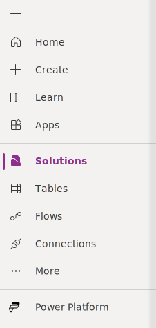
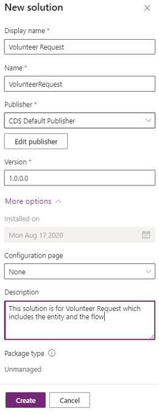
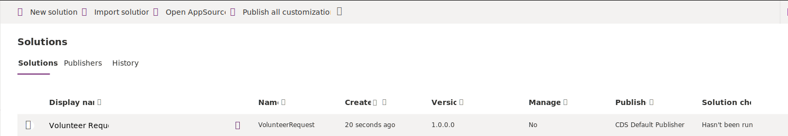
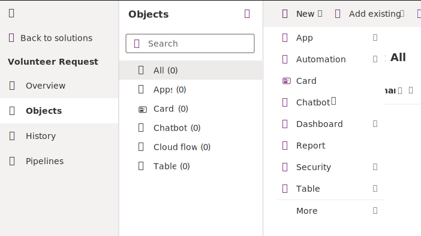
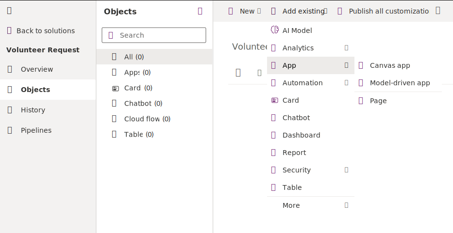

To use solutions within the Power Platform, you'll first need to create a solution, and then add apps, flows and tables to it. Or create new apps, flows, and tables and assign them to the solution:

1. To create a solution, sign in to Power Apps and then select **Solutions**, which is available in the left vertical navigation.

    > [!div class="mx-imgBorder"]
    > 

1. Add the **Display name**, select **CDS Default Publisher**, and then enter a **Description**. Select **Create**.

    > [!div class="mx-imgBorder"]
    > 

    Congratulations, you have created your new solution.

    > [!div class="mx-imgBorder"]
    > 

You can now create new apps, flows, and tables into this solution or add existing ones.

1. To add new apps, flows, and tables, select the **Volunteer Request** solution, select **+ New** in the upper-left corner of the screen, and then select your option.

    > [!div class="mx-imgBorder"]
    > 

1. To add existing apps, flows, and tables, select **+ Add existing**. Select **App** to add existing apps, **Table** to add existing tables (previously known as entities), and **Flow** to add existing flows.

    > [!div class="mx-imgBorder"]
    > 
