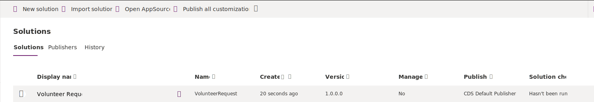

Editing a solution-aware app, flow, and table requires you to first select the items from your solution.

1. Sign in to Power Apps, select **Solutions**, and then select **Volunteer Request**.

    > [!div class="mx-imgBorder"]
    > 

   You should see all your apps, flows, and tables.

    > [!div class="mx-imgBorder"]
    > 

1. To edit the canvas app, select the app and then select **Edit**, which is available in the upper portion of the screen, or you can select the ellipsis. This action will take you directly into Power Apps studio.

    > [!div class="mx-imgBorder"]
    > 

1. Select the flow and then select **Edit**, which directs you to the edit mode for the flow.

    > [!div class="mx-imgBorder"]
    > 

1. Select the table and then select **Edit**, which takes you to the section where you can view the columns, relationships, business rules, and so on.

    > [!div class="mx-imgBorder"]
    > 
