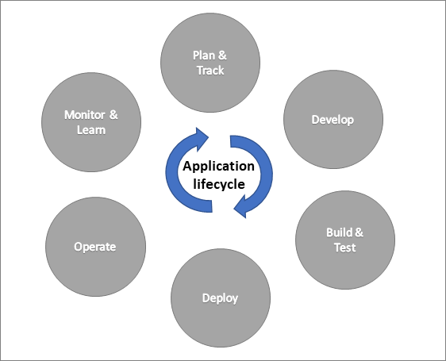
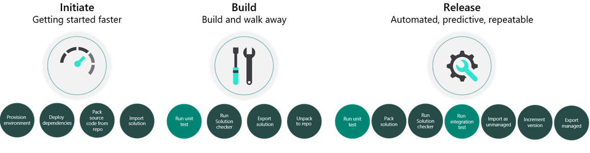

In this module, you've already learned how solutions can be super handy for keeping track of your app pieces and moving them between different places manually. Now, let's dive into how automation can make your app management even stronger through something called Application Lifecycle Management (ALM). ALM isn't just about creating the app; it covers everything from setting rules (like requirements), developing, and keeping things running smoothly. Solutions are like key players in your ALM strategy, along with other helpful tools like Azure DevOps or GitHub.

Usually, a solution architect on your project will map out the ALM plan, and someone skilled in DevOps will set up the automation. As a team member, your job is to stay involved in the process by using the chosen tool to manage your tasks and keeping an eye on your app and flow changes using solutions. Once your part is done, the ALM automation takes over. It kicks off a series of actions that automatically move your changes from development to testing, and then to production. Each step might need some approvals to make sure everything's on track. Imagine the application lifecycle as a never-ending cycle of app development that includes planning, creating, testing, deploying, running, monitoring, and learning from what you discover along the way.

> [!div class="mx-imgBorder"]
> 

While all the actions can be done manually, automation ensures they're done consistently each time they're performed. They also can still happen if, for example, the person who performs the manual actions is out sick. DevOps focused tools like Azure DevOps or GitHub provide the automation, but also provide work item tracking and source control.

## Source control and solutions

Source control, which you can find in tools like Azure DevOps and GitHub, is like a super version tracker for all the parts of your project. Imagine you're working on a Power App, and you make changes. Each time you do that, it's like creating a new version of your project. You can also use 'work items' to note down what changes you made, and these notes can be linked to the version. This helps your team keep a record of when things were changed and lets you undo any changes that caused problems. So, while your team is busy making a newer version of something, the current version can still be used.

Source control is super important in Application Lifecycle Management (ALM) because it's the ultimate source of truth for your project. Even if your development environment crashes, no worries. You can rebuild it using the information stored in source control. In a way, source control makes development environments replaceable. When you send stuff to testing or production, you're actually sending what's in source control, not just something random from your development space.

Now, here's the catch: when you export a solution from your environment, it's like packing everything into one large file. If you just put that file into source control, it can only tell you that something changed, but it won't say exactly what changed within each part. So, to make it more useful, we add a step to the automation process. This step takes the solution from your development space, unpacks it (like opening a packed suitcase), and creates separate files for each part. These separate files are then put into source control. This way, you can keep a detailed track of all the changes. Plus, it opens up the possibility of having multiple development environments that all follow the changes in source control, reducing the chance of one change messing up another.

## Automating with DevOps tools

Automation is important because it brings consistency to what would otherwise be a manual process. Once built, automations can run on demand, on a schedule, or based on a check-in event. While there are many tools you could use to implement the automation, Azure Pipelines and GitHub Actions both have pre-built Power Platform task and action support from Microsoft.

### What can you automate?

There's a wide range of what can be automated since the automation just runs tasks or actions. Think of it as being similar to Power Automate flows but more specific to working with app management and deployments. The following are some of the common automations that might be found on Power Platform projects:

-   Creating a new development environment and installing solutions from source control

-   Taking changes from development environment and updating source control

-   Running solution checker to identify quality problems

-   Provisioning and de-provisioning environments

-   Running automated tests including Power Apps Test Studio tests

-   Building managed solutions from source control for deployment to downstream environments

-   Deploying to downstream environments like test and production

Automation is tailored to each project's requirements, but commonly has initiated, build, and release automations.

> [!div class="mx-imgBorder"]
> 

When working on a project that uses automation, be aware of the overall processes that are in place. However, building the automation is typically done by a DevOps focused resource.

## Power Platform build tools

Microsoft Power Platform Build Tools are like a toolbox designed for managing apps on the Microsoft Power Platform. These tools are a bunch of helpful actions that save you from hunting down special tools and writing complicated scripts to handle different tasks in your app's lifecycle. You can use them one by one to do specific things, like bringing an app into a new environment, or you can use them together in a sequence to make things happen automatically.

Now, depending on whether you're using Azure DevOps or GitHub Actions to automate your work, the fancy words might change a bit. In Azure DevOps, we call these actions 'tasks,' while in GitHub Actions, we call them 'actions.'

The following are some of the common operations:

-   **Power Platform Checker** - Runs static analysis on your solution and allows you to catch problems early by adding it to your automation.

-   **Export Solution** - Exports a solution as unmanaged, managed, or both from an environment.

-   **Import Solution** - Imports a solution into an environment.

-   **Unpack Solution** - Breaks a compressed solution file into individual files for each component to allow checking them into source control.

-   **Pack Solution** - Packs a solution represented in source control into a solution.zip file that can be imported into another environment.

-   **Set Solution Version** - Allows you to update the version number in your automation and to implement a consistent versioning strategy.

-   **Create, Delete, and Copy Environments** - Allows automation of environment management as part of automations.

Why bother with automation? Well, it's a smart way to make sure your app-building process is consistent and reliable. If your team is still doing everything manually, it's a good idea to explore some automations. Not only does this make your work more consistent, but it also helps you make better apps and deploy them with higher quality.
