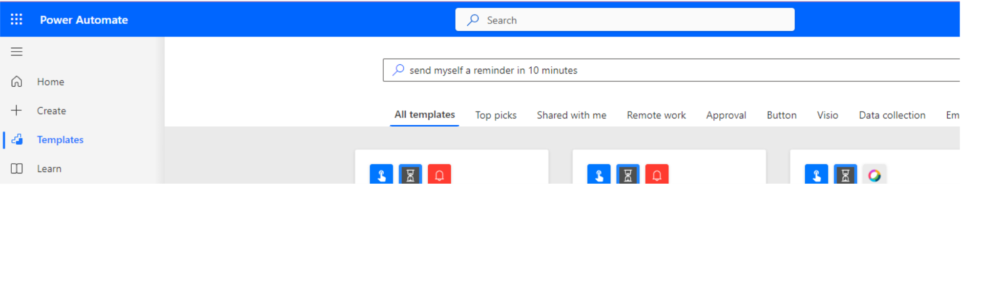
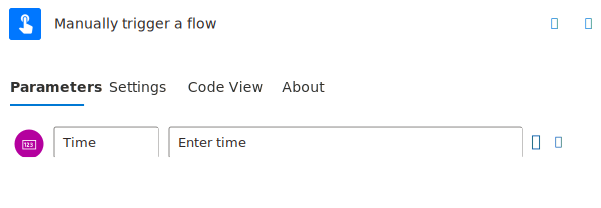

You can customize button flows by letting the user provide specific details to use when the flow runs.

You can create a button flow either on the Power Automate website or in the mobile app for Power Automate. For this unit, you use the website.

In this exercise, our objective is to search for a template available to create a new **Outlook** task and modify it to match our needs.

## Prerequisites

- Access to [Power Automate](https://flow.microsoft.com/?azure-portal=true).

- A basic understanding of Power Automate and experience with creating a flow is recommended.

- A smartphone or tablet with the Power Automate app.

## Open the template

1. From your desktop browser, navigate to the [Power Automate maker portal](https://flow.microsoft.com/?azure-portal=true) and sign in using your organizational account.

1. Select **Templates** and search *send myself a reminder in 10 minutes*.

    > [!div class="mx-imgBorder"]
    > 

1. Sign in if you're prompted to do so and select **Create Flow**.

## Customize the user input

Let's add a custom input for the amount of time of the reminder.

1. Select the trigger card and then select **+ Add an input**.

   > [!div class="mx-imgBorder"]
    > 

1. Select **Number** and then change the text **Number** to **Time** and **Please enter a number** to **Enter time**.

    > [!div class="mx-imgBorder"]
    > 

## Customize the task

1. On the **Delay** action, select it to expand the card.

1. For the **Count** field, choose the **Time** option for the dynamic content.

    > [!div class="mx-imgBorder"]
    > 

1. Select **Save**.

Here's what the completed flow looks like

## Run the flow

You now use the mobile app for Power Automate to run the button flow that you created. You provide the user input needed to create a reminder to happen after the specified amount of time.

1. In the mobile app for Power Automate, select the **Buttons** tab at the bottom of the window, and then select the **Send myself a reminder in 10 minutes** button.

1. Enter the requested time and select **Done**.

Now you can not only run button flows with information that is already available but also request inputs from the user.
