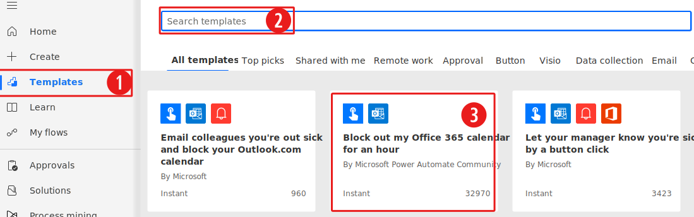
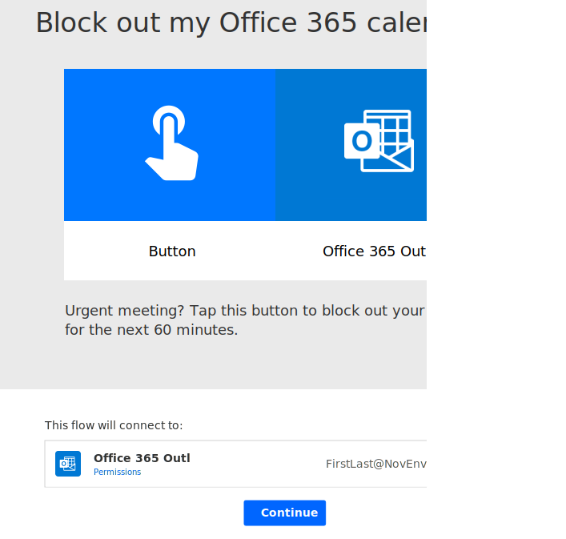
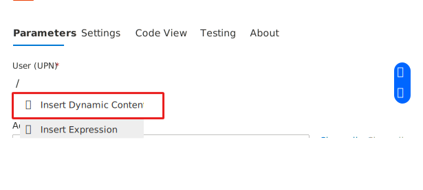
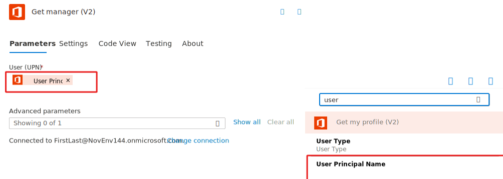
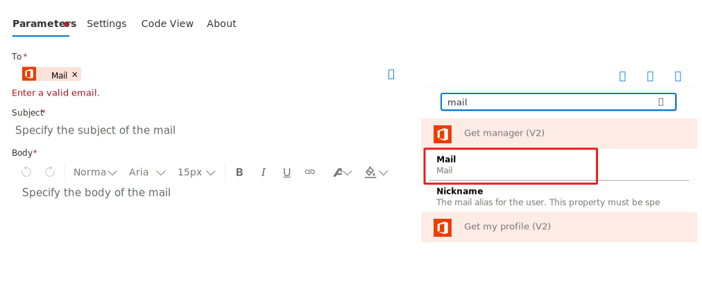
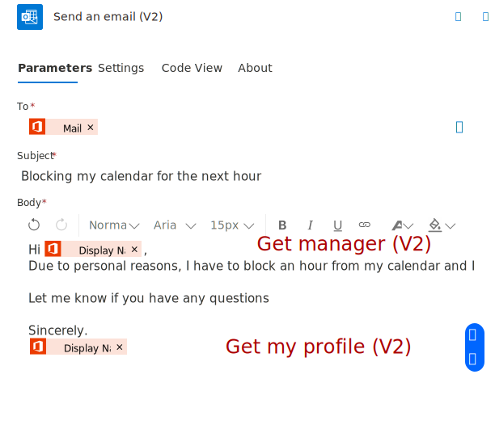
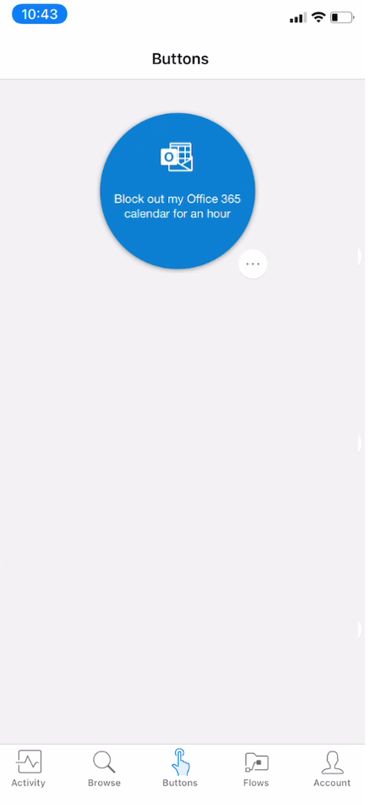

Have you ever run into a situation where you'll be away from your work device for an unplanned, extended period of time? Wish you had a way to block your work calendar and let your manager know? Then this is the unit for you! In a few clicks, you can modify an existing template, and then have it available to trigger from the Power Automate mobile app.

## Prerequisites

- Access to [Power Automate](https://flow.microsoft.com/?azure-portal=true).

- Access to Power Automate mobile app.

- A basic understanding of Power Automate and experience with creating a flow is recommended.

## Open the template

1. Launch Power Automate and sign in using your organizational account.

1. Select **Templates** and search *block calendar*.

    > [!div class="mx-imgBorder"]
    > 

1. Select the *Block out my Office 365 calendar for an hour* tile.

1. Select **Continue**.

    > [!div class="mx-imgBorder"]
    > 

Next, we're going to send an email notification to our manager, to do this we'll use the combination of **Get my profile (V2)** and **Get manager (V2)**.

1. Select **+ Insert a new step** and then select **Add an action**.

    > [!div class="mx-imgBorder"]
    > 

1. Search for **Office 365 Users** and select the **Get my profile (V2)** action. This action will provide us with the User Principal Name.

1. Select **+ Insert a new step** and then select **Add an action** again.

1. Search for **Office 365 Users** and select the **Get manager (V2)** action.

1. Type / in the **User (UPN)** field and then select **Insert dynamic content**. 

    > [!div class="mx-imgBorder"]
    > 

1. In Dynamic content, select UPN. Make sure you select the UPN that is under the **Get my profile (v2)**

    > [!div class="mx-imgBorder"]
    > 

1. Select **+ Insert a new step** and then select **Add an action**.

1. Search for **Outlook** and select the **Send an email (V2)** action.

1. Type / inside the **To** field and select **Insert dynamic content**.

1. In **Dynamic content** select **Mail** under the **Get manager (V2)**.

    > [!div class="mx-imgBorder"]
    > 

1. Finally, you can add your desired text in the **Subject** and the **Body** section. Here's an example:

    > [!div class="mx-imgBorder"]
    > 

Here's an overview of the entire flow:

> [!div class="mx-imgBorder"]
> 

And here's what the virtual button looks like in the Power Automate mobile app:

> [!div class="mx-imgBorder"]
> 
