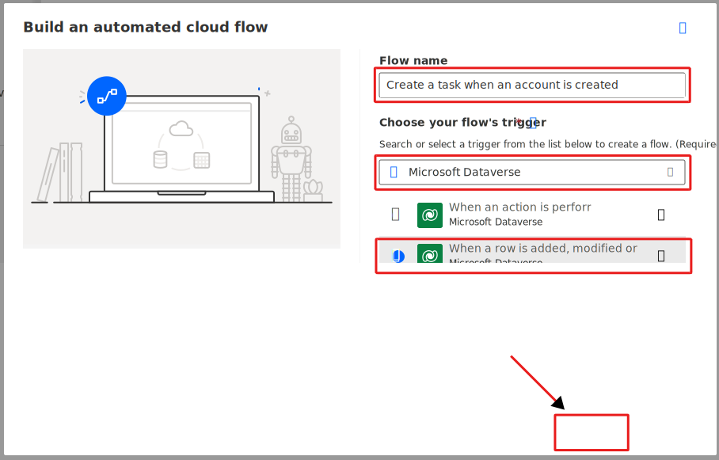
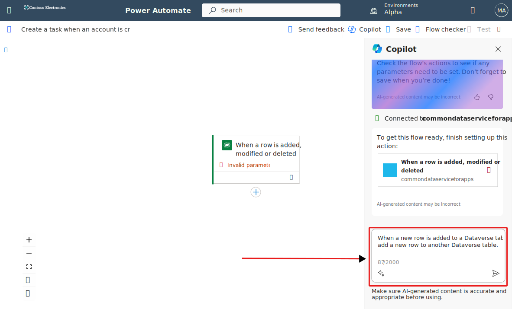
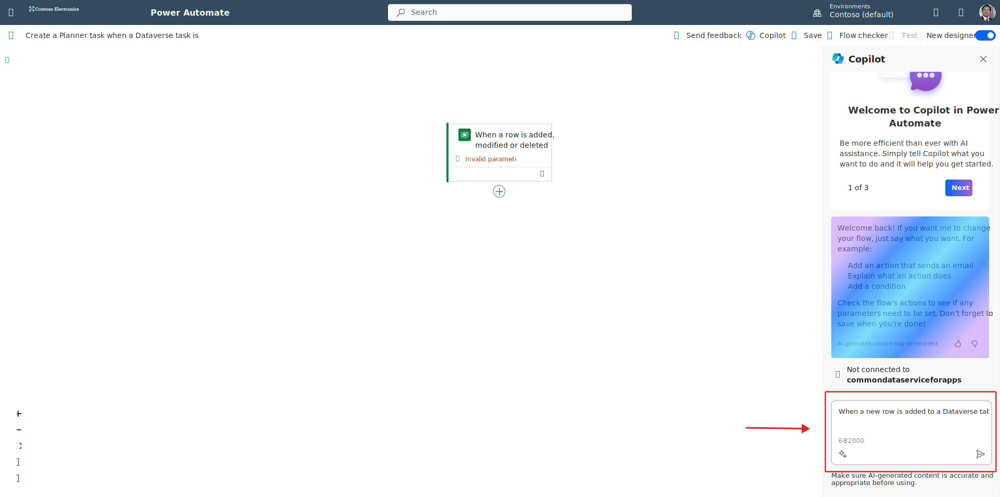

You can create flows that start when an event occurs in Microsoft Dataverse or some other service. These flows then perform an action in that service.

In Power Automate, you can set up automated workflows between your favorite apps and services to sync files, get notifications, collect data, and more.

In this unit, we look to build two flows:

- The first flow creates a task in Microsoft Dataverse when a new Account is created in another instance of Microsoft Dataverse.
- The second flow copies a list item to the Planner when a task is created in Microsoft Dataverse.

Here are some other examples of flows that you can create by using Microsoft Dataverse:

- Create a list item in Microsoft SharePoint when an object is created in Microsoft Dataverse.
- Create Microsoft Dataverse account records from a Microsoft Excel table.

## Prerequisites

- Access to [Power Automate](https://flow.microsoft.com/?azure-portal=true).
- An [environment](/power-platform/admin/environments-overview/?azure-portal=true) with a [Microsoft Dataverse database](/power-platform/admin/create-database/?azure-portal=true). (Applicable only for work or school accounts).
- A basic understanding of Power Automate and experience with creating a flow is recommended.

> [!IMPORTANT]
> To invoke a flow trigger, the Microsoft Dataverse customer engagement table that's used with the flow must have change tracking turned on. For more about how to turn on change tracking, see [Enable change tracking to control data synchronization](/power-platform/admin/enable-change-tracking-control-data-synchronization/?azure-portal=true).

## Example one: Create a task from a new account

This example shows how to create a new row in the Dataverse **Tasks** table whenever an account is added to the Dataverse **Accounts** table. Both the **Accounts** and **Tasks** tables are part of the Common Data Model and are available in all Microsoft Dataverse environments.

1. Sign in to [Power Automate](https://make.powerautomate.com/?azure-portal=true) using your organizational account then select the environment for the flow.

1. In the left pane, select **My flows**.

1. Select **New flow**, and then select **Automated cloud flow**.

1. Type in a name for the flow under **Flow name**. For this example, type *Create a task when an account is created* for the flow name.

1. In the list of flow triggers, enter *Microsoft Dataverse* in the search all triggers field and then select **Microsoft Dataverse - When a row is added, modified or deleted**.

1. Select **Create**. If prompted to sign in to Dataverse, do so.

   > [!div class="mx-imgBorder"]
   > 

1. The new flow opens in Power Automate Copilot designer. In the Copilot pane on the right, type in *When a new row is added to a Dataverse table, add a new row to another Dataverse table* and press **ENTER**.

   > [!div class="mx-imgBorder"]
   > 

1. Copilot expands the flow and adds the action **Add a new row**.

1. From the canvas pane, select the trigger action **When a row is added, modified or deleted** to open it in the action configuration pane.

1. In the **Change type** field, select **Added**.

1. In the **Table name** field, select the table to monitor for changes. This table acts as a trigger that starts the flow.

1. In the **Environment** field, select the environment where the flow should create the record. This doesn't have to be the same environment that the event is triggered from.

1. In the left pane, select **My flows**.

1. Select **+ New flow**, and then select **Automated cloud flow**.

1. In the list of flow triggers, enter *Microsoft Dataverse* in the search all triggers field and then select **Microsoft Dataverse - When a row is added, modified Or deleted**. Microsoft Dataverse keeps information in the Dataverse, so we use this connector throughout.

1. Select **Create**.

1. If you're prompted to sign in to Dataverse, do so.

1. Select the trigger.

1. Select **Added** for Change type, select **Accounts** for Table name.

1. For Dataverse, you also need to specify the **Scope**. This determines whether your flow runs when a *user* within your business unit creates a new record, or if any user in your *organization* creates a new record. For this example, choose **Organization**.

   > [!div class="mx-imgBorder"]
   > 

1. From the canvas pane, select the action **Add a new row** to open it in the action configuration pane.

1. In the **Table Name** field, select the Table that creates a record when the event occurs.

   For this unit, select the **Tasks** table.

1. More fields appear under the table selection. Select the **Subject** field and then the **dynamic content** icon (it's in the shape of a lightening bolt) to choose fields from the previous steps.

   For this unit, select **Account name**.

   > [!div class="mx-imgBorder"]
   > 

1. Select **Save** from the upper right menu to save the flow.

Now when new users are added to the **Accounts** table, a new task is created in the **Tasks** table.

## Example: Create a planner task from a Microsoft Dataverse task

This example shows how to create a task in Microsoft Planner whenever a task is created in Microsoft Dataverse. Planner is a service that you can use to create to-do lists, add reminders, and track errands. To complete the example, you need to [create a plan in Planner](https://support.microsoft.com/office/create-a-plan-in-planner-cbbf3772-4fdd-4f49-aa92-dc2203c062d7).

1. Sign in to [Power Automate](https://make.powerautomate.com/?azure-portal=true) using your organizational account then select the environment for the flow.

1. In the left pane, select **My flows**.

1. Select **+ New flow**, and then select **Automated cloud flow**.

1. Type in a name for the flow under **Flow name**. For this example, type *Create a Planner task when a Dataverse task is created* for the flow name.

1. Type in *Microsoft Dataverse* in the search all triggers field and then select **Microsoft Dataverse - When a row is added, modified or deleted**.

1. Select **Create**.

1. The new flow opens in Power Automate Copilot designer.

1. From the canvas pane, select the trigger action **When a row is added, modified or deleted** to open it in the action configuration pane.

1. In the **Change type** field, select **Added**.

1. In the **Table Name** field, select the table to listen to. This table acts as a trigger that starts the flow. For this exercise, we select the **Tasks** table.

   > [!div class="mx-imgBorder"]
   > 

   > [!NOTE]
   > If the trigger shows **Invalid connection**, select **Change connection** from the action configuration pane on the left. You are either prompted to sign in or select your existing connection.
   >
   > [!div class="mx-imgBorder"]
   > 

1. In the Copilot pane on the right, type in *When a new row is added to a Dataverse table, add a new planner task* and press **ENTER**.

   > [!div class="mx-imgBorder"]
   > 

1. Copilot expands the flow and adds the action **Create a task**.

1. From the canvas pane, select the action **Create a task** to open it in the action configuration pane.

   > [!div class="mx-imgBorder"]
   > 

1. For Group ID, select the dropdown and select the Group that has your Planner plan. In our example, I select **Sales and Marketing**.

1. For Plan ID, select the plan from the dropdown. In our example, I select **Product Launch Event**.

1. In the **Title** field, enter some text and then add the **Subject** from the dynamic content pane. In our example, for the Title field, I enter *Begin onboarding process for:*. Next, I add the subject from the Dataverse Task to the Title of the Planner Task.

1. Select the lighting bolt to bring up the dynamic content options. Since I'm looking for the subject, I start typing **Subject**. Once the subject pops up in the dynamic content box, select it.

   > [!div class="mx-imgBorder"]
   > 

1. Under **Advanced parameters**, select **Bucket Id**.

1. For Bucket ID, select the bucket to create the task in from the dropdown (optional). In our example, I select **To do**.

   > [!div class="mx-imgBorder"]
   > 

   See [create a task parameters](/connectors/planner?azure-portal=true#create-a-task) for information about the other fields you can add to your task.

1. Select **Save** from the upper right menu to save the flow.

Now when new tasks are added to the **Tasks** table, a new task is created in the **Planner** plan.

## Limitations of trigger-based logic

Triggers like **When a record is created**, **When a record is updated**, and **When a record is deleted** start your flow within a few minutes after the event occurs. In rare cases, it might take up to two hours for your flow to be triggered.

When the trigger occurs, the flow receives a notification, but the flow runs on the data that exists when the action runs. For example, if new record creation triggers your flow, and you update the record twice before the flow runs, your flow runs only once with the latest data.

## Specify advanced options

When you add a step to a flow, you can select **Show advanced options** to add a filter or order-by query that controls how the data is filtered.

For example, you can use a filter query to retrieve only active Accounts ordered by email address when retrieving a list of rows. In the example below we have **Filter Rows** and **Sort By** selected from **Advanced parameters**. To retrieve only active accounts, we're using `status eq 0`. To order the list by email address, we use the `Email` column name. For more about filter and order by queries, see [MSDN: $filter](/power-apps/developer/data-platform/webapi/query-data-web-api?azure-portal=true#filter-rows) and [MSDN: $orderby](/power-apps/developer/data-platform/webapi/query-data-web-api?azure-portal=true#order-rows).

> [!div class="mx-imgBorder"]
> 

### Best practices for advanced options

When you add a value to a column, you must match the column type. You must match it regardless of whether you enter a value or select a value in the dynamic content pane.

| Column type | How to use | Where to find | Name | Data type |
| --- | --- | --- | --- | --- |
| Text columns | Text columns require a single line of text or dynamic content that's a text-type column. Examples include the **Category** and **Sub-Category** columns. | **Solutions** > **Default Solution** > **Task** > **Columns** | Category | Text |
| Integer columns | Some columns require an integer or dynamic content that's an integer-type column. Examples include the **Percent Complete** and **Duration** columns. | **Solutions** > **Default Solution** > **Task** > **Columns** | Percent complete | Whole Number |
| Date columns | Some columns require a date entered in *mm/dd/yyyy* format or dynamic content that's a date-type column. Examples include the **Created On**, **Start Date**, **Actual Start**, **Last on Hold Time**, **Actual End**, and **Due Date** columns. | **Solutions** > **Default Solution** > **Task** > **Columns** | Created on | Date and Time |
| Columns that require both a record ID and a lookup type | Some columns that reference another table record require both the record ID and the lookup type. | **Solutions** > **Default Solution** > **Account** > **Columns** | Accountid | Primary Key |
