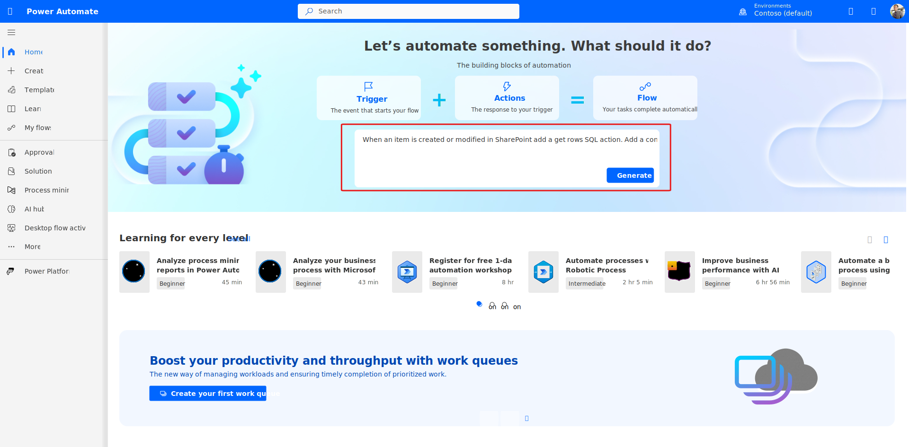
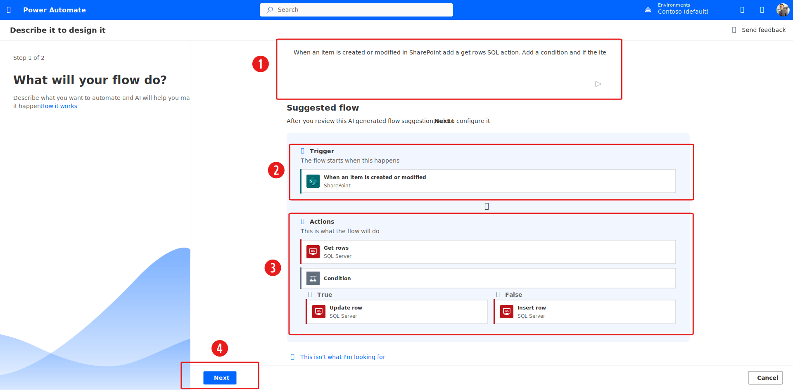
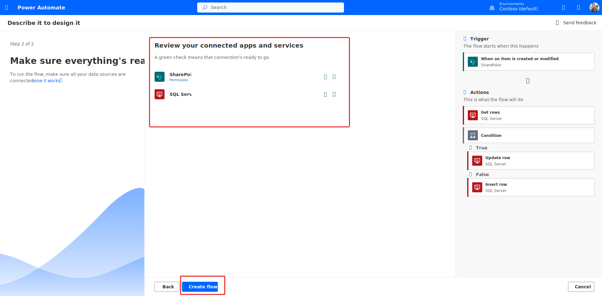
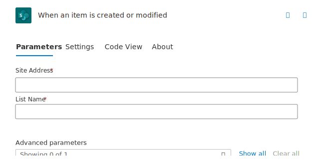
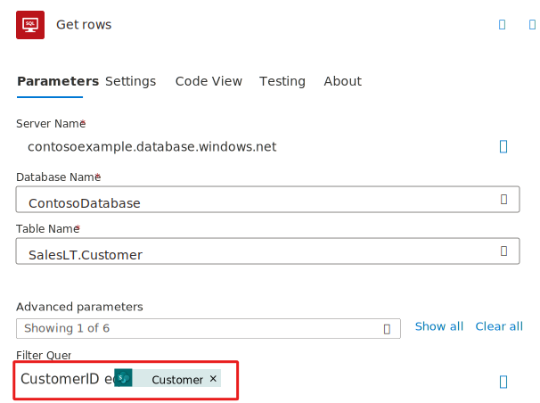
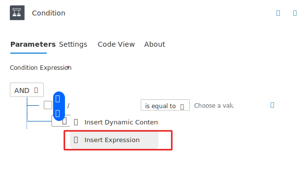
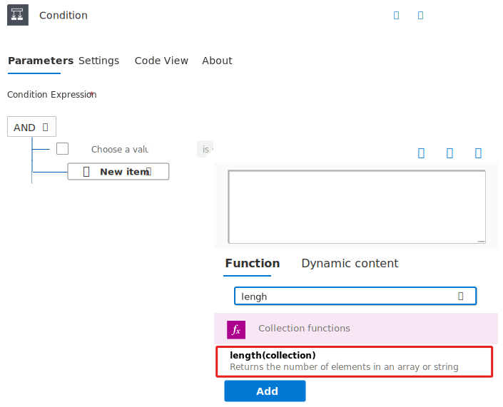
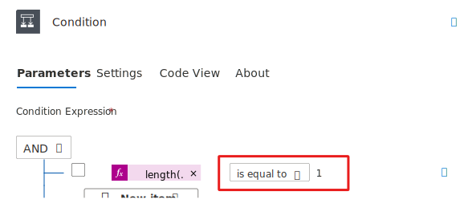

This unit shows how to create a flow that monitors a source for new or changed items, and then copies those changes to a destination. You might create a flow of this type if your users enter data in one location, but your team needs that data in a different location or format.

In this unit, you copy data from a list in [Microsoft Lists](https://support.office.com/article/SharePoint-lists-I-An-introduction-f11cd5fe-bc87-4f9e-9bfe-bbd87a22a194/?azure-portal=true), the source, to a [Microsoft Azure SQL Database](/azure/sql-database/sql-database-technical-overview/?azure-portal=true) table, the destination.

Keep in mind that you can copy data over more than [275 services](https://flow.microsoft.com/connectors/?azure-portal=true) that Power Automate supports.

> [!IMPORTANT]
> Changes that you make in the destination aren't copied back to the source, because two-way synchronization isn't supported. If you try to set up two-way synchronization, you'll create an infinite loop where changes are sent endlessly between the source and destination.

## Prerequisites

- Access to a data source and a destination. This unit doesn't include the steps to create the source and destination.

- Access to [Power Automate](https://flow.microsoft.com/?azure-portal=true).

- A basic understanding of how your data is stored.

- Familiarity with the basics of creating flows. For this unit, it's assumed that you know how to perform these actions.

> [!TIP]
> Column names in the source and destination don't need to match (unless the column's data type is choice), but you must provide data for all required columns when you insert or update an item. Power Automate identifies the required fields for you.

## Quick overview of the steps

If you're comfortable with Power Automate, use these quick steps to copy data from one data source to another.

1. Identify the source to monitor and the destination to copy changed data to. Confirm that you have access to both the source and the destination.

1. Identify at least one column that uniquely identifies items in the source and destination. In the example that follows, we use the **Title** column, but you can use any columns.

1. Set up a trigger that monitors the source for changes.

1. Search the destination to check whether the changed item exists.

1. Use a condition like this:

    - If the new or changed item doesn't exist in the destination, create it.

    - If the new or changed item exists in the destination, update it.

1. Trigger your flow, and then confirm that new or changed items are being copied from the source to the destination.

> [!NOTE]
> If you haven't previously created a connection to SharePoint or a SQL Database, follow the instructions when you're prompted to sign in.

Here are the detailed steps to create the flow.

## Monitor the source for changes

First, Copilot helps us build the structure of the flow.

1. Launch Power Automate and sign in using your organizational account.

1. In the middle of the home page type, **When an item is created or modified in SharePoint add a get rows SQL action. Add a condition and if the item exists, update the item in SQL, else create a new item in SQL.** Then press **Generate**.

   > [!div class="mx-imgBorder"]
   > 

1. Copilot strives to build a flow with actions based on the description and provides an opportunity to review the actions that were generated. In this example, you can see:

    1. The description box where we entered our prompt. You can continue to refine the actions in the flow here.

    1. Copilot added a **When an item is created or modified trigger** (SharePoint).

    1. Copilot added a **Get Rows** (SQL) action, a **Condition**, an **Update Row** (SQL) action in the condition's **True** branch and an **Insert Row** (SQL) action in the condition's **False** branch.

    1. The **Next** button takes you to the flow designer.

   > [!div class="mx-imgBorder"]
   > 

1. Once you're satisfied with the flow, select **Next** to configure the actions.

1. If you didn't previously create a connection to the SQL Database or SharePoint, Copilot instructs you to create a connection. Otherwise, you see green check marks next to each connection.

   > [!div class="mx-imgBorder"]
   > 

1. Once the connections are established, select **Create Flow**.

1. Select the **When an item is created or modified** trigger to open the action properties panel on the left.

   > [!div class="mx-imgBorder"]
   > 

1. Enter the site address and then select the name of the list in Microsoft Lists that your flow monitors for new or updated items.

   > [!div class="mx-imgBorder"]
   > 

## Search the destination for an existing item

Next, we configure the **Get rows** (SQL) action to check if an item already exists in the SQL database.

1. Select the **Get Rows** action to open the action properties panel on the left.

1. Set the **Server name**, **Database name**, and **Table name** for the SQL table you wish to monitor.

   > [!div class="mx-imgBorder"]
   > 

1. Select the **Advanced Parameters** and select **Filter Query**.

   > [!div class="mx-imgBorder"]
   > 

1. In the **Filter Query** box, enter *CustomerID eq*. Then select the **CustomerID** token in the dynamic content list.

   > [!div class="mx-imgBorder"]
   > 

   > [!NOTE]
   > This step assumes the Microsoft List and the SQL table will match on the **CustomerID** column.

## Check whether to create a new item or update an existing item

Next, we configure the condition to check if an item exists. If the item exists, update the item, else create a new row.

1. Select the condition to open the action properties panel on the left. Select **Insert Expression**.

   > [!div class="mx-imgBorder"]
   > 

1. Search for length and select **length(collection)**.

   > [!div class="mx-imgBorder"]
   > 

1. Without leaving the open expressions pane, select the **Dynamic content** tab.

1. Under the **Get rows** category, select **body/value** and then select **Add**.

   > [!div class="mx-imgBorder"]
   > 

   > [!TIP]
   > Confirm that you've selected **value** from the **Get rows** category. Don't select **value** in the **When an item is created or modified** category.

1. In the field in the center, select **is equal to**.

1. In the field on the right, enter ***1*** (one).

    The **Condition** card should now look like this image.

   > [!div class="mx-imgBorder"]
   > 

   > [!TIP]
   > The addition of the `length()` function lets the flow check the **value** list. Length returns the number of items in the list. If there is 1 item in the value list, then we know the item exists in SQL and needs to be updated.

When your flow gets items from the destination, there are two possible outcomes.

| Outcome | Next step |
| --- | --- |
| The item exists. | Update the item. |
| The item doesn't exist. | Create a new item. |

## Create the item in the destination

The condition is checking if the Microsoft List item exists in the SQL destination, but we need to tell Power Automate what to do once the condition is checked. If the Microsoft List item doesn't exist in SQL, then create a new row, else update an existing item.

1. Select the **Insert Row** (SQL) action on the **False** side of the condition to open the action properties panel on the left.

1. Set the **Server name**, **Database name**, and **Table name** for the table to insert the new item into (same as the information you entered above).

   > [!div class="mx-imgBorder"]
   > 

   > [!NOTE]
   > The **Insert row** card expands and shows all fields in the table. Fields that are marked with an asterisk (*) are required and must be filled in for the row to be valid.

1. Select each field that you want to fill in and enter the data.

    You can manually enter the data, select one or more tokens in the dynamic content pane, or enter any combination of text and tokens into the fields.

> [!NOTE]
> The **Insert row** and **Update row** cards show the names of the columns in the SQL Database table that's being used in the flow. Therefore, the cards that are shown in the images in this procedure might differ from the cards that you see.

## Update the item in the destination

Next, we configure the action to update the SQL item.

1. Select the **Update Row** (SQL) action on the **True** side of the condition to open the action properties panel on the left.

   > [!div class="mx-imgBorder"]
   > 

1. Set the **Server name**, **Database name**, and **Table name**.

1. For the **Row Id** field, we have to get the primary key from the SQL database. In this example, it's the **CustomerID** field from output of the **Get Rows** (SQL) action.

    Typically when we use a **Get Rows** action and then want to access the properties of the output in subsequent actions, Power Automate automatically creates a For Each loop to handle each item in the list. However, in this particular case, we know Power Automate always returns one record if a CustomerID is found because CustomerID is the primary key in our SQL table. This means we can access the CustomerID property of the first item in the list using the following expression:

    `outputs('Get_Rows')?['body/value'][0]?['customerid']`

1. Select the **Row Id** parameter and then type **/** and select Insert Expression. Place the code above in the Expression formula bar.

1. Select the **Advanced parameters** and select which fields you want to update.

1. Save and test your flow!

   > [!div class="mx-imgBorder"]
   > 

Now, whenever an item in your list, the source, changes, your flow is triggered. It either inserts a new item or updates an existing item in SQL Database, the destination.

> [!NOTE]
> Your flow isn't triggered when an item is deleted from the source. If this scenario is important to you, consider adding a separate column that indicates when an item is no longer needed.
