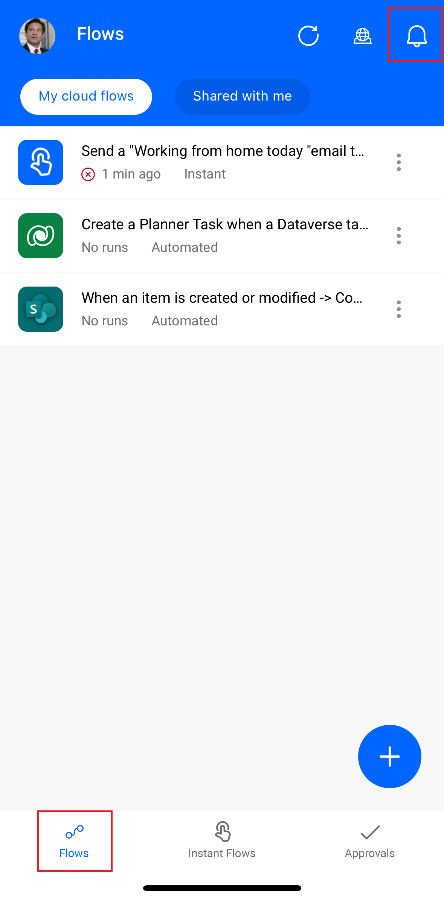
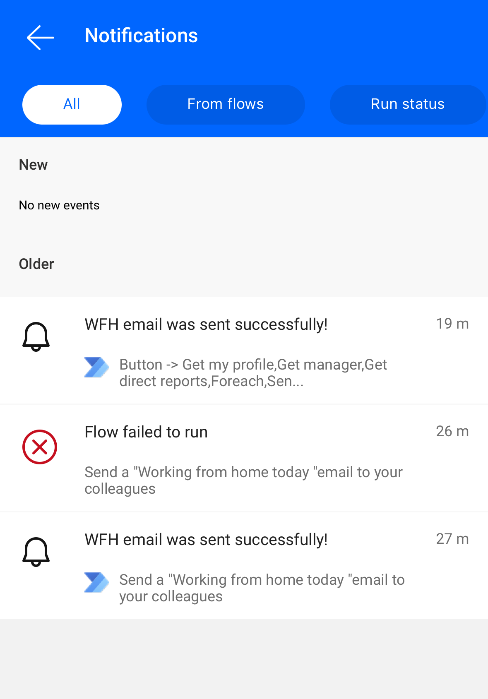
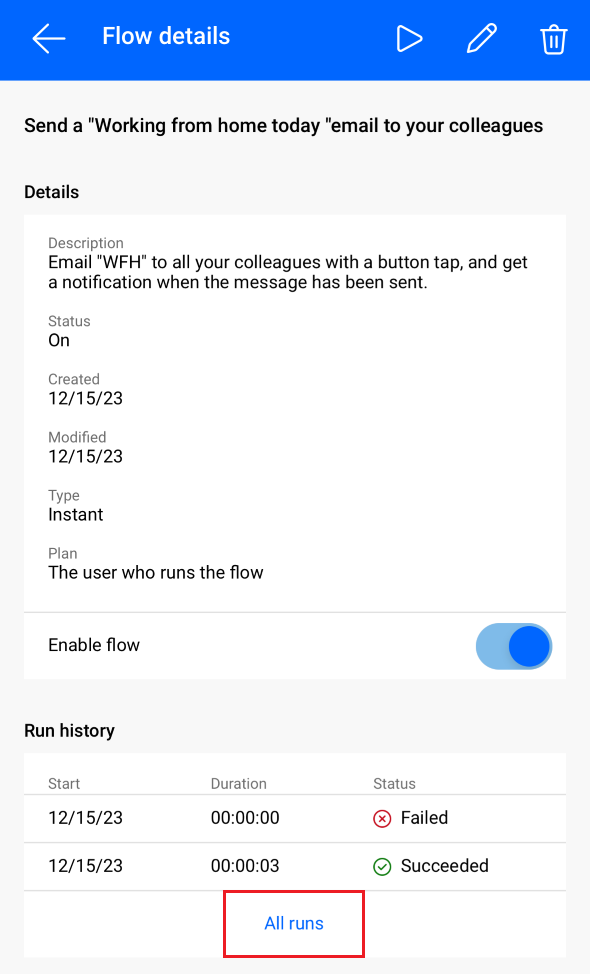
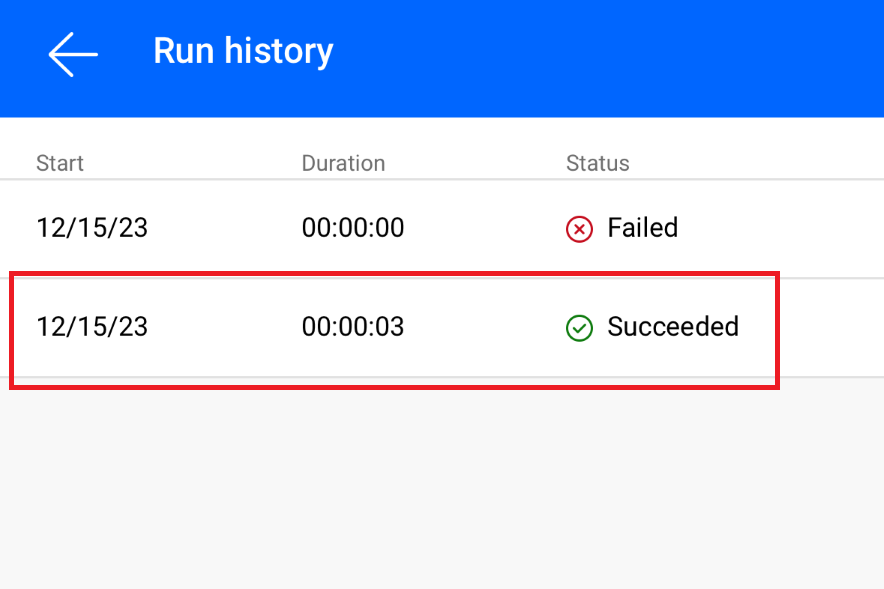
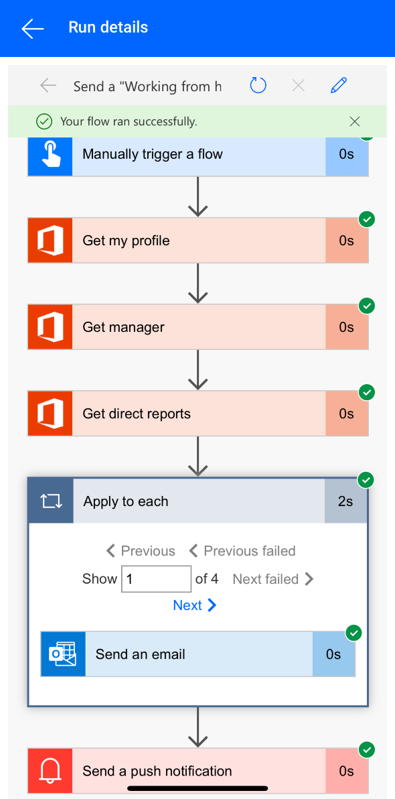

You can view a summary of the number of times that each flow succeeded or failed today, yesterday, and on previous days. You can also explore details about each run, such as:

- When it ran
- How long each step took
- If a step failed, why it failed

## Prerequisites

- Install the Power Automate mobile app for [Google Android](https://aka.ms/flowmobiledocsandroid/?azure-portal=true) or [Apple iOS](https://aka.ms/flowmobiledocsios/?azure-portal=true) on a supported device. The screenshots in this unit were taken on the Apple iPhone version of the app, but the mobile app for Android and Windows Phone is similar.

- If you complete all of the Units in this Learning Path, you have many flow runs available for review. If you don't already have a flow, create one now on the [Power Automate website](https://flow.microsoft.com/?azure-portal=true) before proceeding with this unit. For easier testing, use a flow that you can trigger yourself instead of waiting for an external event.

> [!TIP]
> For testing, you can set up the flow with your personal email address. Then, when the flow is ready for real use, you can set it up with a different address (for example, your manager's).

## Power Automate Mobile Flow Tab

1. If your flow hasn't run before, trigger a run to generate data.

    It might take some time for the data to appear in the app.

1. From your phone, open the Power Automate Mobile app and sign in. Power Automate automatically opens the Flow Tab and displays a list of your flows.

   > [!div class="mx-imgBorder"]
   > 

1. Select the **Bell icon** in the top right hand corner to see your notifications. Flows that fail and other notifications are listed here.

   > [!div class="mx-imgBorder"]
   > 

## Show details of a run

1. From the **Flow tab**, select the flow that you want to show the details about.

1. The flow details page opens, where you can see information about the flow and the flow's run history. Select **All runs**.

   > [!div class="mx-imgBorder"]
   > 

1. Select the flow run you want to see the full history of.

   > [!div class="mx-imgBorder"]
   > 

1. The **Run details** page opens and for each action in the flow, a green **Checkmark** symbol indicates the step was successful and a red **X** symbol indicates that there was an issue with the step. If it succeeded, the amount of time that it took (in seconds) also appears.

   > [!div class="mx-imgBorder"]
   > 
