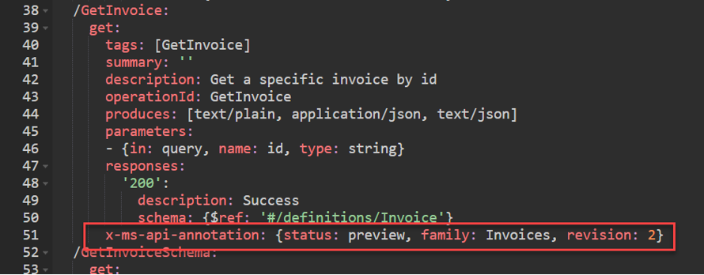
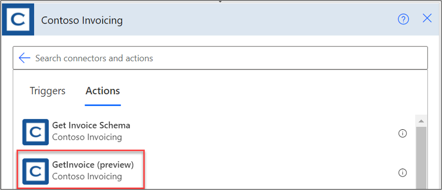

Custom connectors that have been published through certification or created as an open source can still be updated. The process for doing the update is almost identical to the initial publishing. The main difference is that you must consider your existing users when planning your updates. Breaking changes to your connector definition, even if small, can affect existing users.

A connector's triggers and actions can grow and change over time as features are added or expanded in the underlying API. Some changes are merely additive and don't necessarily break the contract that exists between apps and flows that use your connector. Adding new parameters, returning more data, or allowing more flexible inputs might fall into this category. However, many changes might break the contract that is described in the OpenAPI specification. 

Examples of breaking changes include:

- Removing parameters

- No longer supporting certain inputs

- Changing the meaning and behavior of an input, output, or the operation

The API that your custom connector describes must avoid these breaking changes as well. In cases where different groups maintain the connector definition and the API, coordination must happen to keep them in sync.

To evolve a custom connector and API safely, make sure that you follow a pattern that can be navigated by the users of the connector. It's the connector's, and therefore also the API's, responsibility to maintain backward compatibility, communicate intention, and delineate versioning attributes. It's the tools designer's responsibility whether to allow use of the connector to either show or hide operations that are deprecated, expired, or that might have newer versions available. In this way, operations can grow and develop over time without causing undue fragility on applications that rely on them.

## Annotate connector actions

By using OpenAPI configuration, you can annotate the actions on your connector so that, when it's presented in the design surface, it will convey the intended use. For example, by adding the OpenAPI extension **x-ms-api-annotation** to the **GetInvoice** action, you've indicated that its status is preview.

> [!div class="mx-imgBorder"]
> 

As a result, when this action is presented in the Power Automate cloud flow designer, it shows (preview) after the action name.

> [!div class="mx-imgBorder"]
> 

## New versions of an action

At some point in an action's lifetime, you might realize that you need to introduce a breaking change. The best thing to do is create a new version of the action. Existing users of the original action won't be affected, but new users can take advantage of the new version. A common practice is to indicate the version as part of the summary. The following screenshot shows what this process would look like.

> [!div class="mx-imgBorder"]
> 

## Deprecation of an action

After introducing your new action, you might want to deprecate the old action so that it's no longer used in new apps and flows. A good first step would be to mark the old action in the **Visibility** section as **advanced**. If you have actions that are marked as **important**, you should consider if the new V2 action should also be marked **important**. Both visibility changes will encourage the use of the new action by placing it higher in the list of actions.

> [!div class="mx-imgBorder"]
> 

You can also indicate in the summary or description a hint of upcoming deprecation. For example, you could change **Get Invoice** to **Get Invoice (deprecated)**. This choice can soft announce the deprecation without hiding it from users. The goal is to help navigate the connector users through the changes that you make.

To hide the action from new users but not break existing users, you can mark the action as **deprecated** in the OpenAPI configuration. You can make this change by directly editing the OpenAPI definition with the Swagger editor. To indicate that an action is deprecated, add the following command to the operation configuration:

`deprecated: true`

> [!div class="mx-imgBorder"]
> 

After the connector has been published, this command will hide the action from users' ability to select it in new flows.

Many reasons exist for adhering to action versioning. Primarily, doing so will ensure that clients such as Logic Apps and Power Automate will continue to work correctly when users integrate connector actions into their flows. Actions should be versioned by using the above methods whenever one of the following is true:

- A new revision of an action is added.

- An existing action adds or removes parameters.

- An existing operation changes input or output significantly.

Some situations might occur where you can avoid versioning, but you should be careful when doing so and conduct plenty of testing to ensure that you haven't overlooked edge cases where users' apps and flows might be broken unexpectedly. 

You can (cautiously) avoid versioning when:

- A new action is added.

- A new optional parameter is added to an existing action.

- An existing action changes behavior subtly.

We recommend that you err on the side of caution and create a revision when you make nontrivial changes in a connector definition or underlying API.
