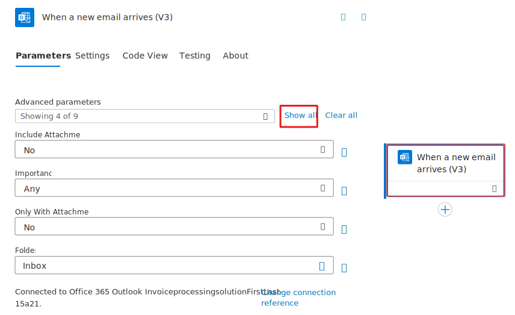
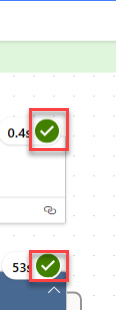

In this exercise, you'll use an Outlook email to trigger a desktop flow and pass input from a cloud flow.

1.  Go to [https://make.powerautomate.com](https://make.powerautomate.com/?azure-portal=true) and make sure that you're in the correct environment.

1.  Select **Create** from the navigation pane and then select **Automated cloud flow**.

	> [!div class="mx-imgBorder"]
	> 

1.  Enter `Use Outlook email to trigger Desktop flow` in the **Flow name** field. Search for and select **When a new email arrives (V3) - Office 365 Outlook** as the trigger event and then select the **Create** button.
    
	> [!div class="mx-imgBorder"]
	> 

1.  Sign in if prompted.

1.  In the **When a new email arrives (V3)** trigger card, select the card to show the advanced options. Stay on the **Parameters** tab within the advanced options.

	> [!NOTE]
	> You can check your connection by selecting the ellipsis (**...**) in the upper-right corner of the box.

	> [!div class="mx-imgBorder"]
	> 

1.  Select **Show all** next to the Advanced parameters dropdown box. Then select **Yes** from the **Include Attachments** dropdown and select **Yes** from the **Has Attachment** dropdown menu (your menu might read **Only with Attachments**, depending on the version of Outlook connector).

	> [!div class="mx-imgBorder"]
	> 

1.  Enter `new invoice` in the **Subject Filter** field. 

	> [!div class="mx-imgBorder"]
	> 

1.  Select the **+** button below the **When a new email arrives (V3)** trigger card. Then select **Add an action**.

1. Search for `Desktop flow` in the search bar and then select **Run a flow built with Power Automate for desktop**.

	> [!div class="mx-imgBorder"]
	> 

1. Select **Enter an invoice** from the **Desktop flow** dropdown menu and then select **Attended** from the **Run Mode** dropdown menu.

1. Fill in the **Amount**, **Contact**, and **Account Name** boxes by using the following values. You'll switch these values later in future labs to use Microsoft Dynamics 365 input values. For now, you'll use static values.

	-   **Amount** - `$200`
	
	-   **Contact** - `b.friday@wingtipcups.com`
	
	-   **Account Name** - `WingTip Cups`

	> [!div class="mx-imgBorder"]
	> 

1. **Save** the flow by selecting the **Save** button and then wait for the flow to be saved. A green success message will show at the top after it has been saved.

1. **Test** the flow by selecting the **Test** button in the upper-right corner of the screen.

	> [!div class="mx-imgBorder"]
	> 

1. From the **Test Flow** pane, select the **Manually** option and then select **Test**.

   An empty flow run history page will display. Because this flow has a trigger, the flow will run automatically if that trigger condition happens (when a new email arrives).

	> [!div class="mx-imgBorder"]
	> 

1. Open an email app to draft an email. You'll send the email to the inbox of the account that your trigger action is monitoring (which is the account that you used to sign in when creating the trigger connection).

1. In the email body, add **newinvoice.jpg file** as an attachment (you can find this .jpg file under the **lab data package** folder).

1. Enter **New invoice** in the subject line. Then, select **Send** to test this flow.

	> [!div class="mx-imgBorder"]
	> 

1. After the email has been received by the inbox that your flow trigger is monitoring, it will trigger the flow run automatically. Return to the flow run history page, where you can observe that your flow has run successfully and has launched the desktop flow on your computer as well.

	> [!div class="mx-imgBorder"]
	> 

    > [!NOTE]
    > Occasionally, in the test account tenant, emails might be blocked due to spam concerns. If you receive an error while sending an email, try sending it from another account and then be sure to include the attachment and correct subject line.

1. It's best practice to add the flow inside of the solution. To begin this connection process, make sure you have the **Invoice processing solution First Last** solution selected by clicking on **Solutions** in the navigation pane and selecting it from the list. 

	> [!div class="mx-imgBorder"]
	> 

1. After selecting the correct solution, you'll be brought to a page that shows all of the flows inside of that selected solution. On this page, select **Add existing** then **Automation** and then **Cloud Flow**. 

	> [!div class="mx-imgBorder"]
	> 

This causes the **Add existing cloud flows** dialogue box to show on the right side of the screen. Select the **Outside Dataverse** tab. Then select the flow `Use Outlook email to trigger Desktop flow` and select **Add**. 

> [!div class="mx-imgBorder"]
> 

Now the flow is connected to the correct solution. 