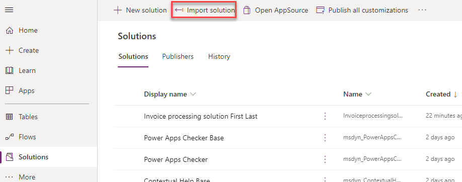
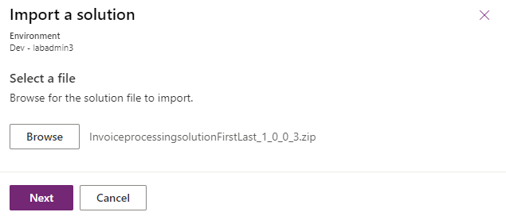
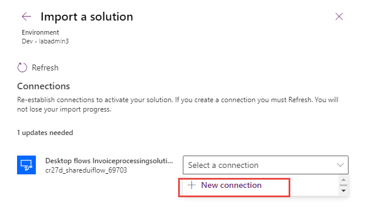
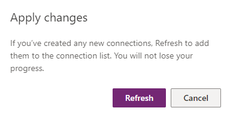
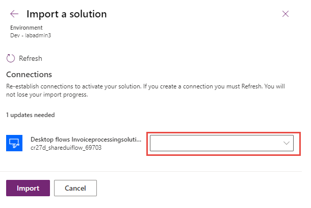

If you've completed the module **Integrate with cloud flows - Online workshop** or import the provided solution in the resources folder, skip to the next task.

To import the solution, follow these steps:

1.  Go to [https://powerautomate.microsoft.com](https://powerautomate.microsoft.com/?azure-portal=true) and select the correct environment.

1.  Select **Solutions** and then select **Import solution**.

	> [!div class="mx-imgBorder"]
	> 

1.  Select **Browse**.

1.  Select the **InvoiceprocessingsolutionFirstLast_1\_0\_0\_3.zip** solution file located in the resources folder and then select **Open**.

1.  Select **Next**.

	> [!div class="mx-imgBorder"]
	> 

1.  Select **New connection**.

	> [!div class="mx-imgBorder"]
	> 

1.  Select **Direct to machine**, select the machine that you registered setup of the first module in the Learning Path **Install required software - Online workshop**., provide your sign-in information, and then select **Create**.

	> [!div class="mx-imgBorder"]
	> 

1.  Close the connections browser window or tab.

1.  Select **Refresh**.

	> [!div class="mx-imgBorder"]
	> 

1. Select the connection that you created and then select **Import**.

	> [!div class="mx-imgBorder"]
	> 

1. Wait for the solution to be imported.
