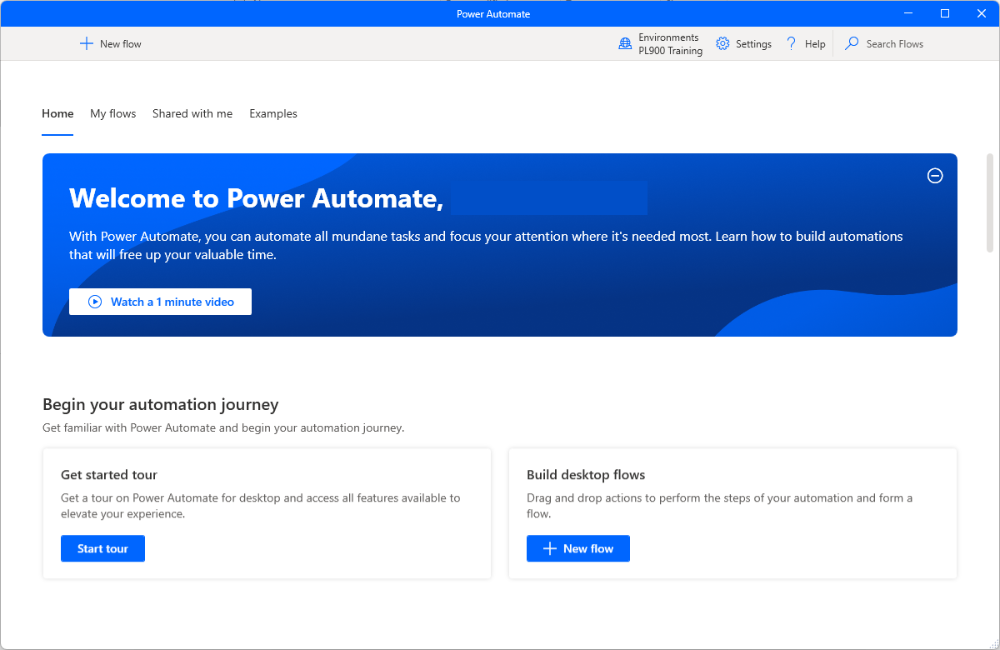
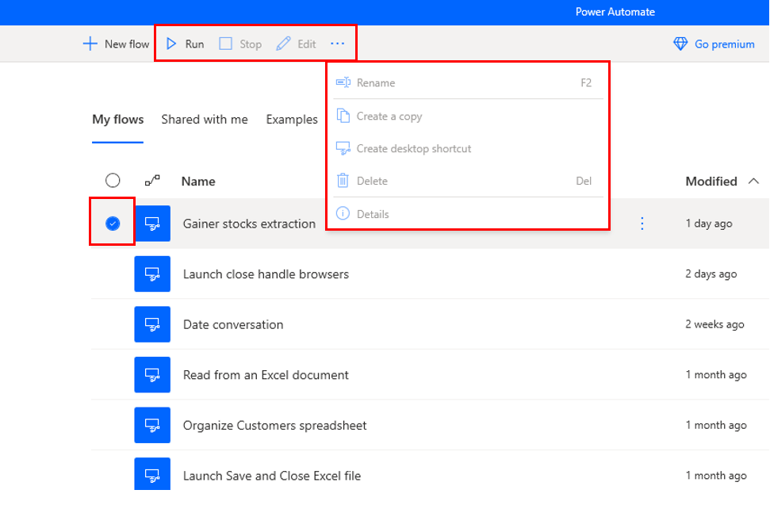
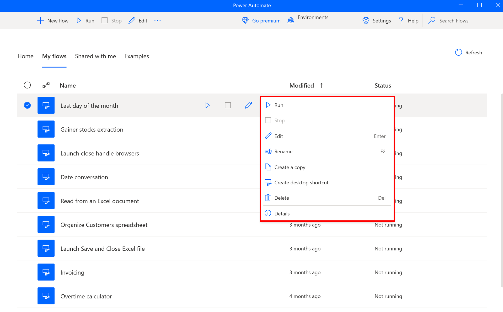
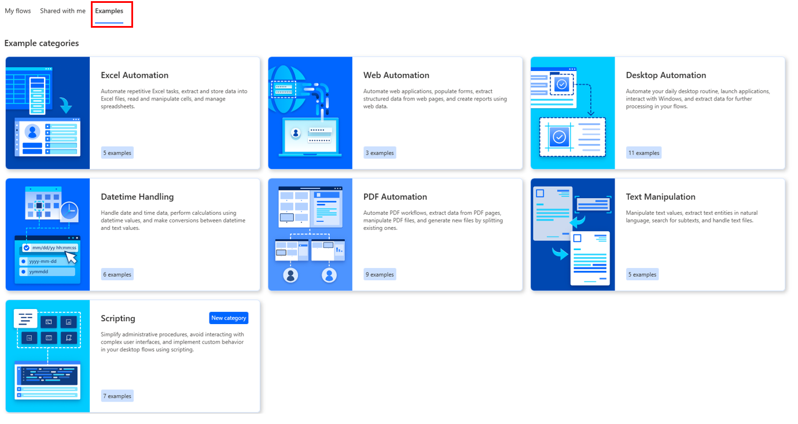
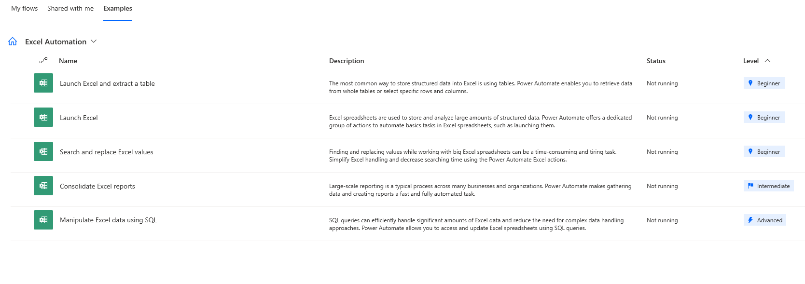

When you launch Power Automate for desktop, the first window that appears is the **Home** screen. This screen is where you give a quick overview of all the new features available.

When you select **My flows**, you see the console. The console is the main component of the platform from which you can manage your existing flows and launch the flow designer to edit them or create new ones.

> [!div class="mx-imgBorder"]
> 

When you select an existing flow, you get a new command bar with bulk actions you can perform.

> [!div class="mx-imgBorder"]
> 

Like all products in Microsoft Power Automate, the Power Automate for desktop console enables you to select a development environment, handle all the flows in it, and create new ones.

> [!NOTE]
> Environments are spaces to store, manage, and share your organization's business data, apps, chatbots, and flows. They also serve as containers to separate apps that might have different roles, security requirements, or target audiences.

To handle an existing flow, right-click on it and choose between starting, editing, renaming, and deleting it. If the flow is currently running, one more option to stop it is available.

> [!div class="mx-imgBorder"]
> 

To run, stop, or edit a flow more efficiently, you can use the icons next to its name.

In **Examples**, you'll see several categories you can have available to use as templates.

> [!div class="mx-imgBorder"]
> 

Each category shows how many examples there are. For example, **Excel Automation** has **5**.

> [!div class="mx-imgBorder"]
> 

Select **Excel Automation** to see all of the examples that you can use.

> [!div class="mx-imgBorder"]
> 
