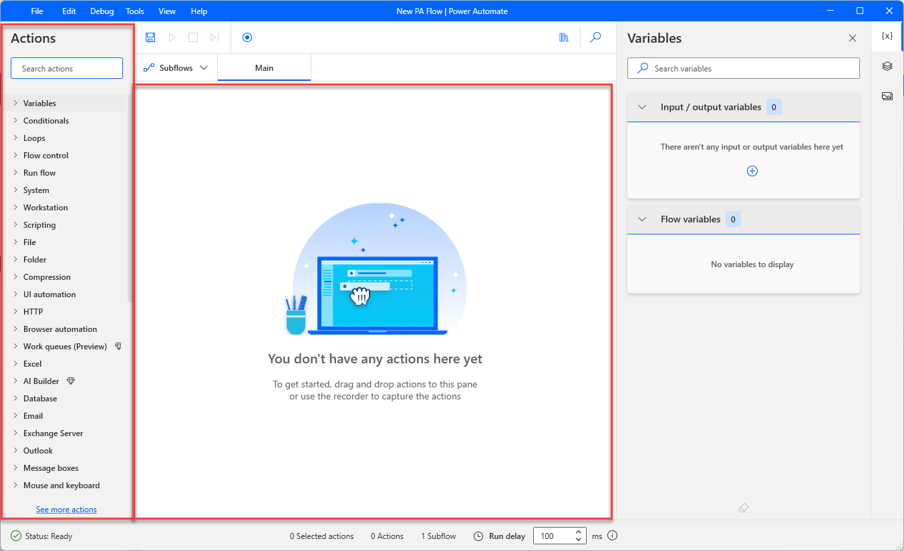
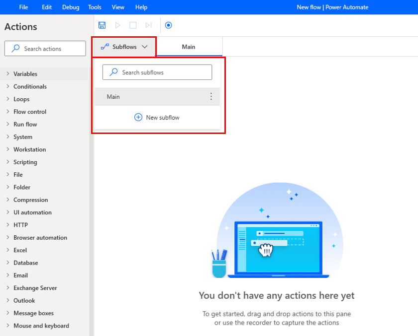
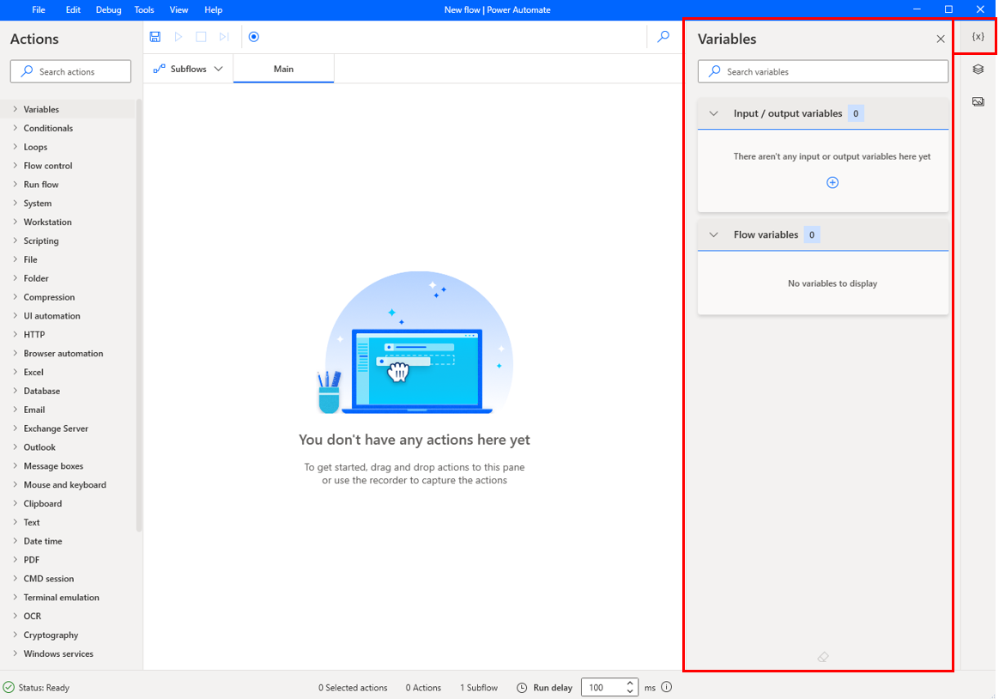
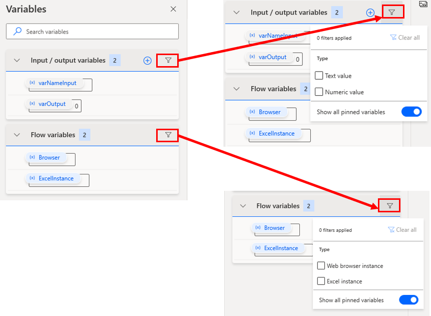
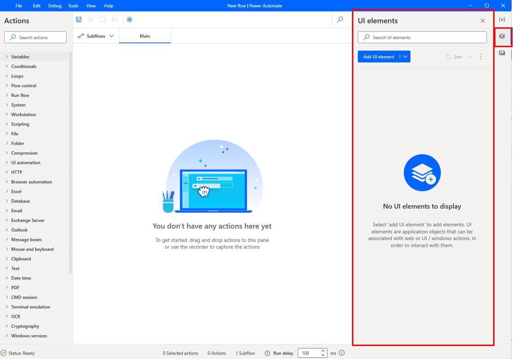
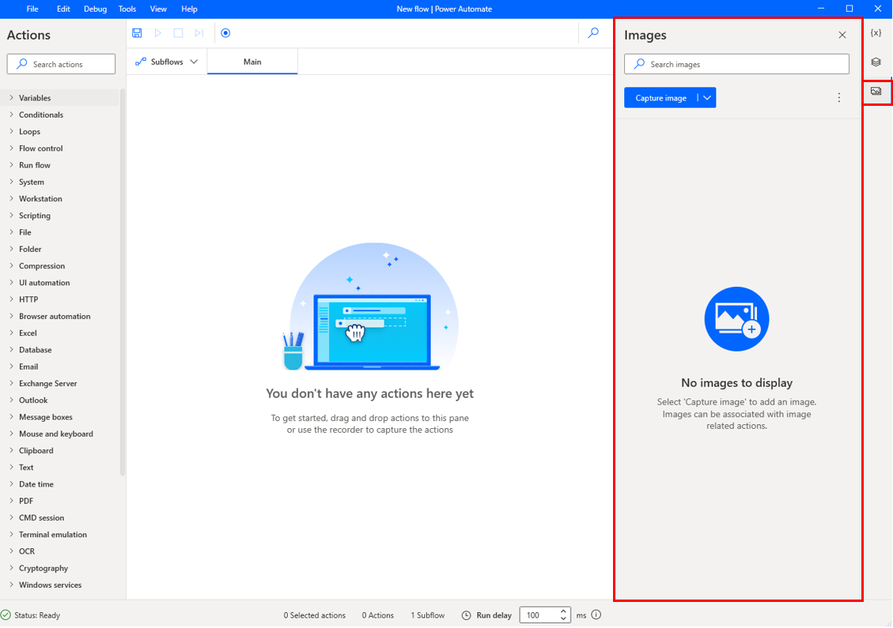
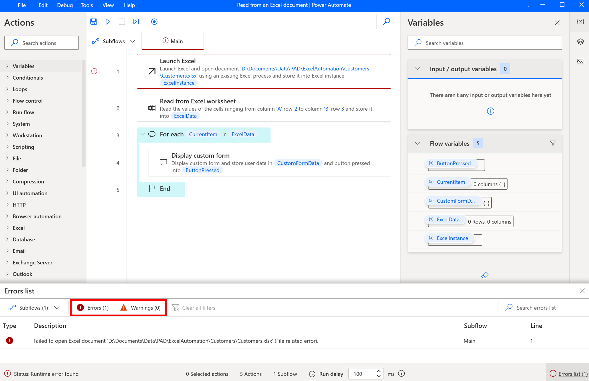

When you choose to create or edit a flow, Power Automate for desktop launches the flow designer.

The flow designer is the platform's primary development tool with which you develop flows that deploy actions. The flow designer consists of seven components that enable you to manage every aspect of the development process.

The actual development happens in the workspace, which is the main component of the window. By using the workspace, you can develop flows that run sequentially or alter the run path by using loops, conditionals, and flow control actions.

To deploy or search for an action, you can use the Actions pane located on the left side of the designer. All actions are categorized into groups based on their functionality.

> [!div class="mx-imgBorder"]
> 

While automating business procedures, you might create complex flows that contain numerous actions. Power Automate for desktop allows you to simplify these flows and makes testing easier through subflows.

Subflows are groups of actions that you can reference as a group within other subflows. Every flow contains the main subflow that runs automatically when the flow starts.

To create a new subflow, select the plus (**+**) icon on the **Subflows** tab above the workspace and then enter the desired name.

> [!div class="mx-imgBorder"]
> 

Every action that is used in a flow accepts some input parameters and stores its results in new variables. The platform displays all produced variables in the Variables pane, where you can search for variables, rename them, find their usages, and filter them by type.

Except for local variables that are used only in the current flow, you can create input/output variables to pass data to and from Power Automate for desktop. Input and output variables empower you to combine multiple Power Automate products and create a powerful and robust automation solution.

> [!div class="mx-imgBorder"]
> 

 > [!NOTE]
 > A new filter option is available in the variables pane

> [!div class="mx-imgBorder"]
> 

In scenarios where you use the UI and web automation capabilities of Power Automate for desktop, you can use the **UI elements** tab to manage the existing UI elements or create new ones. All UI elements that your flow accesses, such as buttons and checkboxes, are stored on this tab.

> [!div class="mx-imgBorder"]
> 

The last main component of the flow designer is the **Images** tab. This tab stores all images that are used in the deployed actions, allowing you to access and manage them effortlessly.

> [!div class="mx-imgBorder"]
> 

During the development or implementation of the flow, you might encounter different types of errors. When an error happens, the platform displays the **Errors** and **Warnings** pane, and provides you with all available information to resolve it. You can use this feature to debug your flows and identify existing inconsistencies.

 > [!NOTE]
 > Environments are spaces to store, manage, and share your organization's business data, apps, chatbots, and flows. They also serve as containers to separate apps that might have different roles, security requirements, or target audiences.

> [!div class="mx-imgBorder"]
> 
