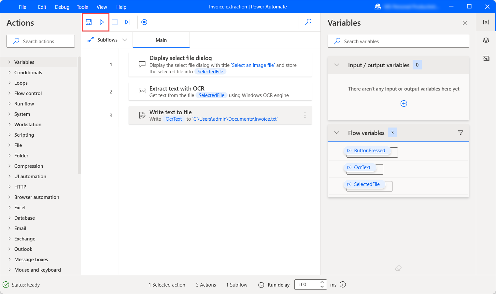

In this exercise, you create a flow that extracts invoice data from scanned documents and saves it to a text file.

1. Launch the Power Automate for desktop console and create a new flow named **Invoice extraction**.

   > [!div class="mx-imgBorder"]
   > 

2. Use the **Display select file dialog** action to prompt users to select an image file. In the **File filter** field, enter the value ***.jpg** to limit the selectable files.

   > [!div class="mx-imgBorder"]
   > 

3. Add an **Extract text with OCR** action to the workspace and configure it to extract text from the previously selected image. In the **OCR engine settings**, set the image width and height multipliers to 2.

   > [!div class="mx-imgBorder"]
   > 

4. Use a **Write text to file** action to write the extracted text to a .txt file. For this example, we chose to overwrite the existing content of the file in each execution.

   > [!div class="mx-imgBorder"]
   > 

5. Save the flow and run it to ensure that the extraction is completed successfully.

> [!NOTE]
> To test the flow, you can use the [newinvoice.jpg](https://github.com/MicrosoftDocs/mslearn-developer-tools-power-platform/raw/master/power-automate-desktop/newinvoice.zip) image file. Select **Download** on the right side of the page and extract the downloaded file to your local computer.
>
> [!div class="mx-imgBorder"]
> 
