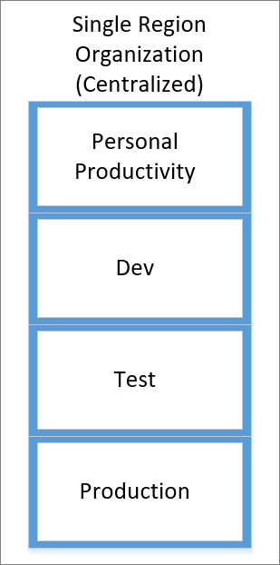
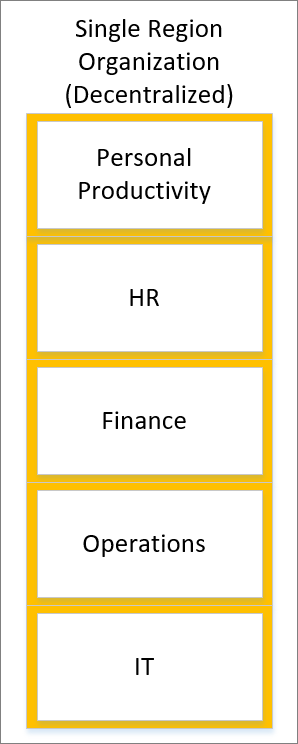
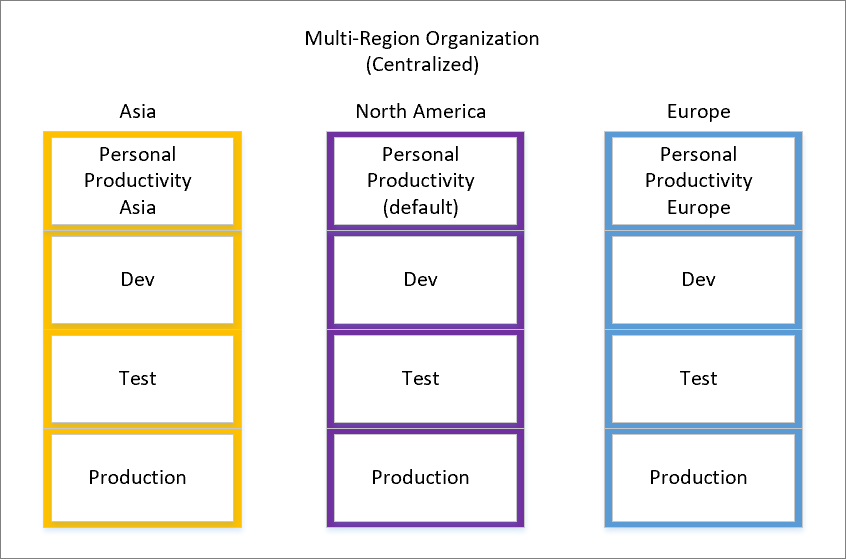
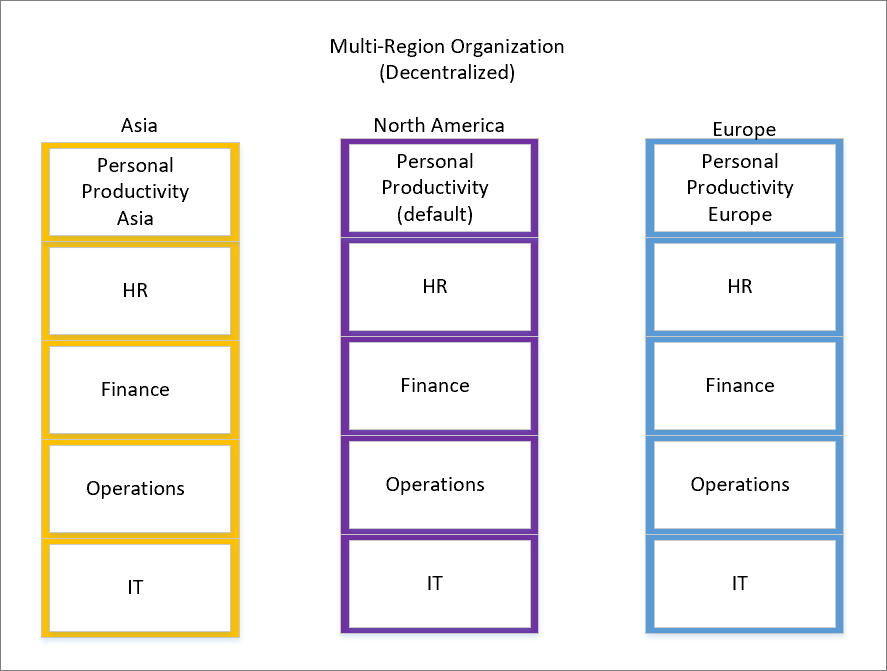

Environment design is highly dependent on organizational design. Considerations include size, location, regulatory environment, and appetite for adoption. While environment design is organization-dependent, the following recommendations will aid you in designing the right landscape for your organization.

> [!NOTE]
> The Introduction to Power Automate security and governance module discussed the default environment. If you recall, every user within the tenant will automatically have access to this environment. Because no method exists for removing access to this environment, it is a common practice to rename this environment to **Personal Productivity** to imply that this environment is general use. Administrators should also be aware of the location of this environment to ensure that no issues occur from a data privacy perspective.

Another important consideration is the aspect of centralization. For example, consider whether your organization has a centralized IT function. You should also determine if your organization is responsible for the administration and governance of Microsoft Power Platform environment. Alternatively, your organization could have a decentralized organization where some aspects of technology are managed outside of an IT department. When establishing environment design, you have additional important parameters to consider.

## Sample configurations

The following sections outline sample configurations that you could use based on your organization's design and goals.

### Single region organization (centralized)

In single region organization (centralized), environments are centrally managed and include isolation for personal productivity, development, testing, and production purposes. The personal productivity environment can be used to support scenarios like email notifications, team-based approvals, improvised data collection, and the integration with Office 365 services. The central team that manages environments will also provide access to non-default environments.

Because this organization operates in a single region, data residency concerns don't exist and don't require further segregation from other regions.

### Single region organization (decentralized)

In single region organization (decentralized), environments are independently managed, and the administrative responsibilities have been assigned to individual business units to manage. This organization operates within a single region and the default environment has been renamed to **Personal Productivity**. Additional environments have been created for respective business units like HR, Finance, Operations, and IT.

### Multi-region organization (centralized)

In multi-region organization (centralized), you have a central way of managing environments. These environments serve various purposes like personal productivity, development, testing, and production. The personal productivity one is handy for things like email notifications, team approvals, quick data collection, and linking with Office 365 services. The central team overseeing these environments also grants access to non-default ones.

Since our organization operates globally, you create environments in the specific regions where you operate. To meet this need, you've set up a default environment in the region where the organization was founded. This default environment is now named "Personal Productivity (default)." Additionally, you have Development (Dev), Testing (Test), and Production environments in this home region (North America). To maintain consistency, you've replicated the same environments in our Asia and Europe regions.

In the default environment, all licensed users are considered app makers, and you can't remove them from it. However, to give users a space to create quick apps and flows without worrying about data moving away from their home region, you've also created Personal Productivity environments in Asia and Europe.

Regional teams can use their IT Change Management practices to make sure important apps and flows comply with the necessary rules as they move through these environments. It's all about making things work seamlessly across regions while following best practices.

### Multi-region organization (decentralized)

In multi-region organization (decentralized), each region manages its own environments independently. Responsibility for administration is given to individual business units. 

Here's how it works: In your main region (North America), you've renamed the default environment to "Personal Productivity." It stays in the same region as our main office. Within this region, you've created extra environments for different business units like HR, Finance, Operations, and IT. This way, each unit can run things their way.

Now, the default environment makes everyone an app maker, and you can't take that away. But you've got you covered. you've also created Personal Productivity environments in Asia and Europe. So, even if you're far from home, you can build apps and flows without worrying about your data wandering off.

And you're not stopping there. you're creating environments for your Asian and European business units too. They get to build their own apps and flows independently, without waiting for the central team. It's all about giving everyone the freedom they need to get things done.

## Manage exceptions

The previous examples showed different setups organizations can use to balance productivity and governance. However, because every organization is unique, there might be situations where you need to make exceptions.

For instance, let's say you have a rule that prevents using SharePoint and Twitter connectors together in an app or flow. For most roles, this rule makes sense because sharing data from SharePoint to Twitter isn't typically a necessary task. But for a group like Corporate Communications, it could be a legitimate use case.

So, if someone needs to use Twitter, but you want to limit who can use it, you can add more governance tools on top of the default rules. You can put the Twitter connector in the same group as SharePoint but control its use.

Here's how it works: When someone creates or edits a flow with this combination of connectors, the system can flag it. An administrator can then step in and apply governance. They might restrict Twitter connector access for a specific group, or they can add an approval step to the flow. If they reject it, they can even disable the flow from running using the **Disable Flow as Admin action** that is part of the Flow management connector. They can also send an email to the person who created the flow to let them know why it was stopped. It's all about keeping things in check while allowing flexibility when needed. For a detailed walkthrough of a similar governance scenario, refer to the [Automating Microsoft Power Automate Governance blog post](https://flow.microsoft.com/blog/automate-flow-governance/?azure-portal=true).
