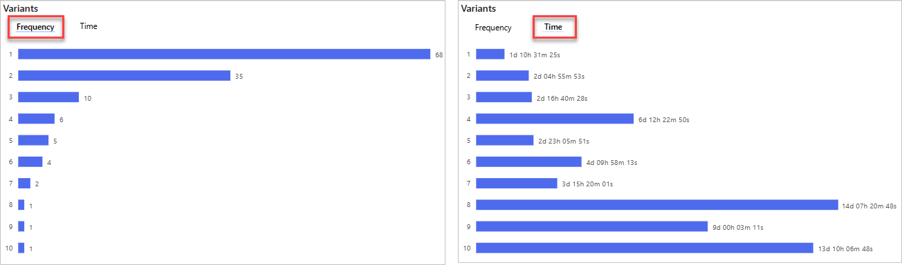

In this unit, we'll focus on the various types of reports provided by Power Automate for process mining and how to effectively analyze them. These reports are crucial for understanding your business processes in-depth and identifying areas for improvement and automation. Although not required, these are the same reports that are available if you complete the previous exercise of creating a process mining report in Power Automate.

## Summary tab

### Key Performance Indicators (KPIs)

At the top of the Summary tab shows your process KPIs:

   

- **Average case duration:** Shows the average case duration. Outliers in the data can affect this KPI.

- **Self loop cases %:** Percentage of cases that have an activity that repeats itself.

- **Loop cases %:** Percentage of cases that have repeated activities that aren't self loops.

- **Rework cases %:** Percentage of cases that have a Self-loop or Loop.

If you have the premium license, there are two additional KPIs that will show:

- **Median case duration:** Middle value in a sorted list of case durations. Compared to the average case duration metric, extreme values or outliers in the data have less of an effect on this metric.

- **Resource count:** Count of how many resources exist in the process. A resource could be any entity that performs an activity, such as employees, machinery, or devices.

### Visualizations

On the right side of the report are visualizations providing additional information. The top panel displays **Variants**, **Cases**, and **Activities** donuts.

- **Variants:** A path is a unique sequence of steps of a process from start to finish. The preceding image indicates that 10 paths are in the process, meaning that 10 variations are available for completing the process from start to finish. A path might differ from another by one step or by numerous steps.

- **Cases:** A case is a single instance of a process that's completed from start to finish. It represents a grouping of activities or events that take place within the process. For instance, if an employee in your organization completes a process by using five steps, it's considered as one case. Similarly, if another employee completes the same process in four steps, it's considered as a different case. The **Cases** donut in the preceding process report indicates a total of 133 cases, so the process has been completed 133 times.

- **Activities:** An activity represents a specific event or task that takes place within a process, such as **Invoice Entry** or **Refund Customer**. The preceding image indicates that your process has identified 13 different activities. Each activity contributes to the overall completion of a case or instance of the process. Understanding the frequency and duration of each activity can provide valuable insights for process improvement.

The lower panel displays a horizontal bar chart for the number of **Variants** which shows how many times each unique path has been followed in your process. For instance, if path 1 is followed 68 times, then 68 different process completions have followed the sequence of steps in path 1. As shown in the following image, the 10 bars in the chart correspond to the 10 paths in the **Variants** donut. If you switch to the **Time** category, you'll be able to view the average duration for each path as well.

 If you have a premium license, you also have the **Average duration of cases over time** chart in the same panel. This graph shows the average duration of the process over time. As shown in the image, the process took longer between mid to late July.

## Map tab

The process map allows you to visualize the flow of your process from one activity to the next. By looking at a graphical representation of how your business processes are performed, you can glean insights about where opportunities for improvements exist.

On the report page, select the **Map** tab to open a larger view of the process map. Scroll on the process map to zoom in and out or use the buttons in the lower-left corner of your screen.

The following list describes different parts of the **process map**, each number corresponding to what's shown in the ensuing screenshot:

1. **Node** - Represents a single activity in the process.

1. **Number at the node** - Represents how many cases have that activity. In the following example, 68 cases had the **Check Customer Payment** activity.

1. **Directed arrow lines** - These lines connect the nodes and represent the flow from one activity to another. The numbers on the arrows indicate the number of cases that moved from one activity to another. For instance, if the arrow from **Credit Memo Entry** to **Refund Customer** has the number 68, then all 68 cases that had the **Credit Memo Entry** activity also had the **Refund Customer** activity as the next step in the process.

1. **Blue ripples (or bubbles)** - These elements surround the numbers at each node and represent the relative count of cases that have the activity at that node. The size of the ripples indicates the number of cases. The larger the case count, the wider the ripples. For instance, if an activity has 113 cases out of the 133 cases (approximately 85 percent), the ripples are wider compared to an activity that's present in only 12 cases (approximately 9 percent), which have smaller ripples.

Next, you'll explore the time performance process map. On the page that you're currently on, select the **Performance** button and then select **Mean duration** from the dropdown menu.

Because you’ve already gone through the previous descriptions, it’s a good time to test your knowledge. Go to the following screenshot and try to describe the attributes of the time performance process map before going through the following descriptions.

The following list describes different parts of the **time performance process map**, each number corresponding to what's shown in the ensuing screenshot:

1. **Node** - A node represents a single activity in the process.

1. **Number at each node** - Represents the mean duration for that particular activity. In the following example, the number at the **Check Customer Payment** node is 2.75, meaning that it takes an average of 2.75 hours to complete that activity in the process.

1. **Directed arrow lines** - These lines, and the numbers on those lines, represent the flow from one activity to another. In the following example, after the **Credit Memo Entry** step, it takes an average of 9.21 hours before the **Refund Customer** step takes place.

1. **Red ripples (or bubbles)** - These elements surround the numbers at each node and represent the relative average duration of an activity. The longer that the mean duration of an activity is, relative to the duration of other activities, the wider its ripples are.

## Variant DNA tab

The variant DNA chart allows you to compare different end-to-end paths of your process and identify exactly where the paths differ. For example, in Variant 2 and Variant 3, the paths differ at step 5. The legend on the right side of the chart shows that Variant 2 has the **Approve Invoice** activity as its fifth activity, while Variant 3 has the **Reject Invoice** activity as its fifth activity.

Furthermore, variant DNA can help you identify paths in your process that deviate from the ideal or desired path for your business. For instance, if Variant 1 represents the ideal path for your process, then only 51.13 percent of cases follow that path. This result indicates that nearly half of your cases deviate from the desired path, which could suggest that issues or bottlenecks have occurred that you need to address to improve your process efficiency.

## Conclusion

This unit has equipped you with the knowledge to navigate and analyze various reports generated by Power Automate in the context of process mining. These skills are vital for identifying inefficiencies, ensuring compliance, and ultimately guiding your journey towards hyperautomation and process excellence. 