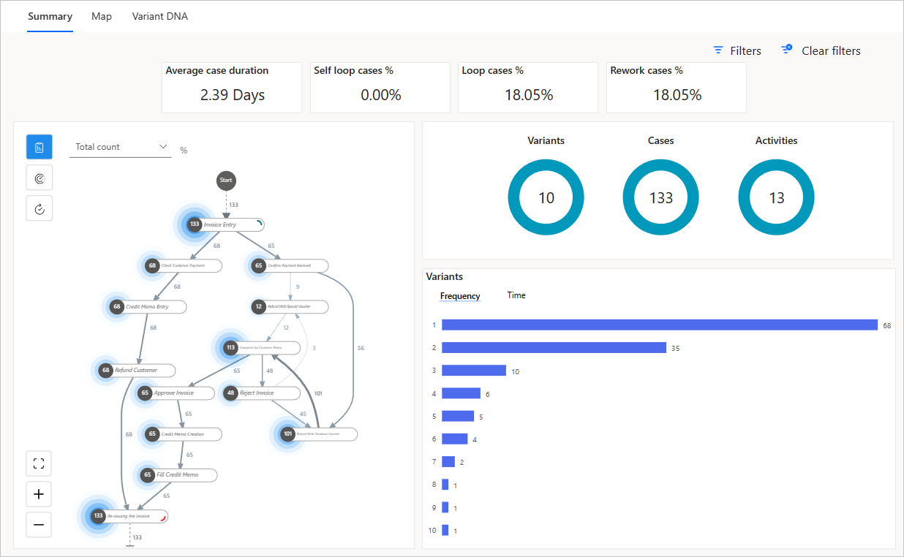

Creating a report for your process is the first step in understanding your business' process. It's similar to having a roadmap that guides you on your journey toward process improvement. With its informative charts and graphics, process mining in Power Automate helps you visualize the flow of your data and pinpoint areas that need improvement.

For this exercise, consider a scenario in which you work as an account manager in your company. You've been able to gain access to event log data from the application that the finance team in your organization uses to perform its accounts payable refunding process. With this data, you'll use Power Automate's process mining capability to gain a deeper understanding of your invoicing process and uncover valuable insights that could transform the way that you do business.

## Prerequisites
Before starting this exercise, make sure that you meet the following prerequisites:

- Power Automate per-user plan with attended RPA or Power Automate trial [license](/power-automate/process-advisor-overview#licensing)

- Download [Sample data](https://go.microsoft.com/fwlink/?azure-portal=true&linkid=2175012)

## Create your report
To create your report, follow these steps:

1. Sign in to [Power Automate](https://powerautomate.microsoft.com/?azure-portal=true).

1. On the left navigation pane, select **Process mining**.

1. Select **Start here** under the **Create new process** section.

   > [!div class="mx-imgBorder"]
   > 

1. Give your process a name, such as **Accounts Payable Refunds**.

1. Optionally, you can describe your process as **My first process report**.

1. Select **Import Data** and then **Dataflow**.

1. Select **Continue**.

   > [!div class="mx-imgBorder"]
   > 

1. Select a data source from which your organization's event logs are derived. For this exercise, you'll upload a .csv file, so select **Text/CSV**.

   > [!div class="mx-imgBorder"]
   > 

1. Select **Upload file (Preview)**.

1. Select **Browse** to launch your file explorer.

1. Select the [sample data](https://go.microsoft.com/fwlink/?azure-portal=true&linkid=2175012), which you downloaded from the prerequisites, and then select **Open**.

1. Use the **Sign in** button to authenticate your credentials.

1. After the upload and authentication are successful, select **Next** in the lower left of the screen.

1. The contents of the CSV file are loaded in the **Preview file data** screen. Here you can select the **File origin** type and **Delimiter** if needed. Our CSV file should already be detected as **65001: Unicode (UTF-8)** file type and using **Comma** as the delimiter. Select **Next** to continue.

1. In the **Transform your data (optional)** screen you can select and rearrange data attributes as necessary. Select **Next** to continue.

	

1. For the **Map your data** screen, you need to inform Power Automate which fields are mapped to an attribute type to correctly set up your process map. At a minimum, you need to define the following:

	- **Case ID:** A case is a specific instance or run of your process. Case ID influences your process scope. Common examples include identifiers for requisitions, purchase orders, and invoices.
	
	- **Activity:** Activities are the steps or status changes that occurred during the process. Examples include purchases, feedback, and survey completion.
	
	- **Event Start:** Timestamp attributes indicate when each of the activities happened. They’re important for analyzing the timing of the process and establishing the order of the activities in your event log.

   	For this exercise map the following attributes:

    | Attribute name | Attribute type |
    |----------------|----------------|
    | CaseId         | Case ID         |
    | ActivityName   | Activity        |
    | StartTimestamp | Event Start   |
    
    The other types are optional; however, mapping them correctly will allow you to glean more insights from your data. Go ahead and map the other attributes.
    
    | Attribute name | Attribute type |
    |----------------|----------------|
    | Location   | Case Level Attribute |
    | Role     | Case Level Attribute |
    | VendorID | Case Level Attribute   |
    | InvoiceValue | Financial per Case |
    | Resource | Resource |
    | EndTimestamp | Event End |

1. Select **Save and analyze** to continue.

> [!div class="mx-imgBorder"]
> 

Power Automate will now analyze your data and create a process map. This might take a few minutes. Once the analysis is complete, you'll be taken to the **Process map** screen. Here you can see the process map that Power Automate has created for you in the **Summary** tab. This tab also provides a high-level overview of your process.

Congratulations, you've now created your first process mining report. In the next unit, you'll learn how to use this report to analyze your process.