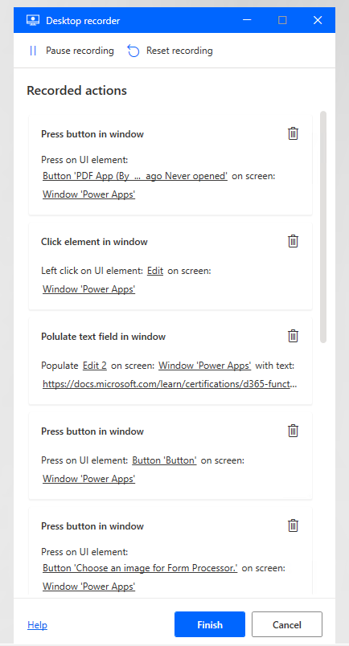
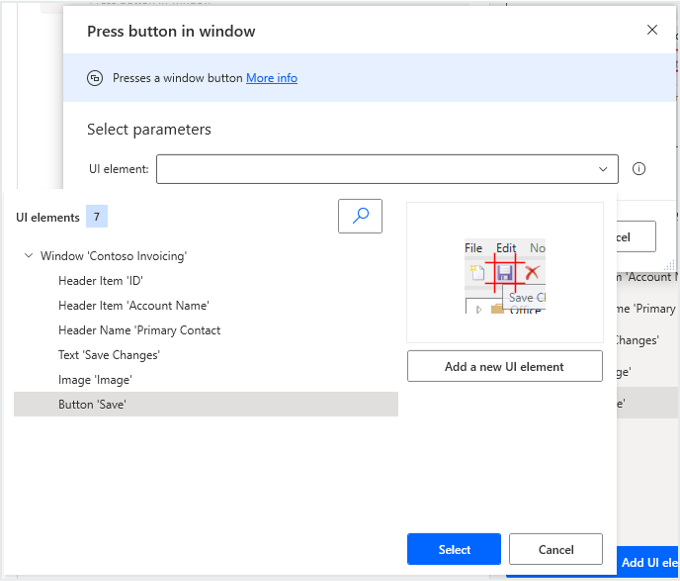

Power Automate for desktop can capture the steps that are performed by the user and edit the steps in desktop flows.

The user can record tasks with the following features:

- **Desktop recorder** - Records the steps on Windows native applications.
- **Web recorder** - Records steps in a browser for web applications.

> [!div class="mx-imgBorder"]
> 

## Desktop recorder

The **Desktop recorder** identifies and highlights objects in the application user interface such as buttons, menus, and fields. Then, it records the mouse clicks and keyboard entries against that object.

> [!div class="mx-imgBorder"]
> 

## Web recorder

The **Web recorder** identifies what is clicked and entered onto a webpage. The process is similar to the **Desktop recorder** process, but it is tailored toward web applications.

## Editing steps and actions

After steps have been recorded, you can edit to remove unnecessary actions and add further actions. You can also edit the objects that are selected in the application and add new UI objects.

> [!div class="mx-imgBorder"]
> 

Power Automate has a wide range of capabilities and can perform many actions, including:

- Running SQL queries against a SQL Server database.
- Manipulating the contents of a Microsoft Excel worksheet.
- Processing emails in Microsoft Outlook.
- Running PowerShell scripts on the local computer.
- Copying to and from the clipboard.
- Accessing Azure AD objects.
- Accessing cloud services.

Power Automate for desktop is powerful, with many possible actions. Solution architects should decide on the most appropriate technology for performing actions, such as when a SQL query is performed by using a desktop flow, a cloud flow, or by an Azure function.

## Variables

Flow variables allow information to change in every run of a desktop flow. If you're using a desktop flow for any type of data entry, you'll need flow variables to define the fields that you need to enter. Solution architects should encourage the use of flow variables and ensure that a naming convention is in place for variables.

Input variables are pieces of information that you pass to a desktop flow. Output variables are outcomes that the desktop flow passed back after the desktop flow has run. Power Automate for desktop provides the ability to receive input values from cloud flows and return values back to the cloud flow by using output variables. As a result, your automations can be seamlessly integrated. Solution architects should ensure that the input and output variables are specified at the design stage because it is likely that cloud and desktop flows will be built by different makers.

If input variables are different for each environment, then you should define environment variables for input variables in the flows.
