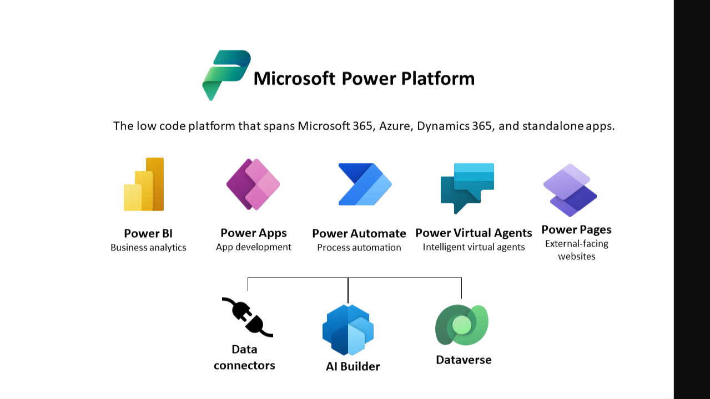

> [!div class="mx-imgBorder"]
> 

The Microsoft Power Platform is a collection of user-friendly tools that help businesses streamline their operations and create applications effortlessly. Whether you're an Excel whiz or a professional developer, you can boost your productivity with the Power Platform's easy-to-use, low-code interface, and drag-and-drop designer.

One of the Power Platform's standout features is connectors. These connectors enable users, often referred to as 'makers,' to link up with various applications and APIs without needing to tackle complex security protocols. Microsoft and third-party organizations offer over 450 connectors to make your work even more efficient.

While Power Platform empowers users to build apps and workflows, some organizations worry about the potential risks of unauthorized connections that could leak sensitive data. However, Microsoft provides plenty of tools and guidance to help organizations strike the right balance between digital transformation and safeguarding sensitive information. This ensures they can remain competitive in their industry without compromising data security. Throughout this module, you'll be introduced to Microsoft Power Platform environments and their role in creating Data Loss Prevention (DLP) policies. A brief introduction and overview of tools will also be discussed, including Microsoft Power Platform and Power Automate Admin experiences and Microsoft Power Platform Center of Excellence (COE) toolkit.