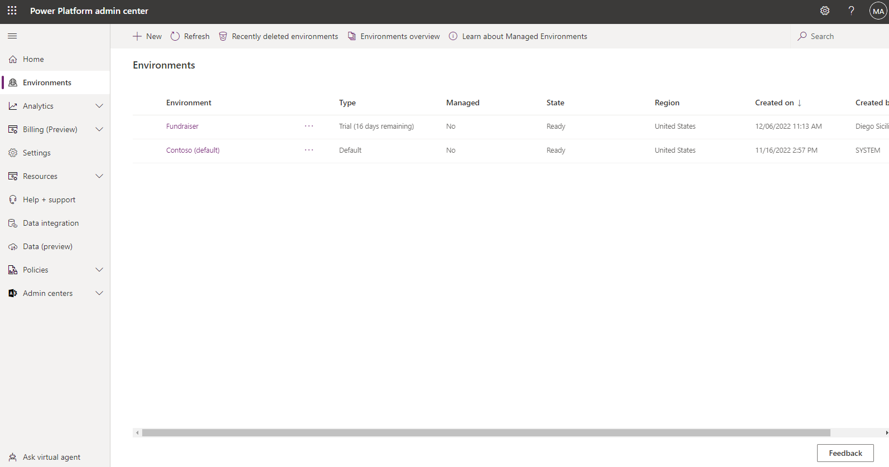
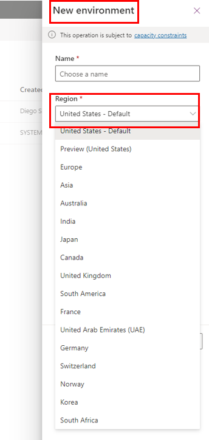

Environments are a vital aspect of securing and managing Power Apps and Power Automate usage. They act as secure containers where apps and flows run. Each app and flow must be associated with an environment, and every licensed user is part of the default environment.

Additional environments can be created, typically to enable opt-in access. Some organizations choose to [rename the default environment](/power-platform/admin/environments-administration?azure-portal=true#rename-your-environment) as **Personal Productivity,** indicating its purpose for building flows that enhance personal productivity.

As an organization evolves, it can set up separate environments for development, testing, and production purposes. This approach aligns app and flow creation with established IT change management requirements.

By default, anyone can create environments, but administrators have the ability to [control environment creation and management](/power-platform/admin/control-environment-creation/?azure-portal=true) using the Microsoft Power Platform Admin center, limiting this privilege to a select group of administrators. This control helps maintain security and compliance within the organization.

> [!div class="mx-imgBorder"]
> 

When creating an environment, organizations can choose which region they want that environment to reside in. This approach is important because it allows organizations to store data closer to actual users and to maintain and meet compliance requirements for their company's location. Regions already available to store data include Asia,  Australia, Canada, Europe, France, India, Japan, South America, United Kingdom, United States, and US Government (GCC).

> [!div class="mx-imgBorder"]
> 

Regions are also important when it comes to analytics because the Microsoft Power Platform isolates analytics through environments. The customer data that is generated in one region isn't allowed to leave that region. 