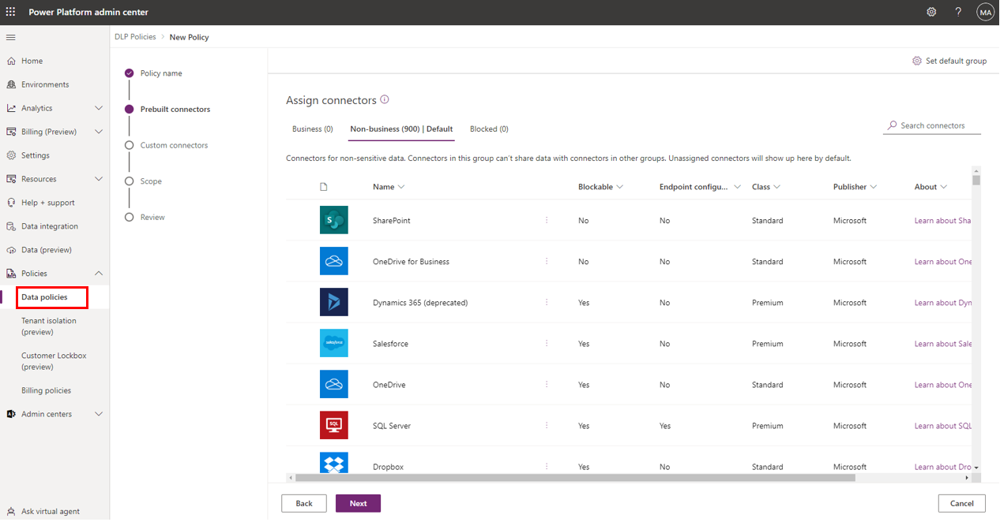
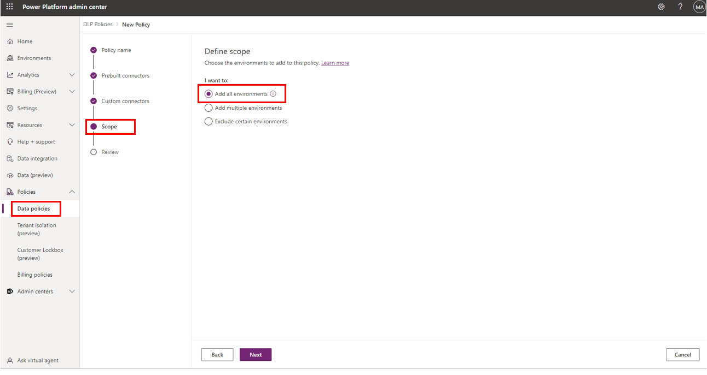

Data Loss Prevention (DLP) policies are like safety rules for your connectors in Power Apps and Power Automate. They let you decide which connectors can talk to each other and which can't. To make it simple, think of DLP policies as sorting connectors into three groups: **Business**, **Non-business**, and **Blocked**. 

**Business Data Group:** This is where connectors with a similar purpose hang out. If two connectors are in the Business group, they can work together in an app or flow.

**Non-business Data Group:** Connectors in this group also work together because they share similar functions. For example, you can use **Salesforce**, **Dropbox**, and **10to8 Appointment** connectors in one flow because they belong to the Non-business group.

**Blocked Data Group:** Connectors here are isolated; they can't chat with connectors in the other groups.

**Example:** Let's say you want to create a flow using Microsoft Word Online, Approvals, and Power BI connectors. These all belong to the Business group, so you're good to go. 

However, if you try to combine the SQL Server connector (Business group) with the Act! connector (Non-business group), it won't work. They're in different groups, so you'll need to move one of them.

> [!div class="mx-imgBorder"]
> 

You can also pick a default data group. Any new connectors will automatically join this group. For instance, if you set Business as the default, new connectors will go there. Just select the data policy you want to make default and choose the **Edit policy** button at the top. To change the default data group, go to **Connectors** and choose the **Set default group** button in the upper- right corner.

DLP policies can be environment-specific or apply to your whole tenant. When you create a DLP policy, you can decide whether it covers all environments, select specific ones, or exclude certain environments.

> [!div class="mx-imgBorder"]
> 

Remember, if you have multiple DLP policies, the strictest one takes charge. So, be mindful of how you layer your policies. Using multiple DLP policies is discussed further in the **Planning** module.

Setting up DLP policies depends on your organization's design and security rules. Some mix business and consumer connectors, while others keep them separate. Start by listing your business systems and create DLP policies that match your needs.

Lastly, keep an eye on new connectors being deployed into your environments to ensure they end up in the right data group. This keeps your DLP policies effective and your data secure.